# Tallyvane — Архитектура системы

> Версия документа: 3.3
> Статус: утверждённый дизайн, палитра и модель экранов проверены прототипом
> Язык кода, идентификаторов и интерфейса: английский. Язык проектной документации: русский.
>
> Изменения относительно 3.2: по итогам живого прототипа введены три уровня глубины вместо режима «подробно», плотность отделена от объёма информации, акцент стал монохромным, а янтарь оставлен только за смыслом «требует внимания»; добавлены быстрые действия на двух поверхностях.
>
> Изменения относительно 3.1: принят внешний движок дизайн-токенов с четырёхслойной моделью, контрактами и графом использования; отменено утверждение об отсутствии внешних пакетов на фронтенде; правила проверки токенов заменены на реальные правила движка.
>
> Изменения относительно 3.0: продукт получил имя Tallyvane; корневой пакет и идентификаторы приведены к нему; введено правило, запрещающее зашивать имя продукта в код.
>
> Изменения относительно 2.0: бэкенд перестроен из слоёного на модульный монолит с вертикальными модулями-возможностями и максимальной гранулярностью модулей сборки; фронтенд переведён на строгий Feature-Sliced Design; введён запрет утилитарного кода с машинно-проверяемым механизмом исключений; добавлен отдельный раздел о статической валидации архитектуры.

---

## Оглавление

1. [Обзор продукта](#1-обзор-продукта)
2. [Принципы проектирования](#2-принципы-проектирования)
3. [Контекст и контейнеры](#3-контекст-и-контейнеры)
4. [Бэкенд: модульный монолит](#4-бэкенд-модульный-монолит)
5. [Запрет утилитарного кода](#5-запрет-утилитарного-кода)
6. [Каталог компонентов и контрактов](#6-каталог-компонентов-и-контрактов)
7. [Подсистема управления контентом](#7-подсистема-управления-контентом)
8. [Модель данных](#8-модель-данных)
9. [Событийная модель](#9-событийная-модель)
10. [Ключевые сценарии и потоки](#10-ключевые-сценарии-и-потоки)
11. [HTTP API](#11-http-api)
12. [Фронтенд: Feature-Sliced Design](#12-фронтенд-feature-sliced-design)
13. [Слой строк интерфейса](#13-слой-строк-интерфейса)
14. [Расширение для браузера](#14-расширение-для-браузера)
15. [Статическая валидация архитектуры](#15-статическая-валидация-архитектуры)
16. [Инфраструктура и эксплуатация](#16-инфраструктура-и-эксплуатация)
17. [Безопасность и приватность](#17-безопасность-и-приватность)
18. [Стратегия тестирования](#18-стратегия-тестирования)
19. [Производительность и бюджеты](#19-производительность-и-бюджеты)
20. [Расширяемость: рецепты](#20-расширяемость-рецепты)
21. [План реализации](#21-план-реализации)
22. [Журнал архитектурных решений](#22-журнал-архитектурных-решений)
23. [Глоссарий](#23-глоссарий)

---

## 1. Обзор продукта

### 1.1. Проблема

Активный поиск работы порождает поток разрозненной информации: десятки вакансий, каждая со своим описанием и требованиями; разные версии резюме и cover letter под каждую подачу; переписка с рекрутерами в LinkedIn, почте и мессенджерах; многораундовые интервью с разными людьми. Через месяц человек физически не помнит, на что именно подавался, какую версию резюме отправил, какую зарплату назвал и о чём договорился с рекрутером. Существующие трекеры либо требуют слишком много ручного ввода и потому забрасываются, либо не хранят достаточно контекста, чтобы быть полезными за десять минут до интервью.

### 1.2. Решение

**Tallyvane** — от *tally*, вести счёт и записывать, и *vane*, флюгер, показывающий направление. Две половины имени соответствуют двум половинам продукта: он ведёт полную запись всего, что произошло, и по этой записи показывает, куда всё движется. Имя выдуманное и нигде в коде не зашито — подробности в разделах [13.4](#134-имя-продукта--тоже-строка) и [ADR-025](#22-журнал-архитектурных-решений).

Персональная система, которая:

- **захватывает** вакансию за один клик прямо со страницы LinkedIn или ATS и разбирает её в структуру с помощью LLM;
- **хранит** неизменяемый журнал всего, что произошло: подачи, письма, сообщения, connection-запросы, раунды интервью;
- **архивирует** оригинал вакансии и точный файл резюме, который был отправлен, — навсегда;
- **напоминает** через Telegram о том, что требует действия, по настраиваемым правилам;
- **собирает** резюме под конкретную вакансию из банка блоков и рендерит в PDF, гарантированно читаемый ATS;
- **готовит** к интервью: одна страница со всем контекстом за десять секунд;
- **считает** реальный доход на руки с учётом штата, налогов, страховки и 401k;
- **показывает** честную аналитику воронки;
- **публикует** собственную витрину: лендинг, блог, документацию и чейнджлог, редактируемые через встроенную админку без пересборки и деплоя.

### 1.3. Границы

**Система делает:** ведёт учёт вакансий, компаний, контактов, подач, интервью и переписки; парсит вакансии из ATS серверно и из LinkedIn через расширение; генерирует, проверяет на читаемость и хранит документы; отправляет уведомления и отдаёт календарный фид; считает нетто-доход для W2; отвечает на аналитические вопросы; управляет содержимым публичного сайта и редактируемыми текстами приложения.

**Система не делает:** не подаёт заявки автоматически и не заполняет чужие формы; не скрейпит LinkedIn с сервера; не является налоговым советником; не агрегирует вакансии и не является поисковиком по рынку; не хранит платёжные данные и не содержит биллинга.

### 1.4. Пользователь

Один основной пользователь, Android/mobile-инженер уровня Staff, ищущий работу в США. Объём: от пяти до двадцати вакансий в неделю, накопительно сотни записей за год. Основное устройство — десктоп 17–24 дюйма; телефон для чтения перед звонком. Продукт спроектирован многопользовательским на уровне данных и API с первого дня, с прицелом на превращение в публичный продукт с веб-, мобильным и десктопным клиентами.

### 1.5. Нефункциональные требования

| Категория | Требование |
| --- | --- |
| Отзывчивость приложения | Действие в UI отвечает оптимистично мгновенно; серверный p95 не выше 200 мс на чтение, 400 мс на запись |
| Захват вакансии | От клика до готовой карточки не более 8 секунд, включая LLM |
| Публикация контента | Изменение видно немедленно, без пересборки и деплоя |
| Публичные страницы | Полный HTML для робота, Lighthouse не ниже 95 по всем осям |
| Надёжность | Ни одно уведомление не теряется и не дублируется; ни один отправленный документ не пропадает |
| Ресурсы | Вся система умещается в 2 ГБ RAM на одном VPS |
| Стоимость | Не более 15 долларов в год: домен плюс токены LLM |
| Восстановление | RPO 24 часа, RTO 1 час; восстановление проверяется автоматически |
| Сопровождаемость | Изолированное изменение — минуты; архитектурные нарушения ловятся компилятором или CI, но никогда ревью |
| Приватность | Данные не покидают инфраструктуру владельца, кроме явных вызовов LLM |

---

## 2. Принципы проектирования

### 2.1. Главное правило

**Ни один компонент не знает о конкретной реализации другого компонента.** Любое взаимодействие идёт через интерфейс, объявленный тем, кто им пользуется, а не тем, кто его реализует.

Правило принуждается машинами, а не дисциплиной. Ревью не является механизмом контроля архитектуры: человек устаёт, торопится и соглашается. Ниже — четыре рубежа, каждый из которых срабатывает раньше следующего.

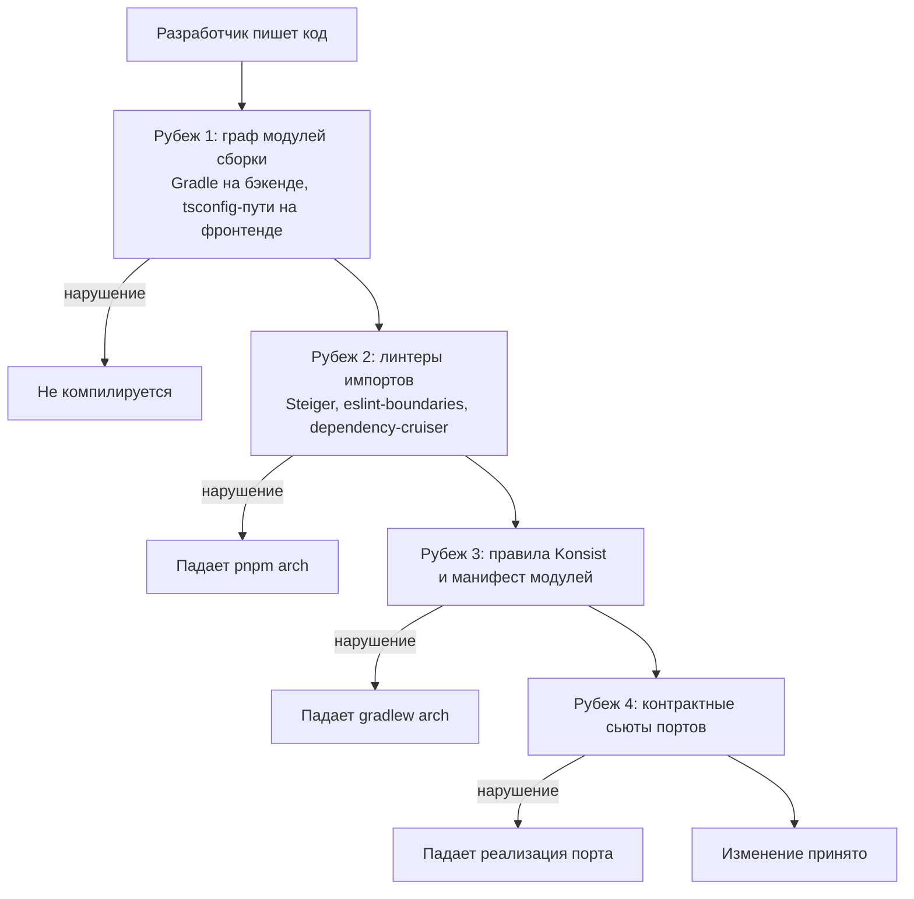

Подробности каждого рубежа — в разделе [15](#15-статическая-валидация-архитектуры).

### 2.2. Две оси декомпозиции

Система режется дважды, и это принципиально.

**По вертикали — на модули-возможности.** `jobs`, `applications`, `contacts`, `resume`, `compensation`, `reminders`, `content`. Каждый модуль владеет своими данными, своими правилами и своей частью API. Это модульный монолит: один процесс, одна база, но границы между областями такие же жёсткие, как между сервисами.

**По горизонтали — на слои внутри каждого модуля.** `contract`, `domain`, `application`, `infrastructure`, `web`. Это чистая архитектура: зависимости направлены внутрь, ядро ничего не знает о технологиях.

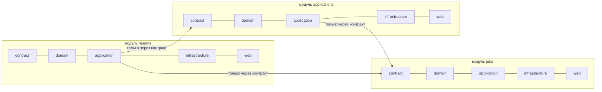

Пересечение двух осей даёт клетку — конкретный модуль сборки. Соседние клетки видят друг друга только там, где это разрешено явно.

### 2.3. Применение SOLID

**SRP.** Единица ответственности — один use case, один порт, один адаптер, один тип блока, одна секция брифа, один слайс на фронтенде. Классов вида `JobService` с двадцатью методами не существует: правило ограничивает use case единственным публичным методом.

**OCP.** Новый источник вакансий, канал уведомлений, тип занятости, движок рендера, тип контентного блока или правило напоминания добавляются без правки существующих строк. Каждая ось расширения — реестр реализаций одного интерфейса, а выбор происходит по данным. Ветвление по значению перечисления вне реестра запрещено правилом.

**LSP.** Каждый порт снабжён контрактным тест-сьютом. Реализация, ведущая себя иначе, не проходит общий сьют и не попадает в основную ветку. Это машинная проверка подстановки.

**ISP.** Порты узкие и сформулированы со стороны потребителя: вместо `JobRepository` с пятнадцатью методами — `JobWriter`, `JobFinder`, `JobArchive`. Один адаптер может реализовывать несколько узких портов, но потребители об этом не знают.

**DIP.** Порты объявлены в слое, который их использует. `infrastructure` зависит от `application`, а не наоборот. То же на фронтенде: реестр блоков — интерфейс в `shared`, реализации в `widgets`, сборка в `app`.

### 2.4. Elegant Objects: что берём

- Объект валиден с момента рождения: инварианты в `init`, а не методом `validate()`.
- Никаких `null` в домене: отсутствие значения — явный подтип.
- Никакого мутабельного состояния в домене: изменение порождает новое значение.
- Никакой статики и синглтонов с логикой: всё через конструктор.
- Никаких утилитарных классов: поведение принадлежит объекту, который владеет данными, либо явно названному объекту-политике. Подробно — раздел [5](#5-запрет-утилитарного-кода).
- Имена по существу, а не по роли.

Сознательно **не** берём: запрет статических фабрик и требование интерфейса на каждый класс — у объектов-значений интерфейсы избыточны.

### 2.5. Каталог применяемых паттернов

| Паттерн | Где | Зачем |
| --- | --- | --- |
| Strategy | `CompensationModel`, `ResumeRenderer`, `LlmProvider`, `NotificationChannel`, `ContentCacheInvalidator` | Взаимозаменяемые алгоритмы за одним контрактом |
| Adapter | `JobSource`, `EmailIngestSource`, `MediaProcessor` | Приведение чужих форматов к внутренней модели |
| Registry | `JobSourceRegistry`, `ReminderRuleRegistry`, `NotificationRouter`, `BlockRegistry` | Выбор реализации по данным вместо ветвления по типу |
| Repository | `JobWriter`, `JobFinder`, `ContentReader` | Изоляция домена от способа хранения |
| Outbox | `OutboxWriter` и `OutboxDispatcher` | Доставка побочных эффектов ровно один раз |
| Specification | `JobQuery`, `ApplicationQuery` | Композиция условий без протечки SQL наружу |
| Decorator | Обвязка `LlmProvider` кэшем, учётом, бюджетом и повторами | Наращивание поведения без правки базы |
| Template Method | Абстрактные контрактные тест-сьюты | Общий сценарий проверки для всех реализаций порта |
| Value Object | `Money`, `UsState`, `TaxYear`, `ContentHash`, `Slug`, `BlobRef` | Невозможность передать не то значение не туда |
| Builder | `ResumeComposition`, `PageDraft` | Пошаговая сборка агрегата с валидацией на выходе |
| Chain of Responsibility | `ExtractionPipeline` | Структура, эвристики, LLM — по очереди |
| Memento | `PageRevision` | Снимок состояния для отката |
| Composite | `PageContent` из блоков | Однородная обработка дерева содержимого |
| Published Language | Модули `contract` | Общий словарь на границе между модулями |

---

## 3. Контекст и контейнеры

### 3.1. Системный контекст

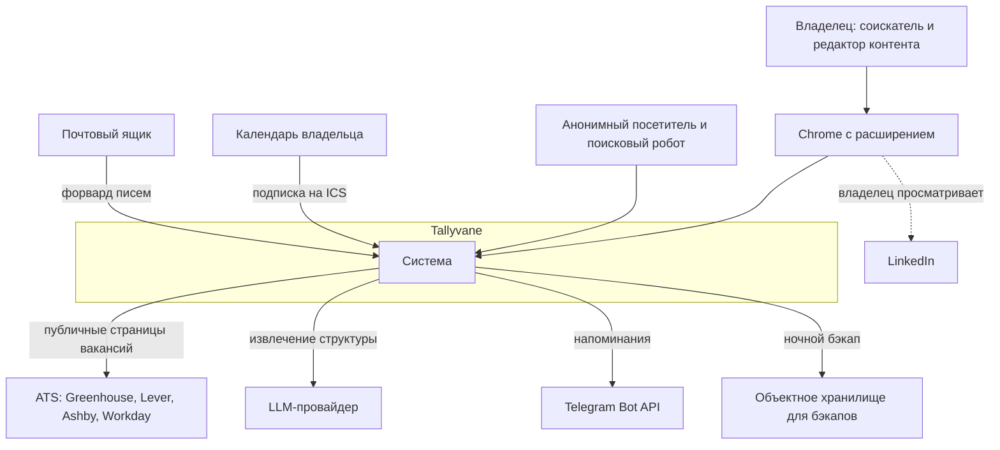

### 3.2. Контейнеры

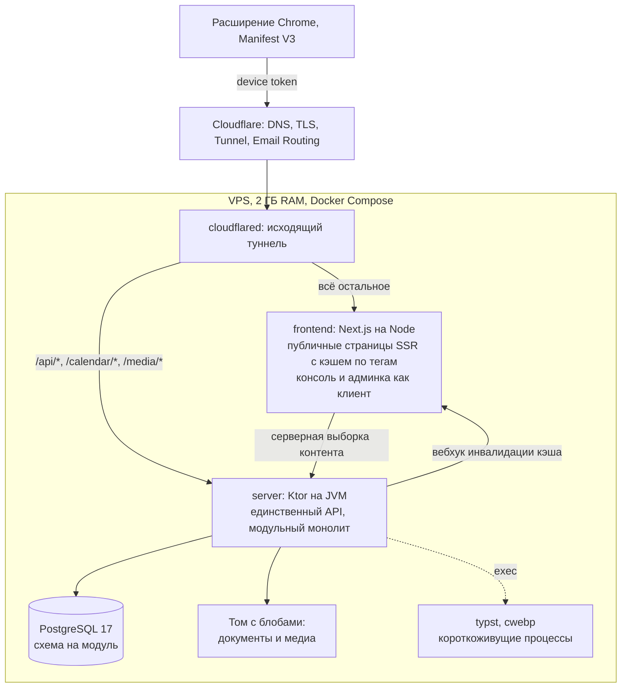

Наружу не открыт ни один порт: `cloudflared` устанавливает исходящее соединение, входящий трафик приходит по туннелю, фаервол пропускает только SSH. Маршрутизация по путям происходит на входе, поэтому Node не оказывается в горячем пути вызовов API. Консоль и админка ходят в Ktor напрямую из браузера — API остаётся единственным честным контрактом для будущего мобильного клиента.

---

## 4. Бэкенд: модульный монолит

### 4.1. Что означает «модульный монолит» здесь

Один процесс, одна база данных, один деплой — и при этом границы между областями настолько жёсткие, что извлечение любого модуля в отдельный сервис было бы механической операцией, а не переписыванием.

Конкретно это означает пять правил, каждое из которых проверяется машиной:

1. Модуль владеет своими таблицами. Никто, кроме него, к ним не обращается.
2. Модуль выставляет наружу ровно один модуль сборки — `contract`. Всё остальное невидимо.
3. Зависимость на чужой `domain`, `application`, `infrastructure` или `web` невозможна: её нет в графе сборки, и она отвергается манифестом.
4. Синхронное обращение к чужому модулю идёт через интерфейс из его контракта.
5. Реакция на чужие изменения идёт через события, без зависимости вообще.

### 4.2. Карта модулей

```
backend/
├── settings.gradle.kts
├── build-logic/                        конвенционные плагины Gradle
├── platform/                           технические возможности, ноль бизнес-логики
│   ├── kernel/                         Money, UserId, Slug, Clock, IdGenerator, Outcome
│   ├── events/                         DomainEvent, EventPublisher, EventSubscriber
│   ├── persistence/                    TransactionRunner, конвенции схем, миграции
│   ├── http/                           пломбировка Ktor: ошибки, аутентификация, RouteModule
│   ├── outbox/                         очередь отложенных эффектов и диспетчер
│   ├── llm/                            LlmProvider, декораторы, адаптер провайдера
│   ├── storage/                        BlobStore
│   ├── exec/                           безопасный запуск внешних бинарников
│   └── observability/                  структурные логи и метрики
├── modules/
│   ├── identity/       { contract, domain, application, infrastructure, web }
│   ├── jobs/           { contract, domain, application, infrastructure, web }
│   ├── capture/        { contract, application, infrastructure, web }
│   ├── applications/   { contract, domain, application, infrastructure, web }
│   ├── contacts/       { contract, domain, application, infrastructure, web }
│   ├── documents/      { contract, domain, application, infrastructure, web }
│   ├── resume/         { contract, domain, application, infrastructure, web }
│   ├── compensation/   { contract, domain, application, infrastructure, web }
│   ├── briefing/       { domain, application, infrastructure, web }
│   ├── reminders/      { contract, domain, application, infrastructure, web }
│   ├── analytics/      { application, infrastructure, web }
│   ├── content/        { contract, domain, application, infrastructure, web }
│   └── mailbox/        { domain, application, infrastructure, web }
├── app/                                композиционный корень и точка входа
├── arch-tests/                         правила Konsist
└── modules.yaml                        манифест разрешённых зависимостей
```

Итого около шестидесяти модулей сборки. Это осознанная цена за то, что нарушение границы не компилируется. Ниже — чем эта цена гасится.

**Модуль получает только те слои, которые ему нужны.** Отсутствие слоя — нормальное состояние, а не недоделка. У `analytics` нет ни контракта, ни домена: это набор проекций для чтения, к нему никто не обращается из других модулей, и собственных правил у него нет. У `briefing` нет контракта по той же причине. У `capture` нет домена: он целиком состоит из оркестрации чужих правил.

**Файл сборки модуля — три строки.** Конвенционные плагины в `build-logic` задают версию Kotlin, настройки компилятора, общие тестовые зависимости и правила публикации. Типичный `build.gradle.kts` модуля выглядит так:

```kotlin
plugins { id("tallyvane.kotlin-module") }

dependencies {
    api(projects.platform.kernel)
    implementation(projects.modules.jobs.contract)
}
```

**Сборка остаётся быстрой.** Мелкие модули — это плюс, а не минус, для инкрементальной компиляции: правка в `resume:domain` пересобирает три модуля, а не весь бэкенд. Включены кэш конфигурации, кэш сборки и параллельное выполнение. Типовые зависимости объявляются через каталог версий.

**Навигация не страдает,** потому что структура каталогов предсказуема до автоматизма: имя модуля плюс имя слоя однозначно задают путь.

### 4.3. Слои внутри модуля

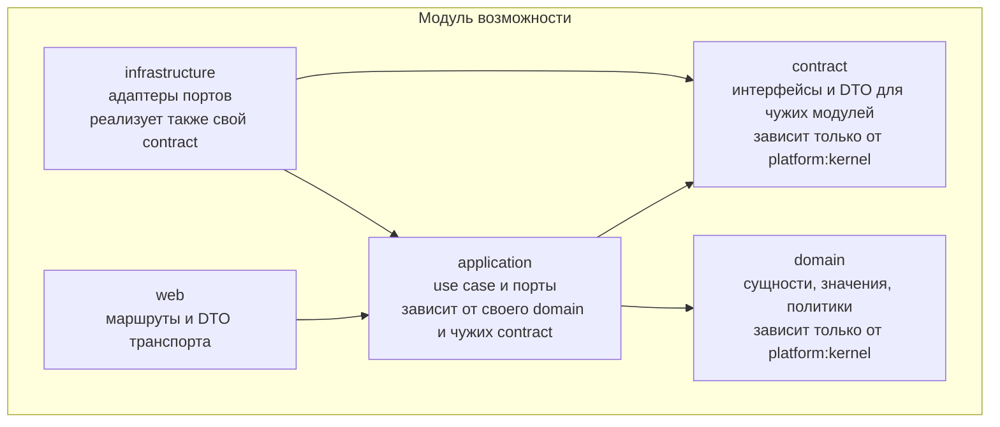

**`contract`** — опубликованный язык модуля. Только интерфейсы и неизменяемые структуры данных. Никакой логики, никаких ссылок на собственный `domain`: контракт обязан быть самодостаточным, иначе чужой модуль потянет за собой внутренние типы. Здесь же объявляются доменные события, которые модуль публикует.

**`domain`** — сущности, объекты-значения и политики. Ни одного вызова ввода-вывода, ни одной аннотации, ни одного обращения к текущему времени: момент всегда приходит параметром.

**`application`** — use case и порты. Use case задаёт границу транзакции, обращается к домену за решениями и к портам за эффектами. Порты объявлены здесь, потому что принадлежат тому, кто их использует.

**`infrastructure`** — адаптеры. Реализации помечены `internal`; наружу выставляется единственная фабрика модуля, отдающая объекты под типами портов. Здесь же лежит реализация собственного контракта: то, как модуль отвечает на вопросы соседей.

**`web`** — маршруты, DTO транспорта, мапперы. Маршрут не содержит логики: разбирает запрос, вызывает один use case, сериализует результат.

### 4.4. Правила зависимостей

Таблица читается так: строка — кто зависит, столбец — от кого разрешено.

| Кто | Разрешено |
| --- | --- |
| `platform:kernel` | Ничего, кроме стандартной библиотеки и `kotlinx-datetime` |
| `platform:*` прочие | `platform:kernel` и свои технические библиотеки |
| `<модуль>:contract` | `platform:kernel`, `platform:events` |
| `<модуль>:domain` | `platform:kernel` |
| `<модуль>:application` | свой `domain`, свой `contract`, `platform:kernel`, `platform:events`, **`contract` чужих модулей** |
| `<модуль>:infrastructure` | свой `application`, свой `contract`, технические `platform:*` |
| `<модуль>:web` | свой `application`, свой `contract`, `platform:http` |
| `app` | всё |
| `arch-tests` | всё, только для чтения структуры |

Запреты, вытекающие отсюда и проверяемые:

- Никакой модуль не зависит от чужих `domain`, `application`, `infrastructure`, `web`.
- `domain` не зависит даже от собственного `application`.
- `platform:*` никогда не зависит от `modules:*`.
- `web` не зависит от `infrastructure` — маршрут не может дотянуться до базы, только через use case.
- Циклы между модулями невозможны: они запрещены Gradle и дополнительно проверяются манифестом.

### 4.5. Связь между модулями

Два механизма, и выбор между ними определяется одним вопросом: **нужен ли вызывающему результат, чтобы продолжить?**

**Синхронно через контракт — когда результат нужен.** Модуль `resume`, собирая резюме под вакансию, обязан эту вакансию прочитать. Он зависит от `jobs:contract` и получает интерфейс:

```kotlin
// modules/jobs/contract
package jobs.contract

interface JobDirectory {
    suspend fun byId(id: JobId): JobSummary?
    suspend fun byIds(ids: Set<JobId>): Map<JobId, JobSummary>
}

/** Регистрация вакансии, добытой другим модулем. */
interface JobIntake {
    suspend fun register(candidate: IncomingJob): IntakeOutcome
}

data class JobSummary(
    val id: JobId,
    val title: String,
    val companyName: String,
    val workMode: WorkMode?,
    val locationState: UsState?,
    val salary: SalaryRangeView?,
)
```

Реализация живёт в `jobs:infrastructure`, связывание происходит в `app`. Модуль `resume` не знает ни класса реализации, ни того, что данные лежат в Postgres.

**Асинхронно через события — когда вызывающему безразличен результат.** Модуль `applications` при фиксации подачи публикует событие. Модули `reminders`, `analytics` и проекция состояний реагируют на него, и `applications` о них не знает вовсе.

```kotlin
// platform:events
interface DomainEvent { val occurredAt: Instant }

interface EventPublisher {
    /** Публикация внутри транзакции: событие попадает в outbox и уходит после коммита. */
    suspend fun publish(event: DomainEvent)
}

interface EventSubscriber<E : DomainEvent> {
    val eventType: KClass<E>
    suspend fun on(event: E)
}
```

```kotlin
// modules/applications/contract
data class ApplicationSubmitted(
    val applicationId: ApplicationId,
    val jobId: JobId,
    val userId: UserId,
    override val occurredAt: Instant,
) : DomainEvent
```

Событие объявлено в контракте публикующего модуля — это часть его опубликованного языка. Подписчик зависит от контракта, но не наоборот: публикующий модуль не знает своих подписчиков ни в каком виде.

Доставка идёт через outbox даже внутри одного процесса. Это выглядит избыточным, но даёт то, ради чего всё затевалось: событие, опубликованное в транзакции, которая потом откатилась, не будет доставлено; событие, опубликованное перед падением процесса, будет доставлено после перезапуска.

**Матрица связей между модулями:**

| Модуль | Читает синхронно из | Публикует события | Слушает события |
| --- | --- | --- | --- |
| `capture` | `jobs`, `identity` | — | — |
| `jobs` | `identity` | `JobSaved`, `JobUpdated` | — |
| `applications` | `jobs`, `documents`, `identity` | `ApplicationSubmitted`, `StatusAdvanced`, `InterviewScheduled` | — |
| `contacts` | `jobs`, `identity` | `ConnectionSent`, `MessageLogged` | — |
| `resume` | `jobs`, `documents` | `ResumeRendered` | — |
| `briefing` | `jobs`, `applications`, `contacts`, `documents`, `compensation` | — | — |
| `compensation` | `identity` | — | — |
| `reminders` | `applications`, `contacts` | — | все прочие |
| `analytics` | — | — | все прочие |
| `content` | `identity` | `ContentPublished` | — |
| `mailbox` | `applications`, `contacts` | `MessageLogged` | — |

Обрати внимание на `briefing`: он читает из пяти модулей и не публикует ничего. Это правильно — бриф является чистым представлением, он ничего не меняет. И на `analytics`: он не читает ни у кого синхронно, потому что строит собственные проекции из событий. Оба случая — признак того, что границы проведены верно.

### 4.6. Владение данными

**Каждому модулю — своя схема в Postgres.** Таблицы `jobs` живут в схеме `jobs`, таблицы подач — в схеме `applications`, и так далее. Это делает нарушение видимым: запрос к чужой таблице невозможно написать, не указав чужую схему явно.

```kotlin
// modules/jobs/infrastructure
internal object JobsTable : Table("jobs.jobs") { /* ... */ }
```

**Внешние ключи между схемами разрешены, соединения — нет.** Это компромисс, и он обдуман. Запрет внешних ключей ради «готовности к извлечению в сервис» стоил бы целостности данных прямо сейчас ради гипотетического будущего, которое, вероятно, никогда не наступит: одна база с ссылочной целостностью надёжнее, чем набор идентификаторов, за согласованностью которых следит код. Зато запрет соединений сохраняет логическую границу: чтобы узнать что-то о чужой сущности, надо спросить у её модуля, а не залезть в его таблицу.

Правило проверяется: тест сканирует определения таблиц и текст запросов каждого модуля инфраструктуры и падает, если встречает имя схемы, отличное от своей, где-либо кроме объявления внешнего ключа.

**Миграции принадлежат модулям.** Каждый модуль несёт свой каталог миграций; `platform:persistence` собирает их в общий поток и применяет в порядке версий. Это позволяет читать историю изменений схемы модуля, не продираясь через чужие.

### 4.7. Композиционный корень

Модуль `app` — единственное место во всём бэкенде, где известны конкретные классы реализаций. Он читает конфигурацию, создаёт адаптеры, собирает use case, регистрирует маршруты и подписчиков событий, запускает фоновые задачи, обрабатывает корректное завершение. Собственной бизнес-логики в нём нет, и это проверяется правилом: в `app` не может быть класса, имя которого не оканчивается на `Wiring`, `Configuration` или `Application`.

Внедрение зависимостей ручное, конструкторами, без контейнера. На этом масштабе контейнер добавляет неявность, не убирая работы, а композиционный корень читается сверху вниз как оглавление системы:

```kotlin
// app/src/main/kotlin/.../JobsWiring.kt
internal class JobsWiring(
    platform: PlatformWiring,
    identity: IdentityContracts,
) {
    private val persistence = JobsPersistence(platform.database)

    val captureJob = CaptureJob(
        sources = JobSourceRegistry(
            listOf(GreenhouseJobSource(platform.httpClient), LeverJobSource(platform.httpClient), /* ... */)
        ),
        extractor = ExtractionPipeline(listOf(JsonLdStage(), HeuristicStage(), LlmStage(platform.llm), NormalizationStage(TagVocabulary.load()))),
        jobs = persistence.writer,
        archive = persistence.archive,
        events = platform.events,
        transaction = platform.transactions,
        clock = platform.clock,
    )

    val contracts: JobsContracts = JobsContracts(
        directory = persistence.directory,
        intake = JobIntakeAdapter(captureJob),
    )

    val routes: RouteModule = JobsRoutes(captureJob, /* ... */)
}
```

Порядок декораторов вокруг провайдера модели тоже задаётся здесь, одной строкой, и потому является явным решением, а не случайностью:

```kotlin
val llm: LlmProvider =
    BudgetGuarded(
        Caching(
            Metered(
                Retrying(OpenAiLlmProvider(httpClient, config.openAi)),
                policy = RetryPolicy.exponential(attempts = 3),
            ),
            cache = llmCache,
        ),
        budget = config.llm.monthlyBudget,
    )
```

---

## 5. Запрет утилитарного кода

### 5.1. Правило

**Поведение принадлежит объекту, который владеет данными, либо явно названному объекту-сотруднику.** Классов и файлов, существующих для того, чтобы «куда-то положить функции», в системе нет.

Запрещено:

- Классы и объекты с именами и суффиксами `Utils`, `Util`, `Helper`, `Helpers`, `Manager`, `Tools`, `Common`, `Misc`, `Shared`, `Constants`, `Processor`, `Data`, `Info`, `Base`.
- Объявления `object` с функциями или изменяемым состоянием.
- Функции верхнего уровня вне тела класса.
- Файлы, собирающие несвязанные функции по признаку «пригодилось».
- Статические импорты чужой логики вместо внедрения зависимости.

Вместо этого:

| Соблазн написать утилиту | Что пишется на самом деле |
| --- | --- |
| `SalaryUtils.parse(text)` | `SalaryRange.parse(text)` — фабрика на самом типе |
| `DateUtils.businessDaysBetween(a, b)` | `BusinessDays(calendar).between(a, b)` — объект с календарём внутри |
| `StringUtils.normalizeCompanyName(s)` | `CompanyName.of(raw)` — объект-значение, нормализующий себя в конструкторе |
| `TaxHelper.calculate(...)` | `W2CompensationModel.evaluate(input, tables)` — стратегия |
| `Constants.GHOSTING_DAYS` | Параметр конструктора политики, приходящий из конфигурации |
| `JsonUtils.parseOrNull(s)` | Метод адаптера, владеющего сериализатором |

Разница не косметическая. Утилитарный класс — это место, куда стекается логика, не имеющая хозяина; со временем он становится узлом, от которого зависит всё, и который нельзя ни подменить в тесте, ни расширить без правки. Именованный объект-сотрудник внедряется, подменяется и расширяется.

### 5.2. Механизм исключений

Абсолютный запрет невозможен физически: адаптация чужого типа, генерация идентификатора, расширение типа из стандартной библиотеки — по природе свободные функции. Поэтому исключения разрешены, но **сделать исключение молча нельзя.**

```kotlin
// platform/kernel
@Retention(AnnotationRetention.SOURCE)
@Target(AnnotationTarget.CLASS, AnnotationTarget.FUNCTION, AnnotationTarget.FILE, AnnotationTarget.PROPERTY)
annotation class ArchitectureException(
    /** Код нарушаемого правила, например "no-top-level-functions". */
    val rule: String,
    /** Почему иначе нельзя. Пустая строка не допускается. */
    val reason: String,
    /** Идентификатор ADR, где решение зафиксировано, например "ADR-017". */
    val adr: String,
)
```

Правила Konsist пропускают нарушение **только** если оно помечено этой аннотацией, причём проверяется:

- `reason` непустой и длиннее сорока символов — отписка «так надо» не проходит;
- `adr` соответствует шаблону и файл с таким идентификатором существует в `docs/adr/`;
- `rule` входит в перечень известных правил.

Сверх того действует **бюджет исключений**: отдельный тест падает, если общее количество аннотаций во всём бэкенде превышает десять. Исключение перестаёт быть бесплатным — чтобы добавить одиннадцатое, придётся сначала убрать какое-то из существующих или осознанно поднять бюджет отдельным решением.

Заранее предвиденные исключения:

```kotlin
@file:ArchitectureException(
    rule = "no-top-level-functions",
    reason = "Расширения для конвертации типов драйвера JDBC в доменные значения; " +
             "не имеют владельца по природе и живут рядом с адаптером, который их применяет",
    adr = "ADR-017",
)
package tallyvane.jobs.infrastructure.mapping
```

Тот же механизм действует на фронтенде: нарушение помечается директивой в комментарии с теми же тремя полями, и скрипт валидации проверяет их по тем же правилам.

---

## 6. Каталог компонентов и контрактов

Для каждого компонента: ответственность, порт, реализации, зависимости и явный запрет — то, чего компонент знать не должен.

### 6.1. Захват вакансий — модуль `capture`

```kotlin
package tallyvane.capture.application.port

interface JobSource {
    val kind: JobSourceKind

    /** Может ли источник обработать этот URL. Не бросает исключений ни на каком входе. */
    fun supports(url: JobUrl): Boolean

    /** Забирает содержимое. Сетевые ошибки возвращаются как исход, не как исключение. */
    suspend fun fetch(url: JobUrl): FetchOutcome
}

sealed interface FetchOutcome {
    data class Success(
        val rawText: String,
        val rawHtml: String?,
        val structured: StructuredHints,
        val canonicalUrl: JobUrl,
        val externalId: String?,
    ) : FetchOutcome

    data object Unsupported : FetchOutcome
    data class Unavailable(val reason: String, val retryable: Boolean) : FetchOutcome
}

interface JobSourceRegistry {
    fun resolve(url: JobUrl): JobSource?
}
```

**Реализации.** `GreenhouseJobSource`, `LeverJobSource`, `AshbyJobSource`, `SmartRecruitersJobSource` — публичные JSON-эндпоинты ATS. `JsonLdJobSource` — универсальный фолбэк для разметки `schema.org/JobPosting`. `ClientSuppliedJobSource` — содержимое, добытое расширением, для случая LinkedIn.

**Контракт, проверяемый сьютом.** `supports` не бросает исключений ни на каком входе, включая мусор. `fetch` на неподдерживаемом URL возвращает `Unsupported`, а не `Unavailable`. При успехе `rawText` непустой. Повторный вызов даёт тот же `canonicalUrl`.

**Не знает.** О базе, о пользователе, о LLM, о том, будет ли результат сохранён. Регистрацию вакансии выполняет модуль `jobs` через свой контракт.

### 6.2. Извлечение структуры — модуль `capture`

```kotlin
package tallyvane.capture.application.port

interface JobExtractor {
    suspend fun extract(input: ExtractionInput): ExtractedJob
}

/** Одно звено цепочки: возвращает что смогло и передаёт остальное дальше. */
interface ExtractionStage {
    val name: String
    suspend fun apply(input: ExtractionInput, accumulated: PartialJob): PartialJob
}
```

Цепочка: `JsonLdStage` берёт всё из разметки, `HeuristicStage` вытаскивает зарплату регулярками и грейд по ключевым словам, `LlmStage` заполняет только оставшиеся пустыми поля, `NormalizationStage` приводит теги к каноническому виду по словарю синонимов. Звено видит накопленное и не перезаписывает достоверные данные догадками.

Цепочка, а не единственный вызов модели, потому что детерминированные данные надёжнее и бесплатны, а при недоступности LLM система деградирует, но не ломается: карточка создаётся с тем, что удалось разобрать, и помечается как требующая доводки.

### 6.3. LLM — `platform:llm`

```kotlin
package tallyvane.platform.llm

interface LlmProvider {
    val model: ModelId
    suspend fun <T> complete(request: StructuredRequest<T>): LlmOutcome<T>
}

data class StructuredRequest<T>(
    val purpose: LlmPurpose,
    val system: String,
    val user: String,
    val schema: JsonSchema<T>,
    val maxOutputTokens: Int,
    val temperature: Double = 0.0,
)

sealed interface LlmOutcome<out T> {
    data class Success<T>(val value: T, val usage: TokenUsage, val fromCache: Boolean) : LlmOutcome<T>
    data class SchemaViolation(val raw: String, val errors: List<String>) : LlmOutcome<Nothing>
    data class Unavailable(val reason: String, val retryable: Boolean) : LlmOutcome<Nothing>
    data object BudgetExceeded : LlmOutcome<Nothing>
}
```

Провайдер живёт в платформе, потому что это техническая возможность. Промпты и схемы принадлежат модулям-возможностям: `capture` знает, как просить разобрать вакансию, `briefing` — как просить вопросы к интервью.

**Композиция декораторами.** Базовая реализация умеет только сходить в API. Поверх — слои, каждый со своей единственной ответственностью: бюджет, кэш, учёт, повторы. Каждый реализует тот же интерфейс и не знает о существовании остальных.

**Кэш.** Ключ — SHA-256 от кортежа: назначение, идентификатор модели, версия промпта, нормализованный текст входа. Убирает повторную оплату при переразборе и делает тесты детерминированными: записанные ответы проигрываются без сети.

**Бюджет.** Месячный потолок в центах из конфигурации. При достижении система переходит в режим без модели: детерминированные стадии продолжают работать, поля остаются пустыми, пользователь видит предупреждение.

### 6.4. События и вывод статуса — модуль `applications`

```kotlin
package tallyvane.applications.application.port

interface EventWriter {
    /** Только добавление. Дубликат по dedupKey молча игнорируется. */
    suspend fun append(event: NewEvent): AppendOutcome
}

interface EventReader {
    suspend fun forApplication(id: ApplicationId): List<ApplicationEvent>
    suspend fun since(userId: UserId, moment: Instant): List<ApplicationEvent>
}
```

**Статус не хранится.** В таблице подач нет колонки статуса: он выводится политикой из списка событий и текущего момента. Это исключает рассинхрон между статусом и фактами, потерю момента перехода и невозможность переоценить историю при изменении правил.

`Ghosted` — не событие, а свойство: нет входящих событий более N дней после последнего исходящего, и подача не в терминальном состоянии. Порог живёт в конфигурации правила; его изменение переоценивает всю историю без миграции.

Для быстрых списков поддерживается материализованная проекция, обновляемая подписчиком на события. Проекция — кэш, а не истина; её можно удалить и построить заново из журнала.

### 6.5. Напоминания — модуль `reminders`

```kotlin
package tallyvane.reminders.application.port

/** Одно правило. Не знает, как и куда будет доставлено сообщение. */
interface ReminderRule {
    val code: ReminderCode
    val defaults: RuleDefaults
    fun evaluate(scope: ReminderScope, settings: RuleSettings, now: Instant): List<ReminderCandidate>
}

data class ReminderCandidate(
    val subject: ReminderSubject,
    val dedupKey: DedupKey,
    val dueAt: Instant,
    val severity: Severity,
    val payload: ReminderPayload,
)

/** Канал доставки. Не знает, почему сообщение возникло. */
interface NotificationChannel {
    val kind: ChannelKind
    suspend fun deliver(message: OutboundNotification): DeliveryOutcome
}

interface NotificationRouter {
    fun channelsFor(candidate: ReminderCandidate, settings: UserNotificationSettings): List<NotificationChannel>
}
```

Семь реализаций правил: `NoReplyAfterApply`, `ConnectionRequestPending`, `PromisedStepOverdue`, `UpcomingInterview`, `PostInterviewFollowUp`, `StaleWatchlistItem`, `WeeklyGoalProgress`. Каждое включается и настраивается независимо; добавление восьмого не трогает существующие файлы.

**Ровно один раз.** Кандидат несёт ключ дедупликации из кода правила, идентификатора субъекта и логического окна. Уникальный индекс по паре пользователь-ключ превращает повторную генерацию в конфликт вставки, трактуемый как «уже доставлено». Двойной запуск планировщика после перезапуска даёт одно сообщение.

**Доставка не теряется.** Планировщик в одной транзакции пишет запись о доставке и сообщение в очередь. Диспетчер читает очередь, отправляет и помечает доставленным, с повторами и нарастающей задержкой.

### 6.6. Компенсация и налоги — модуль `compensation`

```kotlin
package tallyvane.compensation.domain

/** Модель занятости. Сейчас реализация одна; добавление второй не трогает первую. */
interface CompensationModel {
    val employmentType: EmploymentType
    fun evaluate(input: CompensationInput, tables: TaxYearTables): CompensationBreakdown
}

data class CompensationInput(
    val gross: Money,
    val period: SalaryPeriod,
    val residenceState: UsState,
    val workLocationState: UsState?,
    val locality: Locality?,
    val filingStatus: FilingStatus,
    val dependents: Int,
    val retirementContributionBasisPoints: Int,
    val preTaxHealthPremiumMonthly: Money,
    val hsaContributionAnnual: Money,
)

data class CompensationBreakdown(
    val grossAnnual: Money,
    val preTaxDeductions: List<LineItem>,
    val federalTaxableIncome: Money,
    val federalIncomeTax: Money,
    val stateTaxableIncome: Money,
    val stateIncomeTax: Money,
    val localityTax: Money,
    val socialSecurityTax: Money,
    val medicareTax: Money,
    val additionalMedicareTax: Money,
    val netAnnual: Money,
    val netMonthly: Money,
    val effectiveRate: Percent,
    val marginalRate: Percent,
    val warnings: List<TaxWarning>,
)
```

Полностью изолированный узел: ни одного обращения к базе, сети или файловой системе. Данные приходят параметром.

```kotlin
package tallyvane.compensation.application.port

interface TaxTableProvider {
    fun tablesFor(year: TaxYear): TaxYearTables
    val availableYears: Set<TaxYear>
}
```

Логика расчёта не содержит ни одного числового литерала, относящегося к налогам. Обновление на новый год — добавление каталога с файлами:

```
data/tax/2026/
├── federal.json        брэкеты по статусу подачи, стандартные вычеты
├── fica.json           ставки, потолок базы, порог дополнительного Medicare
├── states/
│   ├── ca.json         прогрессивная шкала
│   ├── tx.json         { "kind": "none" }
│   ├── pa.json         { "kind": "flat", "rate": 0.0307 }
│   └── ny.json         шкала и флаг convenience-of-employer
└── localities/
    └── ny-nyc.json
```

Выбор юрисдикции — доменное правило, а не ветка в интерфейсе:

```kotlin
interface TaxJurisdictionPolicy {
    fun resolve(job: JobTaxContext, profile: UserTaxProfile): JurisdictionDecision
}
```

Для remote — штат проживания; для onsite и hybrid — штат работы. Если штат работодателя применяет правило удобства работодателя, а работа удалённая, добавляется предупреждение с объяснением, но расчёт не искажается.

### 6.7. Резюме — модуль `resume`

```kotlin
package tallyvane.resume.application.port

interface ResumeRenderer {
    val format: DocumentFormat
    suspend fun render(composition: ResumeComposition, template: TemplateId): RenderOutcome
}

/** Проверка машинной читаемости. Отдельный компонент, не часть рендерера. */
interface AtsReadabilityValidator {
    suspend fun validate(rendered: RenderedDocument, expected: ResumeComposition): AtsReport
}

data class AtsReport(
    val extractedText: String,
    val missingFragments: List<String>,
    val readingOrderViolations: List<OrderViolation>,
    val structuralWarnings: List<String>,
    val verdict: Verdict,
)
```

Рендерер отвечает за «сделать файл», валидатор — за «доказать, что файл читается». Разделение позволяет прогонять валидатор над любым PDF, включая загруженные вручную.

Сгенерированный PDF немедленно разбирается через PDFBox, текст нормализуется — схлопывание пробелов, снятие лигатур, приведение тире, — и проверяется, что каждый включённый буллет присутствует целиком и что порядок секций совпадает с заданным. Резюме, теряющее данные при извлечении, не может быть сохранено как отправленное.

Правила ATS зашиты в шаблоны: одна колонка, никаких таблиц для вёрстки, никакого текста внутри графики, стандартные заголовки секций, отсутствие колонтитулов, шрифты со встраиванием, однозначный формат дат.

Каждый отрендеренный документ иммутабелен и адресуется по SHA-256 содержимого. Документ, привязанный к подаче, не может быть изменён или удалён — только заменён новой версией, при этом старая остаётся.

### 6.8. Хранилище блобов — `platform:storage`

```kotlin
package tallyvane.platform.storage

interface BlobStore {
    suspend fun put(content: ByteArray, contentType: String): BlobRef
    suspend fun get(ref: BlobRef): ByteArray?
    suspend fun exists(ref: BlobRef): Boolean
    suspend fun delete(ref: BlobRef)
}

@JvmInline
value class BlobRef(val sha256: String)
```

Реализация раскладывает файлы по префиксу хэша в двухуровневую структуру каталогов. Содержательная адресация означает, что один и тот же файл, загруженный дважды, занимает место один раз.

### 6.9. Обработка медиа — модуль `content`

```kotlin
package tallyvane.content.application.port

interface MediaProcessor {
    suspend fun process(original: ByteArray, declaredType: String): MediaProcessingOutcome
}

data class ProcessedMedia(
    val original: BlobRef,
    val width: Int,
    val height: Int,
    val dominantColor: String,
    val blurPlaceholder: String,
    val derivatives: List<Derivative>,
)
```

Тип определяется по сигнатуре байтов, а не по расширению и не по заголовку от клиента. Метаданные EXIF удаляются целиком: снимок экрана может нести геолокацию и имя устройства. Производные генерируются для фиксированного набора ширин вызовом небольшого нативного бинарника через `platform:exec` — тем же приёмом, что и Typst для PDF.

Обработка происходит **на загрузке, а не на лету**: оптимизация в рантайме требует держать графическую библиотеку в памяти и даёт всплески при каждом холодном запросе, что при потолке в два гигабайта неприемлемо.

### 6.10. Коммуникации и шаблоны — модуль `contacts`

```kotlin
package tallyvane.contacts.application.port

interface MessageTemplateEngine {
    /** Неизвестная переменная — ошибка, а не пустая строка. */
    fun render(template: MessageTemplate, context: TemplateContext): TemplateRenderOutcome
    fun variablesOf(template: MessageTemplate): Set<VariableName>
}

interface ChannelConstraints {
    /** Лимиты канала. Записка к connection-запросу в LinkedIn — 200 символов. */
    fun limitsFor(channel: CommunicationChannel): ChannelLimits
}
```

Ограничения канала вынесены отдельно, потому что меняются по воле чужой платформы. Счётчик символов в редакторе и валидация на сервере читают один источник, доступный через API.

### 6.11. Интервью-бриф — модуль `briefing`

```kotlin
package tallyvane.briefing.application.port

/** Один блок брифа. Блоки независимы и собираются композитором. */
interface BriefSection {
    val id: SectionId
    val order: Int
    suspend fun build(context: BriefContext): SectionContent?
}
```

Шесть реализаций: `JobSummarySection`, `WhatIClaimedSection`, `CounterpartSection`, `LikelyQuestionsSection`, `MyQuestionsSection`, `MoneySection`. Композитор собирает их параллельно, каждую со своим бюджетом времени, и отбрасывает вернувшие пусто. Секция, упавшая с ошибкой, не роняет бриф — на её месте появляется плашка с пояснением.

Модуль `briefing` — образцовый потребитель контрактов: он читает у пяти чужих модулей и не владеет ни одной таблицей.

### 6.12. Календарь — модуль `applications`

```kotlin
interface CalendarFeed {
    suspend fun buildFeed(token: FeedToken): IcsDocument?
}
```

Фид отдаётся по публичному URL с неугадываемым токеном, отзывается одной кнопкой, содержит только название компании и позиции: имена собеседующих и заметки в календарь не попадают.

### 6.13. Порты платформы

```kotlin
package tallyvane.platform.kernel

interface Clock { fun now(): Instant }
interface IdGenerator { fun next(): Uuid }                 // UUIDv7, монотонный по времени
interface TransactionRunner { suspend fun <T> inTransaction(block: suspend () -> T): T }
interface OutboxWriter { suspend fun enqueue(message: OutboundMessage) }
interface ProcessRunner { suspend fun run(command: Command, timeout: Duration): ProcessOutcome }
```

`Clock` и `IdGenerator` — порты, а не статические вызовы, именно затем, чтобы весь домен был детерминированно тестируем. Прямые обращения к текущему времени и генератору случайных значений запрещены во всех модулях, кроме реализаций этих портов.

### 6.14. Матрица компонентов

| Компонент | Модуль | Зависит от портов и контрактов | Не знает о |
| --- | --- | --- | --- |
| `CaptureJob` | `capture` | `JobSourceRegistry`, `JobExtractor`, `jobs.contract.JobIntake`, `Clock` | HTTP, БД, LLM-провайдере |
| `JobExtractor` | `capture` | `ExtractionStage` списком | Источниках, хранении |
| `LlmStage` | `capture` | `LlmProvider` | Провайдере, кэше, стоимости |
| `ApplyToJob` | `applications` | `ApplicationWriter`, `documents.contract`, `EventWriter`, `TransactionRunner`, `EventPublisher` | Уведомлениях, календаре, аналитике |
| `ReminderScheduler` | `reminders` | `ReminderRule` списком, чужие контракты, `OutboxWriter` | Каналах доставки |
| `OutboxDispatcher` | `platform:outbox` | `NotificationRouter`, `NotificationChannel` | Правилах и причинах |
| `ComposeInterviewBrief` | `briefing` | `BriefSection` списком | Содержимом конкретных секций |
| `CompensationModel` | `compensation` | `TaxYearTables` значением | Файлах, БД, пользователе |
| `GenerateResume` | `resume` | `ResumeRenderer`, `AtsReadabilityValidator`, `BlobStore` | Typst, PDFBox |
| `PublishPage` | `content` | `ContentWriter`, `BlockSchemaProvider`, `EventPublisher`, `OutboxWriter` | Next.js, кэше, HTTP |
| `UploadMedia` | `content` | `MediaProcessor`, `BlobStore`, `MediaWriter` | Форматах изображений, бинарниках |

---

## 7. Подсистема управления контентом

Публичная витрина редактируется через встроенную админку без пересборки и деплоя. Это модуль `content` на бэкенде и набор слайсов на фронтенде, подчиняющиеся общим правилам.

### 7.1. Ключевая идея: блок определён один раз

Тип блока — связка из четырёх вещей: схема данных, описатели полей для автогенерации формы, React-компонент отображения и значения по умолчанию. Всё в одном файле.

```typescript
export interface BlockType<TData> {
  readonly kind: string;
  readonly label: string;
  readonly schema: ZodType<TData>;
  readonly defaults: TData;
  readonly fields: readonly FieldDescriptor[];
  readonly Component: FC<{ data: TData }>;
}

export interface BlockRegistry {
  get(kind: string): BlockType<unknown> | undefined;
  all(): readonly BlockType<unknown>[];
}
```

Из одного определения кормятся три потребителя, ни один из которых не знает о двух других:

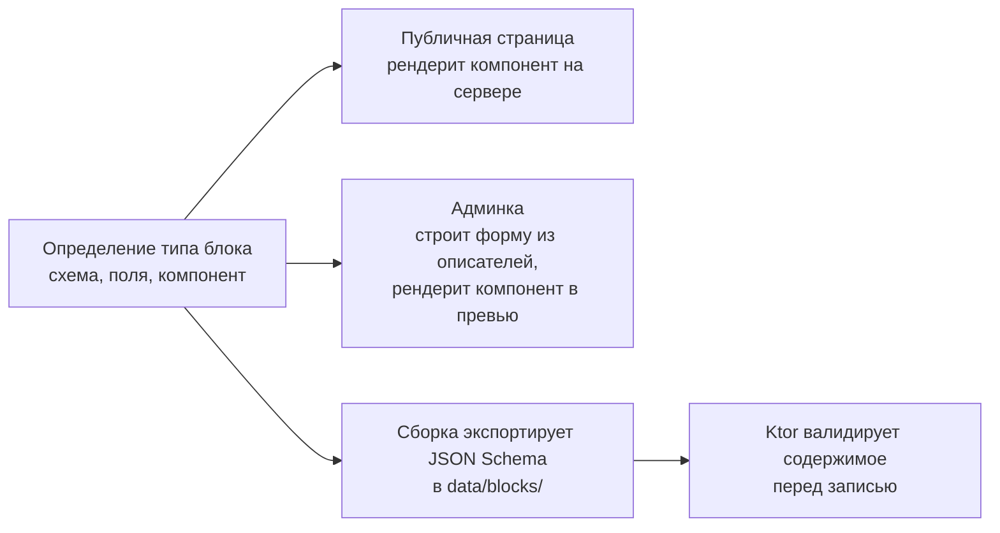

Это решило вопрос выбора движка публичных страниц. Если бы страницы рендерил Ktor на Kotlin, каждый тип блока пришлось бы реализовывать дважды — для сайта и для превью, — и они неизбежно разошлись бы. Серверная валидация при этом не пропадает: на сборке схемы Zod конвертируются в JSON Schema, и Ktor читает их через порт `BlockSchemaProvider`.

Размещение по слоям FSD подчинено тому же принципу инверсии зависимостей, что и композиционный корень бэкенда:

- `shared/blocks` — контракт `BlockType`, `FieldDescriptor`, `BlockRegistry`, контекст и хук `useBlockRegistry()`;
- `widgets/hero-block`, `widgets/feature-grid-block`, … — по одному слайсу на тип блока;
- `app/providers/block-registry` — собирает реестр из конкретных блоков и предоставляет его;
- `widgets/block-renderer` — рендерит по данным, обращаясь к реестру через хук, и **не импортирует ни одного конкретного блока**.

Благодаря этому правило FSD «слайсы одного слоя не видят друг друга» соблюдается без единой оговорки.

### 7.2. Черновики, версии и публикация

```kotlin
package tallyvane.content.application.port

interface ContentWriter {
    suspend fun saveDraft(page: PageId, revision: NewRevision): RevisionId
    suspend fun publish(page: PageId, revision: RevisionId, at: Instant): PublishOutcome
    suspend fun unpublish(page: PageId): PublishOutcome
    suspend fun restore(page: PageId, revision: RevisionId): RevisionId
}

interface ContentReader {
    suspend fun published(slug: Slug, kind: ContentKind): PublishedPage?
    suspend fun draft(page: PageId): PageRevision?
    suspend fun revisions(page: PageId, limit: Int): List<RevisionSummary>
    suspend fun listPublished(kind: ContentKind, cursor: Cursor?): Page<PublishedSummary>
}

interface BlockSchemaProvider {
    fun schemaFor(kind: String): JsonSchema?
    val knownKinds: Set<String>
}

/** Сброс кэша отрендеренных страниц. Реализация знает про конкретный фронтенд. */
interface ContentCacheInvalidator {
    suspend fun invalidate(tags: Set<CacheTag>): InvalidationOutcome
}
```

Страница — это идентичность, тип, слаг и указатель на опубликованную версию. Всё содержимое живёт в версиях. Сохранение черновика создаёт версию; публикация переставляет указатель. Отсюда бесплатно получаются история, откат и предпросмотр неопубликованного.

### 7.3. Мгновенная публикация

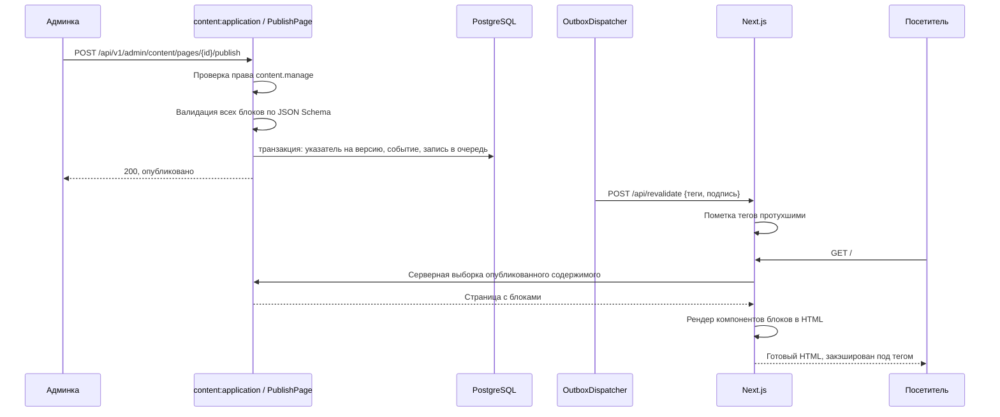

Публикация возвращает управление сразу после коммита: инвалидация уходит через очередь и потому не может ни задержать ответ, ни потеряться при сбое. Если Next в этот момент недоступен, диспетчер повторит.

### 7.4. Роли и доступ

Модель намеренно простая: у пользователя набор возможностей, а не иерархия ролей. `console.use` — доступ к собственному трекеру, есть у каждого. `content.manage` — управление публичным контентом и редактируемыми строками, только у владельца.

Проверка выполняется в use case, а не в маршруте, и продублирована политиками видимости строк. Маршрут, забывший проверку, не станет дырой: use case откажет.

### 7.5. Что редактируется

| Тип контента | Слаг | Особенности |
| --- | --- | --- |
| Лендинг | `/` | Произвольный набор блоков |
| Записи блога | `/blog/{slug}` | Список, дата, теги, разметка и блоки |
| Документация | `/docs/{path}` | Древовидная навигация, оглавление, якоря |
| Чейнджлог | `/changelog` | Записи с версией и датой |
| Юридические страницы | `/legal/{slug}` | Простой текст, дата вступления в силу |
| Строки приложения | не публикуется | Пары «ключ — значение» поверх базового словаря |

---

## 8. Модель данных

### 8.1. Общие соглашения

- **Схема на модуль.** Таблицы живут в схеме, названной по владеющему модулю.
- **Идентификаторы:** `uuid` со значениями UUIDv7 — монотонность по времени даёт кластеризацию в индексах и естественную сортировку.
- **Время:** только `timestamptz` в UTC. Различаются `occurred_at` и `recorded_at`.
- **Деньги:** `bigint` в центах с суффиксом `_cents`. Плавающая точка для денег не используется нигде.
- **Проценты и доли:** целое число базисных пунктов.
- **Перечисления:** `text` с ограничением `CHECK`; нативные типы Postgres не применяются, потому что их изменение требует блокирующей миграции.
- **Мультитенантность:** `user_id` на каждой пользовательской таблице, составные индексы начинаются с него, политики видимости строк как второй рубеж.
- **Мягкое удаление:** `deleted_at` на пользовательских сущностях; события и отправленные документы не удаляются никогда.
- **Соединения между схемами запрещены,** внешние ключи разрешены.

### 8.2. Диаграмма связей

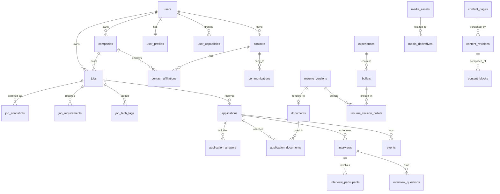

### 8.3. Схема `identity`

```sql
create schema identity;

create table identity.users (
    id           uuid primary key,
    email        citext not null unique,
    display_name text   not null,
    created_at   timestamptz not null default now(),
    disabled_at  timestamptz
);

create table identity.user_identities (
    id         uuid primary key,
    user_id    uuid not null references identity.users(id) on delete cascade,
    provider   text not null check (provider in ('google','github')),
    subject    text not null,
    created_at timestamptz not null default now(),
    unique (provider, subject)
);

create table identity.user_capabilities (
    user_id    uuid not null references identity.users(id) on delete cascade,
    capability text not null check (capability in ('console.use','content.manage')),
    granted_at timestamptz not null default now(),
    primary key (user_id, capability)
);

create table identity.user_profiles (
    user_id                     uuid primary key references identity.users(id) on delete cascade,
    residence_state             char(2)  not null,
    residence_locality          text,
    filing_status               text     not null check (filing_status in ('single','married_joint','married_separate','head_of_household')),
    dependents                  smallint not null default 0 check (dependents >= 0),
    retirement_contribution_bp  integer  not null default 0 check (retirement_contribution_bp between 0 and 10000),
    pretax_health_monthly_cents bigint   not null default 0,
    hsa_annual_cents            bigint   not null default 0,
    work_authorization          text     not null check (work_authorization in ('citizen','permanent_resident','ead','requires_sponsorship')),
    weekly_application_goal     smallint not null default 0,
    timezone                    text     not null default 'America/New_York',
    updated_at                  timestamptz not null default now()
);
```

### 8.4. Схема `jobs`

```sql
create schema jobs;

create table jobs.companies (
    id              uuid primary key,
    user_id         uuid not null references identity.users(id) on delete cascade,
    name            text not null,
    normalized_name text not null,
    website         text,
    careers_url     text,
    size_bucket     text check (size_bucket in ('1-10','11-50','51-200','201-1000','1001-5000','5000+')),
    industry        text,
    stage           text check (stage in ('startup','scaleup','public','enterprise','agency','nonprofit')),
    is_agency       boolean not null default false,
    notes           text,
    created_at      timestamptz not null default now(),
    updated_at      timestamptz not null default now(),
    deleted_at      timestamptz,
    unique (user_id, normalized_name)
);

create table jobs.jobs (
    id                   uuid primary key,
    user_id              uuid not null references identity.users(id) on delete cascade,
    company_id           uuid not null references jobs.companies(id),
    agency_company_id    uuid references jobs.companies(id),
    title                text not null,
    seniority            text check (seniority in ('junior','middle','senior','staff','principal','lead','manager','director')),
    source_kind          text not null check (source_kind in ('linkedin','greenhouse','lever','ashby','workday','smartrecruiters','other_board','company_site','recruiter_inbound','referral','telegram')),
    source_url           text,
    external_id          text,
    work_mode            text check (work_mode in ('remote','hybrid','onsite')),
    onsite_days_per_week smallint check (onsite_days_per_week between 0 and 7),
    location_city        text,
    location_state       char(2),
    allowed_states       char(2)[] not null default '{}',
    employment_type      text check (employment_type in ('w2_fulltime','w2_contract','c2c','1099')),
    salary_min_cents     bigint,
    salary_max_cents     bigint,
    salary_period        text check (salary_period in ('year','month','hour')),
    posted_at            date,
    captured_at          timestamptz not null,
    interest_rating      smallint check (interest_rating between 1 and 5),
    fit_rating           smallint check (fit_rating between 1 and 5),
    disqualifiers        text[] not null default '{}',
    extraction_confidence text not null default 'unknown' check (extraction_confidence in ('high','medium','low','unknown')),
    notes                text,
    created_at           timestamptz not null default now(),
    updated_at           timestamptz not null default now(),
    deleted_at           timestamptz,
    constraint salary_range_valid check (
        salary_min_cents is null or salary_max_cents is null or salary_min_cents <= salary_max_cents
    )
);

create table jobs.job_snapshots (
    id           uuid primary key,
    user_id      uuid not null references identity.users(id) on delete cascade,
    job_id       uuid not null references jobs.jobs(id) on delete cascade,
    captured_at  timestamptz not null,
    source_url   text,
    raw_text     text not null,
    raw_html     text,
    content_hash char(64) not null,
    unique (job_id, content_hash)
);

create table jobs.job_requirements (
    id       uuid primary key,
    user_id  uuid not null references identity.users(id) on delete cascade,
    job_id   uuid not null references jobs.jobs(id) on delete cascade,
    kind     text not null check (kind in ('must','nice')),
    text     text not null,
    position smallint not null
);

create table jobs.job_tech_tags (
    user_id uuid not null references identity.users(id) on delete cascade,
    job_id  uuid not null references jobs.jobs(id) on delete cascade,
    tag     text not null,
    primary key (job_id, tag)
);
```

Архив снимков версионируется: если вакансию переписали, а расширение захватило повторно, появляется вторая запись с другим хэшем, первая остаётся. Уникальность по паре гарантирует, что повторный захват без изменений не плодит мусор.

### 8.5. Схема `applications`

```sql
create schema applications;

create table applications.applications (
    id                      uuid primary key,
    user_id                 uuid not null references identity.users(id) on delete cascade,
    job_id                  uuid not null references jobs.jobs(id),
    attempt_no              smallint not null default 1,
    applied_via             text not null check (applied_via in ('linkedin_easy_apply','ats_form','company_email','referral','agency','recruiter_request','other')),
    applied_at              timestamptz not null,
    stated_salary_min_cents bigint,
    stated_salary_max_cents bigint,
    stated_salary_period    text check (stated_salary_period in ('year','month','hour')),
    earliest_start_date     date,
    notes                   text,
    created_at              timestamptz not null default now(),
    updated_at              timestamptz not null default now(),
    unique (job_id, attempt_no)
);

create table applications.application_answers (
    id             uuid primary key,
    user_id        uuid not null references identity.users(id) on delete cascade,
    application_id uuid not null references applications.applications(id) on delete cascade,
    question       text not null,
    answer         text not null,
    position       smallint not null
);

create table applications.application_documents (
    application_id uuid not null references applications.applications(id) on delete cascade,
    document_id    uuid not null references documents.documents(id),
    role           text not null check (role in ('resume','cover_letter','portfolio','other')),
    primary key (application_id, document_id, role)
);

create table applications.events (
    id             uuid primary key,
    user_id        uuid not null references identity.users(id) on delete cascade,
    type           text not null,
    occurred_at    timestamptz not null,
    recorded_at    timestamptz not null default now(),
    source         text not null check (source in ('manual','extension','email','system','api')),
    application_id uuid references applications.applications(id) on delete cascade,
    job_id         uuid references jobs.jobs(id) on delete cascade,
    contact_id     uuid references contacts.contacts(id) on delete set null,
    interview_id   uuid references applications.interviews(id) on delete set null,
    dedup_key      text,
    payload        jsonb not null default '{}',
    constraint has_subject check (
        application_id is not null or job_id is not null or contact_id is not null
    )
);

create unique index events_dedup on applications.events (user_id, dedup_key) where dedup_key is not null;

create table applications.interviews (
    id               uuid primary key,
    user_id          uuid not null references identity.users(id) on delete cascade,
    application_id   uuid not null references applications.applications(id) on delete cascade,
    round_no         smallint not null,
    kind             text not null check (kind in ('recruiter_screen','hiring_manager','technical','system_design','coding','behavioral','culture','panel','final','other')),
    scheduled_at     timestamptz,
    duration_minutes smallint,
    meeting_url      text,
    my_confidence    smallint check (my_confidence between 1 and 5),
    outcome          text check (outcome in ('pending','passed','failed','cancelled','no_show')),
    notes            text,
    created_at       timestamptz not null default now(),
    updated_at       timestamptz not null default now(),
    unique (application_id, round_no)
);

create table applications.interview_participants (
    interview_id uuid not null references applications.interviews(id) on delete cascade,
    contact_id   uuid not null references contacts.contacts(id),
    role         text not null check (role in ('interviewer','recruiter','observer','hiring_manager')),
    primary key (interview_id, contact_id)
);

create table applications.interview_questions (
    id           uuid primary key,
    user_id      uuid not null references identity.users(id) on delete cascade,
    interview_id uuid not null references applications.interviews(id) on delete cascade,
    question     text not null,
    my_answer    text,
    difficulty   smallint check (difficulty between 1 and 5),
    asked_by     uuid references contacts.contacts(id),
    position     smallint not null
);

create table applications.state_projection (
    application_id     uuid primary key references applications.applications(id) on delete cascade,
    user_id            uuid not null,
    derived_status     text not null,
    last_outbound_at   timestamptz,
    last_inbound_at    timestamptz,
    next_action_due_at timestamptz,
    interviews_count   smallint not null default 0,
    recomputed_at      timestamptz not null default now()
);

create table applications.calendar_feed_tokens (
    token      text primary key,
    user_id    uuid not null references identity.users(id) on delete cascade,
    created_at timestamptz not null default now(),
    revoked_at timestamptz
);
```

Журнал событий только на вставку: изменение и удаление запрещены триггером — последний рубеж защиты от порчи истории. Названная пользователем зарплата хранится отдельно от вилки вакансии, потому что перед следующим этапом надо видеть, какую цифру ты уже озвучил.

### 8.6. Схема `contacts`

```sql
create schema contacts;

create table contacts.contacts (
    id           uuid primary key,
    user_id      uuid not null references identity.users(id) on delete cascade,
    full_name    text not null,
    headline     text,
    linkedin_url text,
    email        citext,
    phone        text,
    notes        text,
    created_at   timestamptz not null default now(),
    updated_at   timestamptz not null default now(),
    deleted_at   timestamptz
);

create unique index contacts_linkedin on contacts.contacts (user_id, linkedin_url) where linkedin_url is not null;

create table contacts.contact_affiliations (
    id         uuid primary key,
    user_id    uuid not null references identity.users(id) on delete cascade,
    contact_id uuid not null references contacts.contacts(id) on delete cascade,
    company_id uuid not null references jobs.companies(id) on delete cascade,
    role_kind  text not null check (role_kind in ('recruiter','hiring_manager','engineer','executive','agency_recruiter','other')),
    role_title text,
    started_on date,
    ended_on   date,
    is_current boolean not null default true
);

create table contacts.communications (
    id               uuid primary key,
    user_id          uuid not null references identity.users(id) on delete cascade,
    contact_id       uuid references contacts.contacts(id) on delete set null,
    job_id           uuid references jobs.jobs(id) on delete set null,
    application_id   uuid references applications.applications(id) on delete set null,
    channel          text not null check (channel in ('linkedin_dm','linkedin_connection_note','email','phone_call','video_call','telegram','ats_form','other')),
    direction        text not null check (direction in ('outbound','inbound')),
    occurred_at      timestamptz not null,
    body             text not null,
    outcome          text not null default 'pending' check (outcome in ('pending','replied','accepted','declined','ignored','bounced','not_applicable')),
    next_step        text,
    next_step_due_at timestamptz,
    template_id      uuid references contacts.message_templates(id) on delete set null,
    created_at       timestamptz not null default now()
);

create table contacts.message_templates (
    id          uuid primary key,
    user_id     uuid not null references identity.users(id) on delete cascade,
    name        text not null,
    channel     text not null,
    body        text not null,
    variables   text[] not null default '{}',
    archived_at timestamptz,
    created_at  timestamptz not null default now(),
    unique (user_id, name)
);
```

Связь человека с компанией вынесена отдельно, потому что рекрутеры меняют работу. Один контакт может иметь несколько аффилиаций во времени, и система покажет: этот человек писал тебе год назад из другой компании.

### 8.7. Схемы `documents` и `resume`

```sql
create schema documents;

create table documents.documents (
    id                uuid primary key,
    user_id           uuid not null references identity.users(id) on delete cascade,
    kind              text not null check (kind in ('resume','cover_letter','portfolio','other')),
    title             text not null,
    blob_sha256       char(64) not null,
    mime_type         text not null,
    byte_size         integer not null,
    text_content      text,
    origin            text not null check (origin in ('uploaded','generated')),
    resume_version_id uuid,
    created_at        timestamptz not null default now()
);

create schema resume;

create table resume.profiles (
    id            uuid primary key,
    user_id       uuid not null references identity.users(id) on delete cascade,
    name          text not null,
    headline      text not null,
    summary       text,
    contact_block jsonb not null,
    created_at    timestamptz not null default now(),
    unique (user_id, name)
);

create table resume.experiences (
    id           uuid primary key,
    user_id      uuid not null references identity.users(id) on delete cascade,
    company_name text not null,
    title        text not null,
    location     text,
    started_on   date not null,
    ended_on     date,
    position     smallint not null
);

create table resume.bullets (
    id            uuid primary key,
    user_id       uuid not null references identity.users(id) on delete cascade,
    experience_id uuid references resume.experiences(id) on delete cascade,
    text          text not null,
    tags          text[] not null default '{}',
    impact_metric text,
    position      smallint not null,
    archived_at   timestamptz
);

create table resume.skills (
    id       uuid primary key,
    user_id  uuid not null references identity.users(id) on delete cascade,
    name     text not null,
    category text not null,
    position smallint not null,
    unique (user_id, name)
);

create table resume.versions (
    id            uuid primary key,
    user_id       uuid not null references identity.users(id) on delete cascade,
    profile_id    uuid not null references resume.profiles(id),
    name          text not null,
    target_job_id uuid references jobs.jobs(id) on delete set null,
    template_id   text not null,
    section_order text[] not null,
    ats_verdict   text check (ats_verdict in ('pass','warn','fail')),
    created_at    timestamptz not null default now()
);

create table resume.version_bullets (
    version_id    uuid not null references resume.versions(id) on delete cascade,
    bullet_id     uuid not null references resume.bullets(id),
    position      smallint not null,
    override_text text,
    primary key (version_id, bullet_id)
);
```

Банк буллетов делает возможными и подгонку под вакансию, и сравнение версий. Версия не копирует тексты, а ссылается на буллеты с возможностью локального переопределения. Разница двух версий — разница множеств выбранных буллетов, вычисляемая запросом, а не текстовым сравнением PDF.

### 8.8. Схема `content`

```sql
create schema content;

create table content.pages (
    id                    uuid primary key,
    kind                  text not null check (kind in ('landing','post','doc','changelog','legal')),
    slug                  text not null,
    published_revision_id uuid,
    published_at          timestamptz,
    created_at            timestamptz not null default now(),
    updated_at            timestamptz not null default now(),
    archived_at           timestamptz,
    unique (kind, slug)
);

create table content.revisions (
    id          uuid primary key,
    page_id     uuid not null references content.pages(id) on delete cascade,
    revision_no integer not null,
    title       text not null,
    excerpt     text,
    seo         jsonb not null default '{}',
    metadata    jsonb not null default '{}',
    author_id   uuid not null references identity.users(id),
    note        text,
    created_at  timestamptz not null default now(),
    unique (page_id, revision_no)
);

alter table content.pages
    add constraint published_revision_fk
    foreign key (published_revision_id) references content.revisions(id);

create table content.blocks (
    id          uuid primary key,
    revision_id uuid not null references content.revisions(id) on delete cascade,
    kind        text not null,
    position    smallint not null,
    data        jsonb not null,
    unique (revision_id, position)
);

create table content.strings (
    namespace  text not null,
    key        text not null,
    value      text not null,
    updated_by uuid references identity.users(id),
    updated_at timestamptz not null default now(),
    primary key (namespace, key)
);

create table content.media_assets (
    id               uuid primary key,
    user_id          uuid not null references identity.users(id) on delete cascade,
    original_sha256  char(64) not null,
    mime_type        text not null,
    width            integer not null,
    height           integer not null,
    byte_size        integer not null,
    alt_text         text,
    dominant_color   char(7),
    blur_placeholder text,
    created_at       timestamptz not null default now(),
    unique (user_id, original_sha256)
);

create table content.media_derivatives (
    asset_id    uuid not null references content.media_assets(id) on delete cascade,
    width       integer not null,
    format      text not null check (format in ('webp','jpeg','png','avif')),
    blob_sha256 char(64) not null,
    byte_size   integer not null,
    primary key (asset_id, width, format)
);
```

Три решения здесь заслуживают пояснения. **Содержимое живёт в версиях, а не в странице** — отсюда бесплатно получаются откат, история и предпросмотр. **Блоки — строки, а не массив в JSON** — иначе нельзя спросить базу, где используется блок такого типа и где ссылаются на это изображение. **Строки приложения не привязаны к пользователю** — это глобальный слой продукта, перекрывающий базовый словарь.

### 8.9. Схема `platform`

```sql
create schema platform;

create table platform.outbox_messages (
    id           uuid primary key,
    user_id      uuid references identity.users(id) on delete cascade,
    channel      text not null,
    payload      jsonb not null,
    available_at timestamptz not null default now(),
    attempts     smallint not null default 0,
    last_error   text,
    delivered_at timestamptz,
    created_at   timestamptz not null default now()
);

create table platform.llm_calls (
    id            uuid primary key,
    user_id       uuid not null references identity.users(id) on delete cascade,
    purpose       text not null,
    model         text not null,
    prompt_hash   char(64) not null,
    input_tokens  integer not null,
    output_tokens integer not null,
    cost_cents    integer not null,
    latency_ms    integer not null,
    from_cache    boolean not null default false,
    created_at    timestamptz not null default now()
);

create table platform.llm_cache (
    prompt_hash char(64) primary key,
    model       text not null,
    response    jsonb not null,
    hits        integer not null default 0,
    created_at  timestamptz not null default now()
);

create schema reminders;

create table reminders.settings (
    user_id        uuid not null references identity.users(id) on delete cascade,
    rule_code      text not null,
    enabled        boolean not null default true,
    threshold_days smallint,
    config         jsonb not null default '{}',
    primary key (user_id, rule_code)
);

create table reminders.deliveries (
    id           uuid primary key,
    user_id      uuid not null references identity.users(id) on delete cascade,
    rule_code    text not null,
    dedup_key    text not null,
    subject_type text not null,
    subject_id   uuid not null,
    due_at       timestamptz not null,
    sent_at      timestamptz,
    dismissed_at timestamptz,
    created_at   timestamptz not null default now(),
    unique (user_id, dedup_key)
);
```

### 8.10. Индексы

```sql
create index jobs_user_captured   on jobs.jobs (user_id, captured_at desc) where deleted_at is null;
create index jobs_user_company    on jobs.jobs (user_id, company_id) where deleted_at is null;
create index jobs_tags_gin        on jobs.job_tech_tags using gin (tag gin_trgm_ops);
create index apps_user_applied    on applications.applications (user_id, applied_at desc);
create index events_app_occurred  on applications.events (application_id, occurred_at);
create index events_user_occurred on applications.events (user_id, occurred_at desc);
create index interviews_upcoming  on applications.interviews (user_id, scheduled_at) where outcome = 'pending';
create index projection_due       on applications.state_projection (user_id, next_action_due_at)
    where next_action_due_at is not null;
create index comms_contact_time   on contacts.communications (user_id, contact_id, occurred_at desc);
create index comms_next_step_due  on contacts.communications (user_id, next_step_due_at)
    where next_step_due_at is not null and outcome = 'pending';
create index outbox_pending       on platform.outbox_messages (available_at) where delivered_at is null;
create index pages_published      on content.pages (kind, published_at desc) where published_revision_id is not null;
create index blocks_by_kind       on content.blocks (kind);
```

Полнотекстовый поиск по архиву вакансий, текстам резюме и контенту — через колонку `tsvector` с индексом GIN, обновляемую триггером.

### 8.11. Инварианты уровня базы

- Запрет изменения и удаления в журнале событий через триггер.
- Запрет удаления документа, на который ссылается подача.
- Согласованность владельца между связанными строками — составные внешние ключи вместо простых, чтобы физически исключить связывание чужих записей.
- Политики видимости строк, ограничивающие выборку текущим пользователем из сессионной переменной.
- Опубликованная версия страницы обязана принадлежать этой же странице.

### 8.12. Миграции

Flyway, каталог миграций принадлежит модулю, `platform:persistence` собирает их в общий поток и применяет в порядке версий. Миграция никогда не редактируется после слияния. Разрушающие изменения разбиваются на пары «добавить новое — переключить код — удалить старое» в разных релизах. Каждая проверяется в CI на пустой и на заполненной базе.

---

## 9. Событийная модель

### 9.1. Два вида событий

Важно не путать. **Доменные события журнала** — это факты предметной области, которые хранятся в `applications.events` навсегда и из которых выводится статус. **Интеграционные события между модулями** — это уведомления вида «у меня кое-что произошло», которые доставляются через outbox и не хранятся как летопись.

Часто одно порождает другое: фиксация подачи записывает `application.submitted` в журнал и публикует `ApplicationSubmitted` соседям. Но это разные вещи с разным временем жизни.

### 9.2. Словарь событий журнала

| Тип | Субъект | Смысл | Источник |
| --- | --- | --- | --- |
| `job.saved` | job | Вакансия добавлена в watchlist | extension, manual |
| `job.updated` | job | Захвачена новая версия описания | extension |
| `job.discarded` | job | Отброшена без подачи | manual |
| `application.submitted` | application | Подача отправлена | manual, extension |
| `application.acknowledged` | application | Пришло автоподтверждение | email, manual |
| `application.rejected` | application | Отказ | email, manual |
| `application.withdrawn` | application | Отзыв заявки | manual |
| `application.position_closed` | application | Вакансия закрыта без решения | email, manual |
| `interview.scheduled` | interview | Раунд назначен | manual, email |
| `interview.completed` | interview | Раунд состоялся | manual |
| `interview.cancelled` | interview | Раунд отменён | manual, email |
| `offer.received` | application | Получен оффер | email, manual |
| `offer.accepted` | application | Оффер принят | manual |
| `offer.declined` | application | Оффер отклонён | manual |
| `contact.connection_sent` | contact | Отправлен запрос на связь | extension, manual |
| `contact.connection_accepted` | contact | Запрос принят | extension, manual |
| `message.sent` | contact | Исходящее сообщение | extension, manual |
| `message.received` | contact | Входящее сообщение | email, manual |
| `content.published` | page | Страница опубликована | api |
| `content.unpublished` | page | Страница снята с публикации | api |

Тип — строка вида `агрегат.действие` в прошедшем времени. Новые типы добавляются без миграции схемы; политика вывода статуса игнорирует незнакомые типы, что делает расширение обратно совместимым.

### 9.3. Вывод статуса

```kotlin
package tallyvane.applications.domain

class DefaultApplicationStatusPolicy(
    private val ghostingThreshold: Duration,
) : ApplicationStatusPolicy {

    override fun statusOf(events: List<ApplicationEvent>, now: Instant): ApplicationStatus {
        val terminal = events.lastOrNull { it.type in TERMINAL_TYPES }
        if (terminal != null) return terminal.toTerminalStatus()

        val progressive = events
            .filter { it.type in PROGRESSIVE_TYPES }
            .maxByOrNull { it.occurredAt }
            ?: return ApplicationStatus.Saved

        val lastInbound = events.filter { it.isInbound }.maxOfOrNull { it.occurredAt }
        val lastOutbound = events.filter { it.isOutbound }.maxOfOrNull { it.occurredAt }
        val silent = lastOutbound != null &&
            (lastInbound == null || lastInbound < lastOutbound) &&
            now - lastOutbound > ghostingThreshold

        return if (silent) ApplicationStatus.Ghosted(since = lastOutbound)
               else progressive.toProgressiveStatus()
    }
}
```

Функция чистая и детерминированная при фиксированном моменте, полностью покрывается табличными тестами. Изменение порога молчания не требует ни миграции, ни пересчёта.

### 9.4. Идемпотентность

Любой источник, способный доставить событие дважды, обязан передать ключ дедупликации: расширение — из адреса, типа действия и даты в локальной зоне; почтовый импорт — из `Message-ID`; планировщик — из кода правила, идентификатора субъекта и номера окна. Вставка с существующим ключом завершается конфликтом, который трактуется как успех. Клиент никогда не видит ошибку из-за повторной отправки.

---

## 10. Ключевые сценарии и потоки

### 10.1. Захват вакансии из расширения

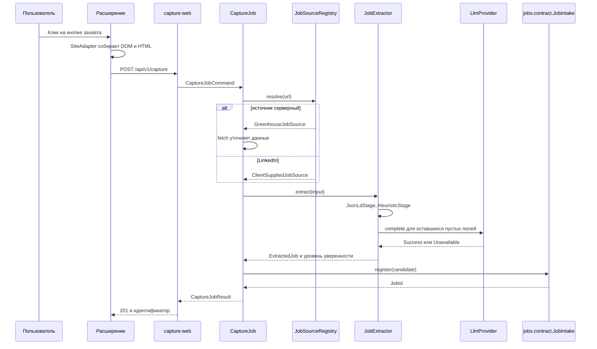

Обрати внимание: `capture` не пишет в базу вакансий сам, он передаёт кандидата в контракт модуля `jobs`. Транзакция, дедупликация по хэшу, запись снимка и публикация события — ответственность владельца данных.

При недоступности LLM поток не прерывается: структура собирается из детерминированных стадий, уверенность помечается низкой, карточка требует проверки.

### 10.2. Подача

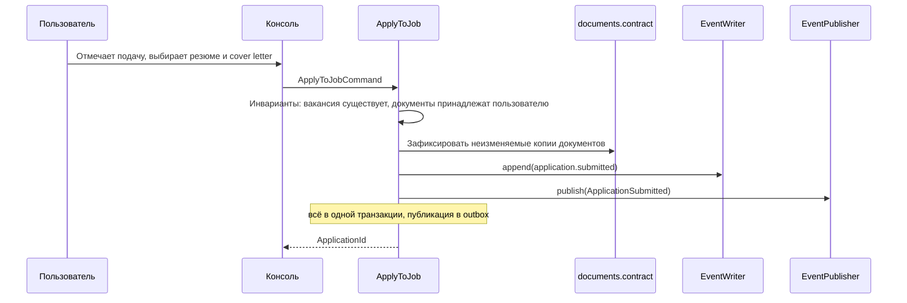

Модули `reminders` и `analytics` узнают о подаче из события и обновляют своё состояние. Модуль `applications` о них не знает.

### 10.3. Входящее письмо

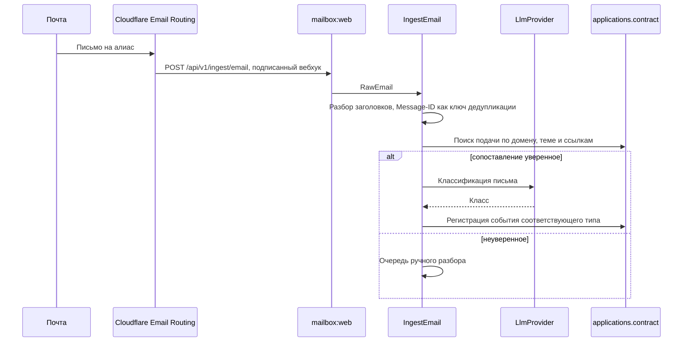

Автоматика никогда не создаёт терминальное событие при низкой уверенности.

### 10.4. Генерация резюме

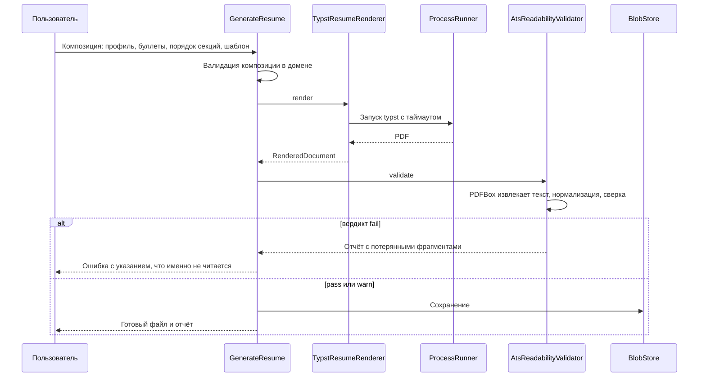

### 10.5. Цикл напоминаний

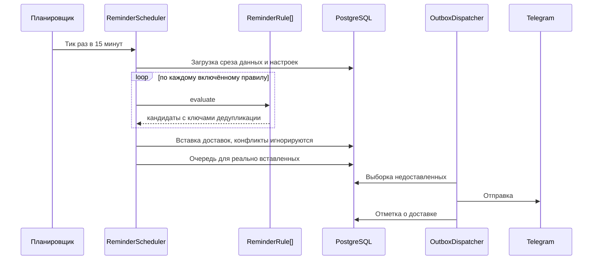

Планировщик и диспетчер разделены намеренно: первый отвечает за «что назрело», второй за «как доставить». Падение Telegram не влияет на вычисление напоминаний, а изменение правил не влияет на доставку.

### 10.6. Сборка брифа

Композитор запрашивает шесть секций параллельно, каждую со своим бюджетом времени. Не уложившиеся отдают заглушку. Результат кэшируется ненадолго и сбрасывается при появлении нового события по подаче. Тяжёлая часть — генерация вероятных вопросов через модель — выполняется заранее, по срабатыванию правила о предстоящем интервью за сутки до звонка: открытие брифа за десять минут до созвона не должно ждать модель.

### 10.7. Публикация контента

Описана в разделе [7.3](#73-мгновенная-публикация).

---

## 11. HTTP API

### 11.1. Соглашения

- База `/api/v1`; версия в пути, а не в заголовке.
- JSON, поля в `snake_case`, время в ISO 8601 с зоной.
- Деньги — целое число центов в поле с суффиксом `_cents`.
- Небезопасные методы принимают заголовок `Idempotency-Key`.
- Пагинация курсорная, ответ содержит `next_cursor`.
- `PATCH` с семантикой слияния: отсутствующие поля не трогаются, явный `null` очищает.

Каждый модуль регистрирует свои маршруты сам через контракт платформы:

```kotlin
package tallyvane.platform.http

interface RouteModule {
    val basePath: String
    fun install(route: Route)
}
```

`app` собирает список реализаций и монтирует их. Ни один модуль не знает о маршрутах другого.

### 11.2. Аутентификация

Четыре вида субъектов, четыре механизма. **Пользователь в браузере** — OAuth 2.0 Authorization Code с PKCE через Google, сессионная cookie с флагами `HttpOnly`, `Secure`, `SameSite=Lax`, сессии в базе и отзываемы. **Расширение** — долгоживущий токен устройства в заголовке, область действия ограничена эндпоинтами захвата. **Календарный фид** — неугадываемый токен в пути, только чтение. **Серверный рендер публичных страниц** — без аутентификации, публичные эндпоинты отдают только опубликованное; предпросмотр черновика требует подписанного одноразового токена.

Вебхук почты аутентифицируется подписью и проверкой временной метки против повторного воспроизведения. Вебхук инвалидации кэша подписывается общим секретом.

### 11.3. Эндпоинты консоли

```
POST   /api/v1/capture                       Захват вакансии из расширения
GET    /api/v1/jobs                          Список с фильтрами и курсором
POST   /api/v1/jobs                          Создание вручную
GET    /api/v1/jobs/{id}                     Карточка с требованиями, тегами, снимками
PATCH  /api/v1/jobs/{id}
GET    /api/v1/jobs/{id}/snapshots/{sid}     Архивная версия описания
POST   /api/v1/jobs/{id}/reextract           Повторный разбор

POST   /api/v1/applications                  Фиксация подачи
GET    /api/v1/applications/{id}
GET    /api/v1/applications/{id}/timeline    Журнал событий в хронологии
GET    /api/v1/applications/{id}/brief       Интервью-бриф
POST   /api/v1/applications/{id}/events      Добавление события

GET    /api/v1/contacts
POST   /api/v1/contacts
GET    /api/v1/contacts/{id}/history         Переписка и аффилиации
POST   /api/v1/communications
GET    /api/v1/templates
POST   /api/v1/templates/{id}/render

GET    /api/v1/resume/bank                   Профили, опыт, буллеты, навыки
POST   /api/v1/resume/versions
POST   /api/v1/resume/versions/{id}/render   Рендер и проверка читаемости
GET    /api/v1/resume/versions/{a}/diff/{b}
GET    /api/v1/documents/{id}/content

POST   /api/v1/compensation/evaluate
GET    /api/v1/compensation/tax-years

GET    /api/v1/today
GET    /api/v1/analytics/funnel
GET    /api/v1/analytics/activity
GET    /api/v1/analytics/rejections

GET    /api/v1/settings/reminders
PUT    /api/v1/settings/reminders/{code}
POST   /api/v1/settings/calendar-token/rotate

GET    /calendar/{token}.ics                 Публичный фид, вне /api
POST   /api/v1/ingest/email                  Вебхук почты
GET    /api/v1/health
```

### 11.4. Публичные эндпоинты контента

```
GET    /api/v1/content/pages/{kind}/{slug}   Опубликованная страница с блоками
GET    /api/v1/content/pages/{kind}          Список для индексов блога и документации
GET    /api/v1/content/strings               Переопределения строк интерфейса
GET    /api/v1/content/sitemap               Данные для карты сайта
GET    /media/{assetId}/{width}.{format}     Производное изображение, вечный кэш
```

### 11.5. Эндпоинты админки

Требуют возможности `content.manage`.

```
GET    /api/v1/admin/content/pages
POST   /api/v1/admin/content/pages
GET    /api/v1/admin/content/pages/{id}
POST   /api/v1/admin/content/pages/{id}/draft
POST   /api/v1/admin/content/pages/{id}/publish
POST   /api/v1/admin/content/pages/{id}/unpublish
GET    /api/v1/admin/content/pages/{id}/revisions
POST   /api/v1/admin/content/pages/{id}/restore/{revisionId}
POST   /api/v1/admin/content/pages/{id}/preview-token

GET    /api/v1/admin/content/strings
PUT    /api/v1/admin/content/strings/{ns}/{key}

POST   /api/v1/admin/media
GET    /api/v1/admin/media
DELETE /api/v1/admin/media/{id}
```

### 11.6. Ошибки

Единый формат, совместимый с RFC 9457:

```json
{
  "type": "https://tallyvane.com/errors/validation-failed",
  "title": "Validation failed",
  "status": 422,
  "detail": "Salary minimum exceeds maximum",
  "instance": "/api/v1/jobs",
  "errors": [{ "field": "salary_min_cents", "code": "range.invalid" }]
}
```

Доменные исключения наружу не пролезают: в `platform:http` есть единственный обработчик, отображающий типы результата use case в HTTP-коды. Стек-трейсы в ответ не попадают никогда.

### 11.7. Контракт как артефакт

Спецификация OpenAPI не пишется руками и не генерируется из кода — она **является** источником истины и лежит в `docs/openapi.yaml`. Из неё генерируются типы TypeScript для фронтенда и для расширения по отдельности, а в будущем — модели для клиента на Kotlin Multiplatform. В CI выполняется проверка обратной совместимости: удаление поля или сужение типа ломает сборку.

---

## 12. Фронтенд: Feature-Sliced Design

### 12.1. Слои и порядок

FSD применяется строго, без оговорок. Шесть слоёв, каждый может импортировать только из строго нижележащих.

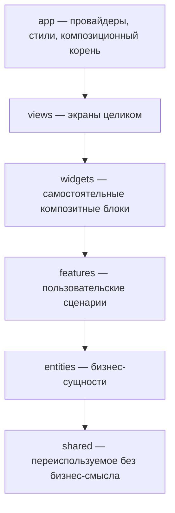

Канонический слой `pages` переименован в `views`, потому что в проекте на Next.js слово `pages` перегружено и провоцирует путаницу с маршрутизацией. Это единственное отступление от канонических имён, и оно зафиксировано отдельным решением.

### 12.2. Структура каталогов

```
frontend/
├── app/                              Next.js App Router: ТОЛЬКО маршруты
│   ├── (public)/
│   │   ├── page.tsx
│   │   ├── blog/[slug]/page.tsx
│   │   ├── docs/[...path]/page.tsx
│   │   ├── changelog/page.tsx
│   │   ├── legal/[slug]/page.tsx
│   │   ├── sitemap.ts
│   │   └── robots.ts
│   ├── (console)/
│   │   ├── today/page.tsx
│   │   ├── pipeline/page.tsx
│   │   ├── jobs/[id]/page.tsx
│   │   ├── brief/[applicationId]/page.tsx
│   │   ├── contacts/page.tsx
│   │   ├── resume/page.tsx
│   │   ├── analytics/page.tsx
│   │   └── settings/page.tsx
│   ├── (admin)/
│   │   ├── pages/page.tsx
│   │   ├── pages/[id]/page.tsx
│   │   ├── media/page.tsx
│   │   └── strings/page.tsx
│   ├── api/revalidate/route.ts
│   └── proxy.ts
├── scripts/
│   └── generate-design-tokens.ts     единственная точка вызова компилятора токенов
└── src/
    ├── app/          провайдеры, глобальные стили, конфиг, сборка реестров
    ├── views/        экраны
    ├── widgets/      композитные блоки
    ├── features/     сценарии
    ├── entities/     сущности
    └── shared/
        ├── ui/
        │   ├── theme/                 источник и вывод дизайн-токенов, см. 12.10
        │   └── …                      примитивы интерфейса
        ├── api/                       клиент, сгенерированный из OpenAPI
        ├── i18n/                      движок строк и словари
        ├── blocks/                    контракт типа блока и реестра
        ├── lib/                       узкие именованные модули
        └── config/                    константы окружения
```

**Каталог `app/` в корне — не слой FSD, а адаптер маршрутизации.** Каждый файл маршрута состоит из одной строки:

```tsx
// app/(console)/today/page.tsx
export { TodayPage as default } from '@/views/today';
```

Правило проверяется скриптом: файл маршрута не длиннее пяти строк, не содержит ничего кроме реэкспорта и метаданных, и в нём нет ни JSX, ни импортов из слоёв ниже `views`. Одновременно скрипт запрещает файлы с именами `page.tsx`, `layout.tsx`, `route.ts`, `template.tsx`, `loading.tsx`, `error.tsx` где-либо внутри `src/` — так исключается любая двусмысленность между FSD-слоем `src/app` и маршрутизацией Next.

### 12.3. Слайсы и сегменты

Слой делится на слайсы по предметной области, слайс — на сегменты по технической природе.

```
src/features/apply-to-job/
├── index.ts          единственный публичный API слайса
├── ui/               компоненты
├── model/            состояние, хуки, бизнес-логика сценария
├── api/              обращения к серверу
├── lib/              вспомогательное, узкое, названное по смыслу
└── config/           константы сценария
```

Разрешённые сегменты: `ui`, `model`, `api`, `lib`, `config`. Любой другой каталог внутри слайса — ошибка валидации. Слои `app` и `shared` слайсов не имеют, только сегменты.

### 12.4. Правила импорта

1. **Направление.** Модуль импортирует только из строго нижележащих слоёв. `shared` не импортирует ниоткуда.
2. **Публичный API.** Импорт только через `index.ts` слайса: `@/features/apply-to-job` — можно, `@/features/apply-to-job/ui/ApplyButton` — нельзя.
3. **Изоляция слайсов.** Слайсы одного слоя не видят друг друга. Единственное исключение — кросс-импорты между сущностями через нотацию `@x`: слайс, к которому обращаются, сам объявляет, что именно и кому он открывает.

```
src/entities/job/
├── index.ts
└── @x/
    └── application.ts     то, что entities/application вправе взять из entities/job
```

4. **Никаких циклов** ни на уровне слайсов, ни на уровне файлов.
5. **`shared` не знает бизнеса.** В нём нет ни одного типа, отражающего предметную область найма.

### 12.5. Карта слайсов

**`shared`** — сегменты `ui` (дизайн-система: скомпилированные токены, раскладка на Tailwind, поведение примитивов из Base UI — см. [ADR-031](#22-журнал-архитектурных-решений); полная опись компонентов по уровням в `frontend/src/shared/ui/COMPONENTS.md`), `api` (сгенерированный из OpenAPI клиент и обвязка запросов), `i18n` (движок строк и словари), `blocks` (контракт типа блока и реестра), `lib` (узкие именованные модули), `config` (константы окружения).

**`entities`** — `job`, `company`, `application`, `contact`, `communication`, `document`, `resume-bullet`, `interview`, `content-page`, `media-asset`, `compensation`.

**`features`** — `capture-job`, `apply-to-job`, `log-event`, `rate-job`, `schedule-interview`, `record-communication`, `send-connection-request`, `compose-resume`, `render-resume`, `evaluate-compensation`, `filter-pipeline`, `global-search`, `configure-reminders`, `edit-page-blocks`, `publish-page`, `restore-revision`, `upload-media`, `edit-strings`.

**`widgets`** — `pipeline-table`, `pipeline-board`, `today-actions`, `job-summary-card`, `brief-layout`, `contact-history`, `resume-studio`, `funnel-chart`, `activity-chart`, `block-editor`, `block-renderer`, плюс по одному слайсу на тип контентного блока: `hero-block`, `feature-grid-block`, `faq-block`, `cta-block`, `screenshot-block`, `quote-block`.

**`views`** — `landing`, `blog-index`, `blog-post`, `doc-page`, `changelog`, `legal-page`, `today`, `pipeline`, `job-detail`, `brief`, `contacts`, `contact-detail`, `resume-studio`, `analytics`, `settings`, `admin-page-list`, `admin-page-editor`, `admin-media`, `admin-strings`.

**`app`** — провайдеры запросов, темы, строк и реестра блоков; глобальные стили; конфигурация.

### 12.6. Реестр блоков как композиционный корень фронтенда

Типы блоков — слайсы слоя `widgets`, и по правилу изоляции они не видят друг друга, а `block-renderer` не видит их. Разрешается это ровно так же, как на бэкенде: через инверсию зависимости и сборку в корне.

```typescript
// shared/blocks/index.ts — только контракт
export interface BlockRegistry { get(kind: string): BlockType<unknown> | undefined; }
export const useBlockRegistry: () => BlockRegistry;
export const BlockRegistryProvider: FC<{ registry: BlockRegistry; children: ReactNode }>;
```

```typescript
// app/providers/block-registry.tsx — единственное место, знающее все блоки
import { heroBlock } from '@/widgets/hero-block';
import { featureGridBlock } from '@/widgets/feature-grid-block';
// ...
export const blockRegistry = createRegistry([heroBlock, featureGridBlock, /* ... */]);
```

```typescript
// widgets/block-renderer — знает только контракт
const registry = useBlockRegistry();
const type = registry.get(block.kind);
```

Добавление типа блока: новый слайс в `widgets` и одна строка в провайдере. Ни рендерер, ни редактор, ни публичные страницы не открываются.

### 12.7. Стек

Next.js с App Router для маршрутизации и рендера публичных страниц; React и TypeScript в строгом режиме; TanStack Query для серверного состояния клиентских экранов; Tailwind CSS как механизм раскладки поверх сгенерированных токенов; Zod для валидации на границе.

Единственная внешняя зависимость, не являющаяся библиотекой общего назначения, — **движок дизайн-токенов**: отдельный опубликованный пакет, описанный в [12.10](#1210-дизайн-токены-движок-и-конвейер). Он подключается как зависимость времени сборки и в бандл не попадает.

Глобального хранилища состояния нет: серверное состояние держит Query, локальное — обычные хуки. В приложении, где почти все данные серверные, отдельный стор создавал бы вторую копию истины.

### 12.8. Кэширование публичных страниц

Страница помечается тегами при выборке содержимого: `page:{kind}:{slug}` и `content:all` для глобальных сбросов. После первого запроса результат отдаётся из кэша маршрута. Публикация в админке вызывает вебхук, помечающий теги протухшими. Дополнительно задано фоновое обновление по времени как страховка: даже если вебхук не дошёл, содержимое обновится само в пределах окна.

### 12.9. Экраны и ощущение

#### Три уровня глубины

Главное решение по интерфейсу — не «сколько показывать», а **где живёт глубина**. Уровней три, и они отвечают на разные вопросы.

| Уровень | Отвечает на вопрос | Что показывает |
| --- | --- | --- |
| **Focus** | Что мне сейчас делать | Одно дело, довод системы под ним, два действия. Всё остальное — одной тихой строкой |
| **Full** | Что вообще происходит | Доска «Сегодня» целиком: секции, строки, статусы, действия |
| Раскрытие строки | Почему именно эта запись | Переписка, отправленная версия резюме, история этапов — на той записи, о которой возник вопрос |

Focus — **не Full с меньшим числом полей, а отдельный экран, у которого есть мнение.** Он не показывает данные, он высказывается: «молчат 21 день, все остальные ответы в этом году приходили в течение девяти, это скорее всего всё — но короткий follow-up стоит две минуты». Именно поэтому свести его к настройке плотности нельзя: настройка убирает поля, а здесь появляется суждение, которого в Full нет.

Отвергнут глобальный переключатель «подробный режим». Он заставляет решать, сколько информации нужно, **до того** как человек узнал, какой у него вопрос, и на практике выставляется один раз и забывается. Раскрытие на строке появляется там, где внимание уже находится, и не портит простую поверхность для всех остальных случаев.

#### Плотность — независимая ось

Плотность меняет **только воздух**: высоту строки, внутренние отступы, кегль в таблицах. Она никогда ничего не добавляет и не убирает. Объединять её с глубиной в один переключатель нельзя, иначе «покажи подробнее» начнёт означать ещё и «сожми строки», а это два разных желания, которые возникают в разное время.

#### Остальные экраны

«Пайплайн» — переключаемая плотная таблица или доска по выведенным статусам, виртуализированная. «Карточка вакансии» — разобранные поля, требования, архивные снимки, история подач, связанные люди, расчёт дохода на руки. «Бриф» — три колонки под 17–24 дюйма без прокрутки и печатная версия. «Люди» — контакты с историей мест работы и перепиской. «Резюме» — банк буллетов слева, композиция по центру, живое превью справа. «Аналитика» — воронка, активность, разбор отказов.

#### Быстрые действия

Плавающая кнопка в правом нижнем углу раскрывает короткое меню из двух групп: создание того, чего ещё нет (вакансия, сообщение, раунд интервью), и действия над тем, что сейчас в фокусе (правка, отложить, отозваться). Группы разделены намеренно — это разные природы действий, и в едином списке их пришлось бы перечитывать каждый раз.

Кнопка не круглая, а со скруглением из общей шкалы: круглых элементов в системе нет, кроме аватаров и точек статуса.

**Меню и командная палитра — один набор действий на двух поверхностях.** Палитра быстрее, но требует заранее знать, что набирать; меню обнаруживаемо и потому единственная видимая подсказка о возможностях на намеренно пустом экране Focus. У каждого пункта меню показано его сочетание клавиш, а последняя строка отсылает к палитре — так меню честно сообщает, что оно короткий список частого, а не весь набор.

**Админка.** Список страниц с состоянием черновика и публикации. Редактор: блоки с перетаскиванием слева, форма полей по центру, живое превью справа; форма не пишется руками, а строится из описателей полей. История версий с автором, заметкой и откатом. Библиотека медиа с альтернативным текстом и местами использования. Редактируемые строки, сгруппированные по пространствам имён, с показом значения по умолчанию рядом.

**Взаимодействие.** Никаких модальных окон: редактирование на месте, создание — выдвижная панель. Автосохранение через 400 мс после последнего нажатия клавиши, оптимистично, с откатом при ошибке. Тёмная тема по умолчанию. Базовая типографика 16 пикселей, вертикальный ритм кратен восьми, не более трёх смысловых блоков на экране. Командная палитра и переходы с клавиатуры.

**Цвет.** Фирменного акцента нет: кнопка основного действия монохромная. Цвет в интерфейсе появляется только там, где несёт статус, поэтому янтарное «требует внимания» читается мгновенно — ему нечему мешать. Обоснование и отменённое предыдущее решение — в [ADR-029](#22-журнал-архитектурных-решений).

### 12.10. Дизайн-токены: движок и конвейер

Визуальные основы построены не как файл с константами, а как компилируемая система с четырьмя слоями, контрактами и графом использования. Движок вынесен в отдельный опубликованный пакет: он не содержит ни одного имени роли и описывает только форму, которую вокабуляр обязан принять, поэтому переносим между проектами без изменений.

#### Четыре слоя

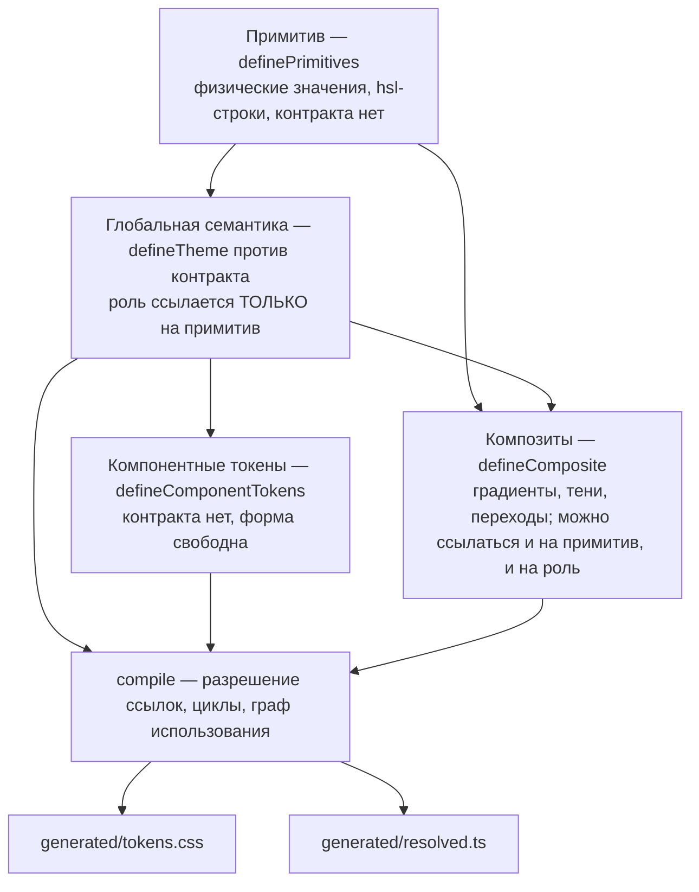

Принадлежность слою — это **тег на самом объекте**, а не каталог, в котором лежит файл. Компилятор читает `__kind` и не зависит от того, кто куда что переложил.

#### Контракт как единственный список обязательных ролей

```typescript
export const colorContract = defineContract({
  category: 'color',
  required: ['surfacePrimary', 'textPrimary', 'borderSubtle', 'interactivePrimary', /* … */],
});

export const darkTheme = defineTheme(colorContract, {
  surfacePrimary: '{color.neutral.950}',
  textPrimary:    '{color.neutral.50}',
  // отсутствие обязательного ключа — исключение в момент импорта модуля
});
```

Тип обязательных ролей выводится из того же массива через `RequiredShape<typeof colorContract>`, поэтому параллельного интерфейса, который надо держать в синхронизации руками, не существует. И проверка происходит **при импорте модуля** — на старте dev-сервера или на первом же тесте, тронувшем файл, — а не тогда, когда кто-то вспомнил запустить чекер.

#### Граф использования: двусторонний пресс

Это главная причина, по которой слой семантики не разрастается мусором и не остаётся дырявым.

| Правило | Что ловит | Что означает |
| --- | --- | --- |
| DS201 / DS202 | Примитив, к которому напрямую тянутся два независимых компонента или композита | Существует общий смысл без имени — поднять в роль |
| DS101 | Глобальная роль, которую не использует никто | Роль лишняя, либо она обязательная по контракту и потребляется через Tailwind |
| DS102 | Глобальная роль ровно с одним потребителем | Она не глобальная — опустить в компонентные токены |
| DS203 | Примитив, многократно используемый внутри одного компонента | Нормально, кода не требует: это просто отсутствие DS201 |

Обязательные роли из контракта исключены из DS101 и DS102: они потребляются через адаптер Tailwind, который графу «токен на токен» не виден, и «на эту роль никто не ссылается» для них — нормальное состояние, а не запах.

Остальные правила семейства: DS001 — сырой цвет вне слоя примитивов, DS002 — неразрешимая ссылка, DS003 — примитив, импортирующий вышележащий слой (ловится циклическим импортом самого TypeScript, кода не требует), DS004 — роль, ссылающаяся на другую роль вместо примитива, DS005 — недостающий обязательный ключ, DS006 — необязательный ключ, присутствующий в одной теме и отсутствующий в другой, DS007 — две категории, порождающие одно имя переменной.

#### Выход и граница рантайма

Компиляция порождает два артефакта, оба коммитятся:

- `generated/tokens.css` — статические переменные CSS с префиксом `--ds-`, подключаются как обычный файл стилей;
- `generated/resolved.ts` — те же данные уже без ссылок, для потребителей, у которых нет движка CSS.

**Компилятор — зависимость исключительно времени сборки.** Единственное место его импорта — `scripts/generate-design-tokens.ts`. Ни один адаптер, ни один компонент не имеет права его тронуть: разрешение ссылок, обнаружение циклов и весь механизм валидации не попадают ни в серверный, ни в клиентский бандл. Всё, что нужно в рантайме, читается из `resolved.ts`.

#### Раскладка каталога

```
shared/ui/theme/
├── tokens/            примитивы: color, dimension, radius, typography, motion, layout, z-index
├── contracts/         обязательные роли по категориям
├── themes/            dark.ts, light.ts, shared-roles.ts — темизованная семантика
├── semantic/          плоская семантика без оси тем: radius, spacing
├── components/        компонентные токены по пространствам имён
├── composites/        градиенты, тени, переходы
├── adapters/          мост в Tailwind и в не-CSS потребителей
├── generated/         tokens.css и resolved.ts, коммитятся
├── provider/          ThemeProvider, контекст, хук переключения темы
└── compiler.config.ts сборка всего перечисленного во вход компилятора
```

Каталог целиком лежит внутри сегмента `ui` слоя `shared`, поэтому правило о разрешённых сегментах не нарушается: оно ограничивает состав сегментов слайса, а не внутреннюю структуру самого сегмента.

Рантайм переключения темы намеренно живёт здесь же, в `provider/`, а не отдельным сегментом: это React-компонент с контекстом, то есть по природе элемент интерфейса. Флеш неправильной темы гасится встроенным скриптом, выполняющимся при разборе HTML до старта гидратации, а не эффектом.

#### Смена палитры

Переодевание в другой набор цветов — это правка значений в `tokens/color.ts`. Ни один нижележащий файл не меняется синтаксически, потому что в них лежат `{ссылки}`, а не значения. Переназначение роли — одна строка внутри соответствующего `defineTheme`. Контракты при смене палитры не трогаются вовсе: обязательность роли говорит о том, что структурно нужно библиотеке компонентов, а не в какой цвет она сегодня одета.

Именно поэтому предварительную палитру можно выбрать до того, как экраны нарисованы, и уточнить после — стоимость такой правки близка к нулю по построению.

---

## 13. Слой строк интерфейса

### 13.1. Правило

**Ни одной пользовательской строки прямо в разметке.** Все тексты живут в словарях и достаются через единственную функцию. Правило проверяется: литеральный текст внутри JSX — ошибка сборки, с точечными исключениями для технических символов.

```typescript
const t = useStrings('pipeline');
return <Button>{t('save')}</Button>;
```

Слой строк живёт в `shared/i18n` и потому доступен всем вышележащим слоям, не нарушая направления импорта.

### 13.2. Типобезопасность

Словарь — JSON, сгруппированный по пространствам имён, соответствующим слайсам. На сборке из него генерируется тип, поэтому обращение по несуществующему ключу не компилируется.

```jsonc
// shared/i18n/locales/en.json
{
  "common":   { "save": "Save", "cancel": "Cancel", "delete": "Delete" },
  "pipeline": { "title": "Pipeline", "empty": "Nothing here yet" },
  "brief":    { "money": "Compensation", "counterpart": "Who you are talking to" }
}
```

```typescript
export type Dictionary = typeof enDictionary;
export type Namespace = keyof Dictionary;
export type KeyOf<N extends Namespace> = keyof Dictionary[N] & string;

export function useStrings<N extends Namespace>(
  ns: N
): (key: KeyOf<N>, vars?: Record<string, string | number>) => string;
```

Подстановка переменных простая и предсказуемая: `{name}` заменяется значением. Множественные формы — отдельные ключи с суффиксами, без внешней библиотеки: на текущем объёме полноценный движок множественного числа избыточен.

### 13.3. Слоистый словарь

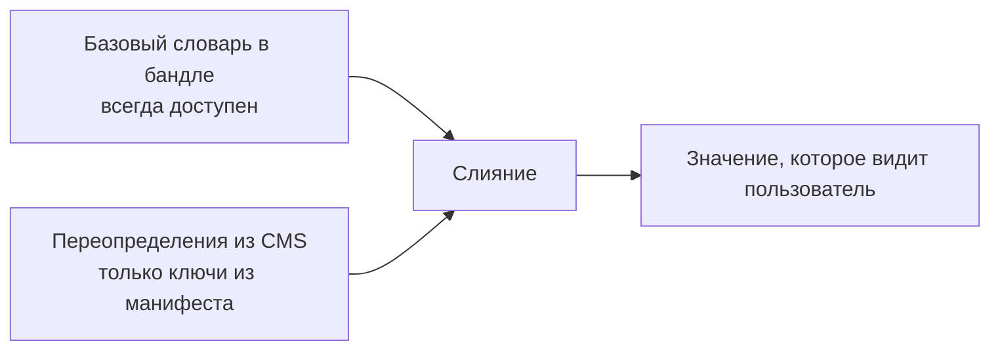

Тот же принцип инверсии зависимостей, применённый к тексту: компоненты зависят от абстракции словаря, а не от источника значения. Отсюда три следствия. Приложение самодостаточно: если запрос за переопределениями не прошёл, работает базовый слой, пустых подписей не бывает. CMS правит только разрешённое: манифест перечисляет редактируемые ключи — длинные тексты, пустые состояния, подсказки, письма и уведомления, — а структурные подписи в админку не попадают, и сломать интерфейс через CMS невозможно. Второй язык добавляется файлом: сейчас поддерживается только английский, поскольку рынок американский и продукт будет показываться другим людям.

### 13.4. Имя продукта — тоже строка

**Слово «Tallyvane» не встречается в коде ни разу.** Это не педантизм: пока продукт личный и бесплатный, риск по товарным знакам близок к нулю, но при выходе на монетизацию может выясниться, что имя придётся сменить. Разница между переименованием за минуту и переименованием за день определяется сегодня, а не тогда.

Имя живёт ровно в двух местах. В словаре строк под ключом `common.productName` — оттуда его берут заголовки страниц, письма, уведомления в Telegram и подписи в интерфейсе. И в конфигурации сборки как `product.name`, `product.domain`, `product.supportEmail` — оттуда его берут манифест расширения, метаданные страниц, тема писем и адреса в типах ошибок API.

Из этого правила следует несколько частностей, которые легко нарушить по невнимательности:

- Корневой пакет `tallyvane.*` и идентификатор группы артефактов `com.tallyvane` — исключение, потому что смена пакета всё равно требует правки импортов; они переименовываются отдельной механической операцией и в правило не входят.
- Типы ошибок API вида `https://tallyvane.com/errors/...` собираются из `product.domain`, а не пишутся строкой.
- Имя контейнеров, схем базы и переменных окружения нейтрально: `server`, `frontend`, `db`, а не производные от бренда.
- Логотип и иконки лежат в дизайн-системе как единственные экземпляры, а не копируются по фичам.

Проверяется машинно: правило `no-hardcoded-product-name` на обеих сторонах ищет литерал имени где-либо, кроме словаря строк и файла конфигурации, и валит сборку. Благодаря этому переименование остаётся правкой двух значений в течение всей жизни проекта, а не превращается со временем в раскопки.

---

## 14. Расширение для браузера

Расширение существует по одной причине: LinkedIn невозможно разобрать серверно. Оно работает только с тем, что пользователь уже открыл в браузере, ничего не автоматизирует и не действует от его имени на чужой платформе.

```
extension/src/
├── background/        service worker: очередь отправки, авторизация
├── content/           внедряемые скрипты
├── adapters/
│   ├── SiteAdapter.ts общий интерфейс
│   ├── linkedin/
│   ├── greenhouse/
│   └── generic/
├── ui/                всплывающая панель
└── api/               клиент, сгенерированный из OpenAPI
```

```typescript
export interface SiteAdapter {
  readonly id: string;
  matches(url: URL): boolean;
  detectKind(document: Document): CaptureKind | null;
  extractJob(document: Document): JobCapture | null;
  extractProfile(document: Document): ProfileCapture | null;
  extractMessage(document: Document): MessageCapture | null;
}
```

Реестр выбирает адаптер по адресу; добавление сайта — новый файл и строка регистрации. Селекторы вынесены в отдельные константы каждого адаптера, потому что именно они ломаются при редизайне чужого сайта. При неудачном извлечении адаптер возвращает пусто, расширение показывает понятное сообщение и предлагает захватить страницу как сырой текст.

Отправка идёт через очередь в локальном хранилище: если сервер недоступен, захват не теряется. Каждый элемент несёт ключ дедупликации, поэтому повторная отправка не создаёт дубликат.

Расширение — отдельная сборка и **не** подчиняется FSD: у него своя, более простая структура, потому что это не приложение с экранами, а набор адаптеров. Правило изоляции соблюдается по-своему: адаптеры не видят друг друга, общаются только через реестр и общий интерфейс.

---

## 15. Статическая валидация архитектуры

Архитектура, которую не проверяет машина, — это пожелание. Ниже — конкретный набор инструментов, правил и команд.

### 15.1. Точки входа

```
./gradlew arch      все проверки бэкенда
pnpm arch           все проверки фронтенда
```

Обе команды входят в `check` соответствующей сборки, запускаются в CI на каждый push и в pre-commit хуке в быстром режиме — только для изменённых файлов.

### 15.2. Бэкенд, рубеж первый: граф модулей

Компилятор ловит нарушение направления зависимостей, потому что нужного ребра просто нет в графе. Но добавить ребро может любой, дописав строку в `build.gradle.kts`, и это скомпилируется. Поэтому граф зафиксирован декларативно.

```yaml
# modules.yaml — источник истины о том, кто кого вправе видеть
layers:
  contract:       [platform:kernel, platform:events]
  domain:         [platform:kernel]
  application:    [own:domain, own:contract, platform:kernel, platform:events, any:contract]
  infrastructure: [own:application, own:contract, platform:*]
  web:            [own:application, own:contract, platform:http]

modules:
  jobs:
    layers: [contract, domain, application, infrastructure, web]
    reads:   [identity]
    publishes: [JobSaved, JobUpdated]
  briefing:
    layers: [domain, application, infrastructure, web]
    reads:   [jobs, applications, contacts, documents, compensation]
    publishes: []
  # ...
```

Задача `validateModuleGraph` разрешает реальный граф зависимостей Gradle и сравнивает с манифестом. Любое расхождение в любую сторону — незаявленная зависимость или заявленная, но неиспользуемая — валит сборку. Это делает архитектурное решение видимым в diff: чтобы модуль начал читать у соседа, надо явно вписать это в манифест, и такое изменение невозможно пропустить на ревью.

### 15.3. Бэкенд, рубеж второй: правила Konsist

Модуль `arch-tests` содержит набор проверок структуры кода. Каждое правило именовано, и его код используется в аннотации исключения.

**Слои и зависимости**

| Код | Правило |
| --- | --- |
| `domain-is-pure` | В `*:domain` нет импортов Ktor, Exposed, JDBC, kotlinx.serialization, java.io, java.net |
| `domain-no-application` | `*:domain` не импортирует из пакетов `application`, `infrastructure`, `web` даже своего модуля |
| `contract-is-self-contained` | Типы в `*:contract` не ссылаются на типы из своего `domain` |
| `contract-is-immutable` | Все свойства в `*:contract` — `val`, коллекции неизменяемые |
| `platform-knows-no-business` | Пакеты `platform.*` не импортируют `tallyvane.modules.*` |
| `web-has-no-persistence` | В `*:web` нет импортов Exposed и JDBC |

**Строение кода**

| Код | Правило |
| --- | --- |
| `single-public-method` | У класса use case ровно один публичный метод, названный `invoke` |
| `usecase-is-imperative` | Имя use case — глагол в повелительном наклонении из проверяемого словаря |
| `port-is-interface` | Всё в пакете `port` — интерфейсы, без реализаций |
| `port-naming` | Имя порта без префикса `I` и без суффикса `Interface` |
| `adapter-is-internal` | Реализация порта в `infrastructure` объявлена `internal` |
| `no-banned-suffix` | Имя не оканчивается на `Utils`, `Util`, `Helper`, `Manager`, `Tools`, `Common`, `Misc`, `Constants`, `Processor`, `Data`, `Info` |
| `no-top-level-functions` | Функций вне класса нет |
| `no-stateful-objects` | Нет `object` с функциями или изменяемыми свойствами |
| `no-companion-logic` | В `companion object` только фабрики и константы, без ветвлений |
| `no-hardcoded-product-name` | Литерал имени продукта не встречается нигде, кроме словаря строк и конфигурации |

**Детерминизм и безопасность**

| Код | Правило |
| --- | --- |
| `no-ambient-time` | Нет обращений к `Instant.now`, `LocalDate.now`, `System.currentTimeMillis` вне реализации `Clock` |
| `no-ambient-random` | Нет `UUID.randomUUID`, `Random()` вне реализации `IdGenerator` |
| `no-sql-concat` | Нет конкатенации строк в построении SQL |
| `own-schema-only` | Определения таблиц модуля указывают только свою схему |
| `no-cross-schema-join` | В запросах модуля нет соединений с таблицами чужих схем |
| `no-llm-with-personal-data` | Классы, строящие промпты, не ссылаются на типы из `contacts:contract` |

**Полнота**

| Код | Правило |
| --- | --- |
| `port-has-contract-suite` | У порта с более чем одной реализацией есть наследник контрактного сьюта |
| `usecase-has-test` | У каждого use case есть тестовый класс |
| `registry-owns-branching` | `when` по значениям `JobSourceKind`, `ChannelKind`, `ReminderCode` встречается только в пакете реестра |
| `app-has-no-logic` | В модуле `app` имена классов оканчиваются на `Wiring`, `Configuration` или `Application` |

Пример реализации правила:

```kotlin
class NamingRules : StringSpec({

    "no-banned-suffix" {
        Konsist.scopeFromProduction()
            .classesAndInterfacesAndObjects()
            .withoutArchitectureException("no-banned-suffix")
            .assertFalse { declaration ->
                BANNED_SUFFIXES.any { declaration.name.endsWith(it) }
            }
    }

    "single-public-method" {
        Konsist.scopeFromProduction()
            .classes()
            .withPackage("..application..")
            .withNameEndingWith(*USE_CASE_VERBS)
            .assertTrue { it.functions(includeNested = false).count { f -> f.hasPublicOrDefaultModifier } == 1 }
    }
})
```

### 15.4. Бэкенд, рубеж третий: бюджет исключений

```kotlin
class ExceptionBudget : StringSpec({

    "architecture exceptions are justified" {
        Konsist.scopeFromProject()
            .declarationsWithAnnotationOf<ArchitectureException>()
            .assertTrue { declaration ->
                val annotation = declaration.architectureException()
                annotation.reason.length >= 40 &&
                    annotation.adr.matches(ADR_PATTERN) &&
                    adrFileExists(annotation.adr) &&
                    annotation.rule in KNOWN_RULES
            }
    }

    "architecture exceptions stay within budget" {
        val count = Konsist.scopeFromProject().declarationsWithAnnotationOf<ArchitectureException>().size
        count shouldBeLessThanOrEqual MAX_EXCEPTIONS   // = 10
    }
})
```

Поднять бюджет можно, но это правка константы в архитектурных тестах, которая видна в diff и требует обоснования. Именно этого и добивались: исключение возможно, но не бесплатно и не молча.

### 15.5. Фронтенд: инструменты

| Инструмент | Что проверяет |
| --- | --- |
| **Steiger** | Канонические правила FSD: направление импортов, публичный API слайса, отсутствие сегментов вне разрешённого набора, бессмысленные и переизбыточные слайсы, повторяющиеся имена |
| **eslint-plugin-boundaries** | Порядок слоёв как явная матрица разрешений, запрет кросс-импортов внутри слоя |
| **eslint-plugin-import** | Запрет глубоких импортов мимо `index.ts`, запрет циклов |
| **dependency-cruiser** | Циклы на уровне файлов, недостижимый код, граф зависимостей как артефакт сборки |
| **Собственный скрипт** | Проектные инварианты, которых нет ни в одном инструменте |
| **tsc --noEmit** | Типы, включая сгенерированные ключи словаря строк и обязательные роли из контрактов |
| **Компилятор токенов** | Семейство DS: неразрешимые ссылки, циклы, недостающие обязательные роли, коллизии имён переменных, граф использования |
| **ESLint-правила движка токенов** | Сырые значения в разметке и в инлайновых стилях |

### 15.5.1. Правила движка токенов

Четыре правила ESLint приходят вместе с движком и работают по месту использования, а не по определению токенов.

| Правило | Что запрещает |
| --- | --- |
| `no-raw-color-value` | Шестнадцатеричный цвет, `rgb()`, `hsl()` в инлайновом стиле или в пропсе |
| `no-arbitrary-color-class` | Произвольное значение цвета в классе Tailwind вида `text-[#…]` |
| `no-raw-dimension-value` | Голый размер в пикселях, rem, em, процентах и единицах вьюпорта |
| `no-arbitrary-dimension-class` | Произвольный размер в классе Tailwind вида `w-[26px]` |

Порогов и послаблений у размерных правил нет: **любой голый литерал сообщается безусловно.** Это осознанная позиция, а не строгость ради строгости. Попытка завести порог «слишком мелкое значение, чтобы быть токеном» на практике каждый раз упирается в то, что у конкретного случая уже есть настоящее решение — либо существующий шаг шкалы, либо штатная утилита Tailwind. Единственное исключение — единица `ch`, привязанная к метрикам шрифта, а не к шкале размеров.

Компиляция токенов встроена в `pnpm arch` двумя командами: `tokens:generate` перезаписывает артефакты, `tokens:check` падает, если результат отличается от закоммиченного.

### 15.6. Фронтенд: конфигурация границ

```javascript
// eslint.config.js, фрагмент
const LAYERS = ['shared', 'entities', 'features', 'widgets', 'views', 'app'];

const rules = LAYERS.flatMap((layer, index) => ({
  from: layer,
  allow: LAYERS.slice(0, index),   // только строго нижележащие
}));
```

Матрица разрешений выводится из порядка слоёв, а не пишется руками: невозможно опечататься и случайно разрешить лишнее.

### 15.7. Фронтенд: собственные проверки

Скрипт `scripts/validate-architecture.mjs` покрывает то, чего не делает ни один готовый инструмент.

| Код | Правило |
| --- | --- |
| `route-files-are-thin` | Файл в `app/` не длиннее пяти строк, содержит только реэкспорт и метаданные |
| `no-routes-in-src` | Внутри `src/` нет файлов `page.tsx`, `layout.tsx`, `route.ts`, `template.tsx`, `loading.tsx`, `error.tsx` |
| `slice-has-public-api` | У каждого слайса есть `index.ts` |
| `segments-are-known` | На верхнем уровне слайса только `ui`, `model`, `api`, `lib`, `config`; внутренняя структура сегмента свободна |
| `no-utility-files` | Нет файлов с именами `utils`, `helpers`, `common`, `misc`, `constants` |
| `no-literal-text-in-jsx` | Текстовые узлы в JSX идут через `useStrings` |
| `shared-has-no-domain` | В `shared` нет идентификаторов из словаря предметной области найма |
| `blocks-are-registered` | Каждый слайс-блок в `widgets` присутствует в провайдере реестра, и наоборот |
| `strings-keys-exist` | Каждый ключ, использованный в коде, есть в базовом словаре |
| `strings-no-orphans` | В словаре нет ключей, которые нигде не используются |
| `editable-strings-exist` | Каждый ключ из манифеста редактируемых существует в словаре |
| `no-hardcoded-product-name` | Литерал имени продукта не встречается нигде, кроме словаря строк и конфигурации |
| `tokens-are-generated` | `generated/tokens.css` и `generated/resolved.ts` совпадают с результатом свежей компиляции; закоммитить правку руками нельзя |
| `no-compiler-at-runtime` | Движок токенов импортируется только из `scripts/generate-design-tokens.ts` |

Исключение помечается директивой с теми же тремя полями, что и на бэкенде, и попадает в тот же бюджет:

```typescript
// @architecture-exception rule=no-literal-text-in-jsx adr=ADR-019
//   reason=Технические символы разделителей не являются пользовательским текстом
```

### 15.8. Артефакты и наглядность

Каждый прогон CI публикует граф зависимостей модулей бэкенда и слайсов фронтенда в виде изображения. Это не украшение: увидеть на картинке, что `briefing` тянется к пяти модулям, а `analytics` не тянется ни к одному, гораздо быстрее, чем вычитать это из конфигурации. Расхождение между картинкой и представлением о системе — самый ранний признак, что архитектура поехала.

---

## 16. Инфраструктура и эксплуатация

### 16.1. Состав контейнеров

```yaml
# ops/docker-compose.yml, концептуально
services:
  db:           # postgres:17-alpine, том с данными
  server:       # JVM, Ktor, бинарники typst и cwebp внутри образа
  frontend:     # Node, Next.js в режиме production
  cloudflared:  # исходящий туннель, маршрутизация по путям
  backup:       # задание по расписанию: дамп и выгрузка
```

Typst и cwebp — не контейнеры, а статические бинарники внутри образа приложения, вызываемые через `platform:exec` как короткоживущие процессы с таймаутом и ограничением ресурсов.

### 16.2. Бюджет памяти на 2 ГБ

| Компонент | Выделено | Комментарий |
| --- | --- | --- |
| PostgreSQL | 384 МБ | `shared_buffers=192MB`, `work_mem=8MB`, `max_connections=20` |
| JVM | 576 МБ | Куча 384 МБ, метапространство 128 МБ, накладные расходы; сборщик G1 |
| Node с Next.js | 320 МБ | Один процесс, режим production |
| cloudflared | 48 МБ | |
| typst и cwebp на пике | 64 МБ | Короткоживущие процессы |
| Резерв ОС и файлового кэша | ~640 МБ | |

Куча в 384 МБ достаточна с запасом: пул соединений ограничен восемью, одновременных пользователей один, тяжёлых вычислений в памяти нет, налоговые таблицы занимают десятки килобайт. Ограничения памяти прописаны в описании сервисов, чтобы всплеск в одном контейнере не убивал соседей.

Число модулей Gradle на потребление памяти в рантайме не влияет вовсе: в JVM попадает один набор классов независимо от того, из скольких модулей он собран.

### 16.3. Маршрутизация и сеть

Правила туннеля разводят трафик по путям: `/api/*`, `/calendar/*` и `/media/*` уходят в Ktor, всё остальное — в Next. Node не оказывается в горячем пути вызовов API и не отдаёт файлы. Единственное правило фаервола на вход — SSH по ключу.

### 16.4. Конфигурация и секреты

Переменные окружения читаются один раз при старте в типизированный объект с валидацией. Отсутствие обязательной переменной приводит к отказу запуска с внятным сообщением, а не к падению через час. Секреты живут в файле с ограниченными правами вне репозитория. В логи значения не попадают: типы-обёртки для секретов переопределяют строковое представление.

### 16.5. Бэкапы и восстановление

Ежедневно: дамп базы и архив каталога блобов, шифрование, выгрузка в объектное хранилище. Хранение по схеме «семь ежедневных, четыре еженедельных, двенадцать ежемесячных».

Существеннее самого бэкапа — **автоматическая проверка восстановления**. Раз в неделю задание поднимает временный контейнер с базой, восстанавливает последний дамп, прогоняет проверки целостности — счётчики строк по ключевым таблицам каждой схемы, ссылочная целостность, применимость всех миграций — и отправляет результат в Telegram. Бэкап, который никогда не восстанавливали, бэкапом не является.

Отдельно доступен ручной полный экспорт: один архив с JSON всех сущностей и всеми файлами, пригодный для переноса.

### 16.6. Наблюдаемость

Логи структурированные, в JSON, с корреляционным идентификатором запроса, проходящим через все слои и модули. Уровень `WARN` означает «требует внимания человека», а не «случилось нечто необычное».

Метрики: количество захватов, доля успешных извлечений по уровням уверенности, латентность и стоимость вызовов модели, глубина очереди, возраст самой старой недоставленной записи, время последнего успешного бэкапа, доля попаданий в кэш публичных страниц.

Аномалии — растущая очередь, провал бэкапа, превышение бюджета модели, серия неудачных инвалидаций — приводят к сообщению в Telegram. Эндпоинт проверки различает живость и готовность.

---

## 17. Безопасность и приватность

**Модель угроз.** Компрометация публичного эндпоинта, утечка данных через LLM-провайдера, кража токена расширения, потеря данных при отказе VPS, злоупотребление загрузкой файлов.

**Меры.** Наружу не открыт ни один порт; весь вход через исходящий туннель. Строгая политика содержимого, запрет встраивания в фрейм, HSTS. Cookie сессии с флагами `HttpOnly`, `Secure`, `SameSite=Lax`; токен защиты от подделки запросов для небезопасных методов. Токен расширения ограничен областью действия и отзывается независимо от сессий. Ограничение частоты на аутентификацию, вебхук почты и публичные эндпоинты контента. Параметризованные запросы всегда, конкатенация SQL запрещена правилом. Проверка принадлежности ресурса и наличия права выполняется в use case, а не в маршруте, и продублирована политиками видимости строк. Загружаемые файлы проверяются по сигнатуре содержимого, метаданные EXIF удаляются, отдача с заголовком вложения и запретом на исполнение, размер и количество ограничены. Содержимое блоков валидируется по сгенерированной схеме перед записью. Произвольный HTML в блоках не поддерживается как тип поля. Календарный фид не содержит имён людей и заметок.

**Данные и LLM.** В модель уходит текст вакансии и, при гэп-анализе, содержимое резюме. В модель **никогда** не уходят тексты личной переписки, имена и контакты рекрутеров, заметки о людях, зарплатные ожидания. Ограничение реализовано не соглашением, а конструкцией: правило `no-llm-with-personal-data` запрещает классам, строящим промпты, ссылаться на типы из контракта модуля `contacts`.

**Логи.** Тексты вакансий, резюме, сообщений и контента не пишутся в логи ни на каком уровне. Логируются идентификаторы и размеры.

---

## 18. Стратегия тестирования

### 18.1. Пирамида

| Уровень | Что покрывает | Инструменты | Скорость |
| --- | --- | --- | --- |
| Доменные модульные | Политики, расчёты, инварианты значений | Kotest, property-based | Миллисекунды |
| Use case | Оркестрация на поддельных портах | Kotest, рукописные фейки | Миллисекунды |
| Контрактные сьюты | Соответствие каждой реализации порта | Kotest, абстрактный базовый класс | Секунды |
| Контракты между модулями | Что модуль честно реализует свой `contract` | Kotest поверх реальной инфраструктуры | Секунды |
| Интеграционные | Адаптеры персистентности, миграции | Testcontainers | Секунды |
| API | Маршруты, сериализация, коды ошибок | Ktor test host | Секунды |
| Архитектурные | Все правила из раздела 15 | Konsist, Steiger, ESLint, свои скрипты | Секунды |
| Компонентные фронтенда | Блоки, формы, слой строк | Vitest, Testing Library | Секунды |
| Сквозные | Критические пути в браузере | Playwright | Минуты |

Библиотеки моков не используются. Вместо них рукописные фейки, реализующие порт целиком и хранящие состояние в памяти. Фейк проходит тот же контрактный сьют, что и настоящая реализация: это гарантирует, что тесты не лгут о поведении.

### 18.2. Особые виды проверок

**Эталонные налоговые случаи.** Таблица кортежей «вход — ожидаемый результат до цента» для комбинаций штатов, доходов и статусов подачи.

**Свойства расчёта.** Нетто монотонно растёт с брутто; сумма удержаний и нетто равна брутто; рост взноса в пенсионный план не увеличивает федеральный налог; штат без подоходного налога даёт нулевой штатный компонент.

**Читаемость резюме.** Каждый шаблон прогоняется через рендер и обратное извлечение текста на наборе представительных композиций. Потеря буллета или нарушение порядка чтения — падение сборки.

**Соответствие блоков схемам.** Значения по умолчанию проходят собственную схему; сгенерированная JSON Schema принимает те же данные, что и схема Zod; компонент рендерится на значениях по умолчанию без ошибок.

**Полнота словаря строк.** Каждый использованный ключ существует; осиротевших ключей нет; каждый ключ из манифеста редактируемых существует.

**Записанные ответы модели.** Тесты извлечения работают на зафиксированных ответах из репозитория: детерминированно, бесплатно, быстро. Отдельный ручной набор проверяет реальную модель и обновляет записи.

**Детерминизм времени.** Часы подменяются фиксированным значением; тестов, зависящих от реального времени, в проекте нет.

### 18.3. Мутационное тестирование и дисциплина порогов

Покрытие строками говорит, что строка выполнилась, но ничего не говорит о том, что её результат кто-то проверил. Мутационное тестирование отвечает на второй вопрос: оно вносит в код точечные изменения и смотрит, упадёт ли хоть один тест. Выживший мутант — это утверждение, которого нет.

Применяется к тем частям, где цена молчаливой ошибки высока: движок токенов, налоговый калькулятор, политика вывода статуса, правила напоминаний, валидатор читаемости резюме.

Дисциплина порога важнее самого инструмента и формулируется одним правилом: **порог всегда равен реально измеренному числу минус запас, и никогда не назначается как цель.** Вписать желаемые девяносто пять процентов и оставить код догонять — значит получить красный CI на следующем же коммите без единого изменения в коде, то есть ровно то, что этот механизм должен предотвращать. Порог двигается только после свежего прогона и только вниз от полученного числа.

Второе правило: **выживший мутант сначала читается, потом закрывается.** Часть мутантов эквивалентна — изменение ничего не меняет по существу, потому что защитная проверка дублирует ту, что уже есть внутри вызываемой функции. Такие случаи закрываются упрощением кода, а не написанием теста ради теста. Тест, добавленный только чтобы покрасить отчёт, — это ещё одно утверждение, которое придётся сопровождать, не дающее взамен ничего.

---

## 19. Производительность и бюджеты

| Операция | Целевой бюджет | Как достигается |
| --- | --- | --- |
| Открытие экрана «Сегодня» | 150 мс серверно | Один запрос к проекции, статусы не вычисляются на лету |
| Список пайплайна, 1000 строк | 200 мс серверно, 16 мс на кадр | Курсорная пагинация, виртуализация |
| Захват вакансии | 8 с полностью | Детерминированные стадии параллельно, модель только для пустых полей |
| Открытие брифа | 300 мс | Предгенерация тяжёлых секций за сутки по правилу |
| Рендер резюме | 2 с | Typst компилирует быстро, валидация в том же процессе |
| Расчёт нетто | 5 мс | Чистая функция над таблицами в памяти |
| Публичная страница, попадание в кэш | 30 мс | Отдача готового HTML из кэша маршрута |
| Публичная страница, промах | 400 мс | Один запрос к API, рендер блоков |
| Изображение | 15 мс | Производные готовы заранее, адресация по содержимому, вечный кэш |
| Инкрементальная сборка бэкенда | 10 с | Мелкие модули, кэш сборки и конфигурации, параллельное выполнение |
| Полная проверка архитектуры | 30 с | Konsist и Steiger работают со структурой, а не с выполнением |

---

## 20. Расширяемость: рецепты

Раздел проверяет заявленное свойство «правится за минуты».

**Добавить поддержку нового ATS.** Класс, реализующий `JobSource`, в `capture:infrastructure`; строка в реестре в композиционном корне; наследник контрактного сьюта. Существующие файлы: одна строка.

**Добавить тип занятости 1099.** Класс `Contract1099CompensationModel` в `compensation:domain`, регистрация, эталонные случаи. Код расчёта W2 не открывается вовсе.

**Добавить канал уведомлений.** Реализация `NotificationChannel` и регистрация в маршрутизаторе. Правила напоминаний не меняются, потому что ничего не знают о каналах.

**Добавить восьмое правило напоминания.** Реализация `ReminderRule` и добавление в список. Планировщик не меняется.

**Сменить провайдера модели.** Реализация `LlmProvider` и одна строка в корне. Декораторы продолжают работать поверх нового провайдера.

**Заменить движок PDF.** Реализация `ResumeRenderer`. Валидатор читаемости не меняется и немедленно начнёт проверять новый движок теми же критериями.

**Добавить тип контентного блока.** Слайс в `widgets`, строка в провайдере реестра. Форма редактирования строится сама, публичная страница рендерит сама, серверная схема генерируется при сборке.

**Сделать редактируемым ещё один текст.** Добавить ключ в манифест. Ни один компонент не трогается.

**Добавить новую возможность целиком.** Создать пять модулей по шаблону конвенционного плагина, вписать в `modules.yaml`, зарегистрировать `RouteModule` и `Wiring` в корне. Ни один существующий модуль не открывается.

**Извлечь модуль в отдельный сервис.** Заменить прямую реализацию его контракта на реализацию поверх HTTP-клиента; заменить локальную доставку событий на брокер; вынести схему в отдельную базу. Ни один потребитель не меняется, потому что все они зависят только от интерфейсов контракта.

**Перенести публичные страницы на рендер в сети доставки контента.** Сменить адаптер сборки и написать другую реализацию `ContentCacheInvalidator`.

**Добавить второй язык.** Новый файл локали и переключатель.

**Добавить мобильный клиент.** Изменений на бэкенде не требуется: контракт описан в OpenAPI, аутентификация по токенам поддержана, консоль уже пользуется API так же, как это будет делать мобильное приложение.

**Включить биллинг.** Модуль `billing` по общему шаблону и порт проверки доступа, вызываемый в use case платных возможностей. Мультитенантность и модель возможностей уже заложены.

---

## 21. План реализации

Все выбранные направления входят в первую версию. Порядок продиктован тем, чтобы польза появлялась рано и каждый шаг опирался на готовый предыдущий.

### Веха 0. Каркас и рельсы

Конвенционные плагины Gradle, `platform:kernel` и `platform:persistence`, манифест модулей и задача его проверки, набор правил Konsist, приложение Next.js с тремя группами маршрутов и настроенным FSD со всеми валидаторами, Docker Compose, Flyway, модуль `identity` с OAuth и возможностями, `platform:http`, проверка живости, деплой через туннель, конвейер CI с командами `arch`.

На выходе — пустое приложение, в котором **уже невозможно нарушить архитектуру**. Именно поэтому эта веха первая: правила, введённые позже, приходится внедрять против уже написанного кода.

### Веха 1. Ядро учёта

Модули `jobs`, `applications`, `contacts` целиком. Журнал событий, вывод статуса политикой, проекция состояний. Слой строк вводится сразу. Экраны: быстрый ввод, пайплайн, карточка вакансии, контакты. Ручной ввод без автоматики. **С этого момента инструментом можно пользоваться по назначению.**

### Веха 2. Захват

Модуль `capture` с серверными источниками для Greenhouse, Lever и Ashby. Расширение Chrome с адаптерами под LinkedIn и ATS. Архивация снимков, очередь отправки с дедупликацией.

### Веха 3. Извлечение

`platform:llm` с декораторами кэша, учёта, бюджета и повторов. Цепочка стадий извлечения, нормализация тегов, разбор требований, экран проверки результата.

### Веха 4. Деньги

Модуль `compensation`: движок, налоговые данные на текущий год, политика выбора юрисдикции, предупреждения о правиле удобства работодателя, эталонные и property-based тесты.

### Веха 5. Бриф

Модуль `briefing`: композитор и шесть секций, предгенерация тяжёлых секций, трёхколоночная раскладка, печатная версия.

### Веха 6. Напоминания

Модуль `reminders` и `platform:outbox`: планировщик, семь правил, гарантия однократной доставки, канал Telegram, настройки порогов, календарный фид с ротацией токена.

### Веха 7. Резюме

Модули `documents` и `resume`: банк буллетов, конструктор композиции, шаблоны Typst, рендер через `platform:exec`, валидатор читаемости, сравнение версий.

### Веха 8. Аналитика

Модуль `analytics`: проекции из событий, воронка, активность по неделям, разбор отказов, полный экран «Сегодня» с прогрессом недельной цели.

### Веха 9. Контент и витрина

Модуль `content`: страницы, версии, блоки, строки, медиа. На фронтенде — слайсы блоков, редактор с живым превью и откатом, публичные маршруты с кэшем по тегам, вебхук инвалидации, карта сайта.

### После первой версии

Модуль `mailbox` с импортом писем и классификацией; генерация cover letter и черновиков сообщений; статистика по шаблонам; расширенный налоговый режим с 1099 и C2C; экспорт резюме в DOCX; второй язык; мобильный клиент; биллинг.

---

## 22. Журнал архитектурных решений

**ADR-001. Статус подачи выводится, а не хранится.** Единственный источник истины — неизменяемый журнал событий. Отвергнуто хранимое поле статуса: оно рассинхронизируется с фактами, теряет момент перехода и не позволяет переоценить историю при изменении правил.

**ADR-002. Kotlin и Ktor на сервере.** Родной для владельца язык, строгая типизация доменной модели, перспектива переиспользования моделей в мобильном клиенте.

**ADR-003. Отменено.** Заменено на ADR-011.

**ADR-004. Typst как движок PDF.** Приоритет машинной читаемости для ATS и потолок в 2 ГБ. Typst даёт чистый текстовый слой и потребляет десятки мегабайт против сотен у headless Chromium.

**ADR-005. Мультитенантность с первого дня, биллинг — нет.** Колонка владельца и сквозной скоупинг стоят почти ничего сейчас и катастрофически дорого потом.

**ADR-006. Публичный домен с исходящим туннелем.** Требование календарного фида и перспектива продукта делают публичный адрес обязательным; туннель сохраняет фаервол закрытым.

**ADR-007. Захват LinkedIn только через расширение.** Серверный скрейпинг ненадёжен и создаёт риск блокировки аккаунта.

**ADR-008. Доставка побочных эффектов через очередь.** Уведомление не теряется при сбое и не дублируется при перезапуске.

**ADR-009. Налоговые данные — файлы, а не код.** Ставки меняются ежегодно; логика расчёта не содержит налоговых литералов.

**ADR-010. Ручное внедрение зависимостей без контейнера.** На этом масштабе контейнер добавляет неявность, не убирая работы.

**ADR-011. Единое приложение Next.js на все три поверхности, размещённое на своём VPS.** Появление CMS сделало серверный рендер обязательным для публичной части; раз рантайм Node всё равно нужен, отдельное SPA рядом становится лишней сущностью. Размещение на своём VPS выбрано вместо рендера на границе сети, потому что инструмент знаком владельцу и не добавляет вторую платформу в эксплуатацию. Цена — 320 МБ памяти и урезанная до 384 МБ куча JVM.

**ADR-012. Приватная часть — тонкий клиент, а не BFF.** Консоль и админка обращаются к Ktor напрямую из браузера; серверный рендер только для публичных страниц. API остаётся единственным честным контрактом для будущего мобильного клиента и не обрастает эндпоинтами, заточенными под веб.

**ADR-013. Тип блока определяется один раз в TypeScript.** Схема, описатели полей и компонент в одном файле обслуживают публичную страницу, форму редактирования и превью; для серверной валидации при сборке генерируется JSON Schema. Отвергнут рендер публичных страниц силами Ktor: он потребовал бы реализовывать каждый блок дважды.

**ADR-014. Содержимое страницы хранится в версиях.** Страница — идентичность и указатель; отсюда бесплатно получаются история, откат и предпросмотр.

**ADR-015. Производные изображений создаются при загрузке.** Оптимизация в рантайме даёт всплески памяти, неприемлемые при потолке в два гигабайта.

**ADR-016. Слоистый типобезопасный словарь строк.** Все тексты идут через одну абстракцию с типами из JSON; переопределения из CMS накладываются поверх базового слоя.

**ADR-017. Модульный монолит: вертикальные модули-возможности поверх горизонтальных слоёв.** Декомпозиция только по слоям делает систему плоской: со временем `application` превращается в свалку из сотни несвязанных сценариев. Декомпозиция только по возможностям теряет чистоту слоёв. Пересечение двух осей даёт модуль сборки, границы которого проверяет компилятор. Цена — около шестидесяти модулей; гасится конвенционными плагинами, кэшем сборки и предсказуемой структурой каталогов.

**ADR-018. Максимальная гранулярность модулей сборки.** Каждый слой каждой возможности — отдельный модуль Gradle. Рассматривались варианты с двумя и тремя модулями на возможность: они дешевле в сопровождении, но перекладывают часть проверок с компилятора на тесты. Выбрана максимальная строгость: нарушение границы не должно компилироваться. Модуль получает только нужные ему слои; отсутствие слоя — нормальное состояние.

**ADR-019. Чтения между модулями синхронны через контракт, реакции асинхронны через события.** Критерий выбора: нужен ли вызывающему результат, чтобы продолжить. Отвергнут вариант «только события»: он вынудил бы держать реплики чужих данных внутри каждого модуля ради тривиальных чтений. Отвергнут вариант «только синхронно»: он превратил бы `applications` в узел, знающий обо всех потребителях своих изменений.

**ADR-020. Схема Postgres на модуль; соединения между схемами запрещены, внешние ключи разрешены.** Запрет внешних ключей ради гипотетического извлечения в сервисы стоил бы целостности данных прямо сейчас. Запрет соединений сохраняет логическую границу: чтобы узнать что-то о чужой сущности, надо спросить у её модуля.

**ADR-021. Запрет утилитарного кода с машинно-проверяемыми исключениями.** Утилитарный класс — место, куда стекается логика без хозяина; со временем от него зависит всё, и его нельзя ни подменить, ни расширить. Абсолютный запрет невозможен, поэтому исключение помечается аннотацией с обязательной причиной и ссылкой на решение, а общее их количество ограничено бюджетом в десять штук на весь бэкенд.

**ADR-022. Строгий Feature-Sliced Design на фронтенде с переименованием слоя `pages` в `views`.** FSD применяется без оговорок, включая изоляцию слайсов и доступ только через публичный API. Слой `pages` переименован, потому что в проекте на Next.js это слово перегружено маршрутизацией. Каталог `app/` в корне не является слоем FSD: это адаптер маршрутизации, файлы в котором содержат только реэкспорт.

**ADR-023. Реестр блоков как композиционный корень фронтенда.** Типы блоков — слайсы слоя `widgets` и потому не видят друг друга; рендерер обращается к ним через интерфейс реестра из `shared`, а сборка происходит в `app`. Это та же инверсия зависимостей, что и в композиционном корне бэкенда, и она позволяет соблюсти изоляцию слайсов без единого исключения.

**ADR-024. Архитектура проверяется машиной, а не ревью.** Четыре рубежа: граф модулей сборки, линтеры импортов, правила структуры кода, контрактные сьюты портов. Ревью не считается механизмом контроля архитектуры: человек устаёт и соглашается.

**ADR-025. Имя продукта — Tallyvane, и оно нигде не зашито.** Выбрано выдуманное составное слово: *tally* — вести счёт и записывать, *vane* — флюгер, показывающий направление. Ниша трекеров вакансий занята плотно (Teal, Huntr, Simplify, Careerflow, Prentus, Jobright и другие), поэтому всё с корнями *track*, *apply*, *job*, *career* отвергнуто сразу — и как описательное, а значит неохраноспособное, и как заведомо смешиваемое. Рабочее название «Job Search Console» отвергнуто дополнительно из-за переклички с Google Search Console.

Проверены и отвергнуты по коллизиям в классах 9 и 42: Notarium (заявка USPTO плюс одноимённый AI-воркспейс), Remira (крупная немецкая софтверная компания), Vantry (канадские заявки прямо в класс 42 с формулировкой SaaS), Landfall, Cairn, Longhand, Daybook, Foothold. Проверены и отвергнуты по фонетической близости: Kestrio при существующей KESTIO, Corvale при существующей и активно защищаемой Corval Group. Всего проверено более девяноста вариантов в семи стилистических направлениях; `tallyvane.com` и `tallyvane.app` подтверждены свободными по данным реестров.

Само имя при этом является значением, а не константой: оно живёт в ключе `common.productName` словаря строк и в блоке `product.*` конфигурации сборки, а правило `no-hardcoded-product-name` не даёт зашить литерал в код. Причина в том, что полноценная проверка товарного знака делается перед монетизацией, и вероятность смены имени на этом шаге ненулевая; цена такой смены фиксируется сейчас на уровне двух правок.

**ADR-026. Дизайн-токены строятся внешним компилируемым движком с контрактами и графом использования.** Отменяет утверждение версии 3.0 о том, что внешних пакетов на фронтенде нет: движок токенов — не код приложения, а инструмент времени сборки, и он по построению не содержит ни одного имени роли, поэтому переносим между проектами. Подключается как опубликованный пакет, общий с другим проектом владельца, а не копией: копия неизбежно разъедется, а исправление, найденное в одном проекте, должно доставаться обоим.

Приняты четыре слоя — примитив, глобальная семантика, компонентные токены, композит — с принадлежностью слою в виде тега на объекте, а не каталога. Приняты контракты как единственное место списка обязательных ролей, с выводом типа из того же массива, и с проверкой в момент импорта модуля, а не в момент запуска чекера. Принят граф использования как двусторонний пресс: он поднимает в роль примитив, к которому тянутся два независимых потребителя, и опускает в компонентные токены роль, у которой потребитель один.

Отвергнут подход, при котором источником истины служит документ, а Figma и CSS его зеркалят со сверкой имён: он допускает расхождение и лишь обнаруживает его постфактум. В принятом варианте источник — модули TypeScript, CSS и разрешённые данные генерируются, а расхождение невозможно по построению.

Отдельно зафиксирована граница рантайма: компилятор импортируется ровно из одного скрипта сборки, а всё живое читает уже разрешённые данные. Это удерживает разрешение ссылок, обнаружение циклов и весь механизм валидации вне обоих бандлов.

**ADR-027. Три уровня глубины вместо режима «подробно».** Focus отвечает на вопрос «что мне сейчас делать», Full — на «что вообще происходит», раскрытие строки — на «почему именно эта запись». Focus является отдельным экраном с суждением системы, а не Full с меньшим числом полей: он показывает довод, которого в Full нет вовсе.

Отвергнут глобальный переключатель подробности. Он требует решить, сколько информации нужно, до того как человек узнал свой вопрос, и на практике выставляется однажды и забывается. Глубина сверх Full раскрывается на конкретной строке — там, где внимание уже находится, — и потому не ухудшает простую поверхность для всех прочих случаев.

**ADR-028. Плотность и объём информации — ортогональные оси.** Плотность меняет только воздух: высоту строки, отступы, кегль в таблицах; она никогда ничего не добавляет и не убирает. Единый переключатель «подробнее» связал бы два независимых желания, и просьба показать больше данных начала бы дополнительно сжимать строки.

**ADR-029. Монохромный акцент; цвет зарезервирован за статусом.** Отменяет решение, при котором янтарь служил одновременно фирменным акцентом и сигналом «требует внимания». Прежнее рассуждение — «в трекере поиска работы призыв к действию и есть „обрати внимание“, значит хватит одного цвета» — было стройным, но отвергнуто по результату прототипа, а не в споре. Оно дало два дефекта. Вместе с тёплой нейтралью получился интерфейс, читающийся как приложение для пасеки. И, что важнее, сигнал обесценился: когда янтарным окрашены кнопки, бейджи и полоса прогресса, янтарный перестаёт что-либо значить.

Принято: кнопка основного действия монохромная, нейтральная шкала уведена с двенадцати процентов насыщенности до трёх-восьми, янтарь означает внимание и ничего больше. Кольцо фокуса тоже монохромное — янтарное создало бы на экране два разных янтарных смысла, «эта запись требует действия» и «курсор здесь», а это разные вещи.

**ADR-030. Быстрые действия на двух поверхностях.** Плавающая кнопка и командная палитра выражают один набор действий. Палитра быстрее, но требует заранее знать, что набирать; кнопка обнаруживаема и на намеренно пустом экране Focus остаётся единственной видимой подсказкой о возможностях. Дублирование здесь осознанное: у каждого пункта меню показано сочетание клавиш, поэтому меню обучает и постепенно перестаёт быть нужным.

**ADR-031. Поведение примитивов берётся из Base UI, оформление — только из токенов.** Отменяет упоминание shadcn в §12.5 версии 3.3. Компоненты shadcn приезжают с классами `bg-background`, `text-muted-foreground`, `--radius`, которых в этой системе не существует: пространства имён Tailwind очищены намеренно, а роли называются иначе. Вставленный компонент не выдал бы ошибку — CSS разрешил бы несуществующую переменную в ничто и показал элемент без цветов. Base UI не привозит ни классов, ни цветов и выражает состояние через `data`-атрибуты, поэтому инвариант «ни одно имя класса не разрешается в примитив» остаётся нетронутым. Radix отвергнут из-за незакрытого комбобокса, приходящегося на самые частые поля продукта; React Aria — из-за веса и хукового API; своя реализация — по объёму скрытой работы в фокусе и клавиатуре. Полный разбор — [ADR-031](docs/adr/ADR-031-base-ui-as-behaviour-layer.md).

### Зафиксированные противоречия и их разрешение

**Локальный запуск против доступа с любого устройства.** Разрешено в пользу постоянно работающего сервера на VPS с доступом через туннель.

**Архив оригинала вакансии.** Требование «вакансия исчезает, а текст нужен через месяц» не сопровождалось выбором архивации. Разрешено в пользу полного архива текста и HTML с версионированием.

**Календарный фид против закрытой сети.** Разрешено в пользу публичного домена с секретным отзываемым токеном.

**Блок про доход на руки в брифе против отсутствия калькулятора в первой версии.** Разрешено включением движка компенсации в первую версию с ограниченным покрытием штатов.

**Полный объём первой версии против скорости получения пользы.** Объём сохранён, но порядок вех даёт работающий трекер уже на первой.

**Статическая генерация против редактирования контента через админку.** Кажущееся противоречие: статичность относится к тому, что отдаётся посетителю, а не к происхождению содержимого. Разрешено рендером по запросу с кэшированием по тегам.

**Мгновенная публикация против единственной реализации блоков.** Разрешено размещением рендера в Node рядом с Ktor: блоки остаются React-компонентами и пишутся один раз.

**Управление текстами приложения через CMS против самодостаточности приложения.** Разрешено слоистым словарём: базовый слой всегда в бандле.

**Максимальная строгость модулей против удобства работы.** Шестьдесят модулей — реальная цена. Разрешено конвенционными плагинами, сводящими файл сборки модуля к трём строкам, предсказуемой структурой каталогов и тем, что мелкие модули ускоряют инкрементальную компиляцию, а не замедляют её.

**Запрет утилит против существования функций без хозяина.** Разрешено механизмом аннотированных исключений с обязательным обоснованием и жёстким бюджетом.

**Отсутствие внешних пакетов на фронтенде против движка дизайн-токенов.** Версия 3.0 утверждала, что весь фронтенд умещается в одно приложение без workspace-пакетов. Движок токенов это опровергает, и утверждение отменено, а не натянуто: движок не является кодом приложения, он работает только во время сборки и по построению не знает ни одного имени роли. Ограничение сохранено в другой форме — пакет ровно один, и он внешний.

**Желание сначала увидеть экран против необходимости сначала определить палитру.** Противоречие снимается самой архитектурой токенов: ниже слоя примитивов везде лежат ссылки, а не значения, поэтому смена палитры после того, как экраны собраны, — это правка одного файла. Предварительные цвета выбираются свободно и уточняются потом. **Проверено на практике:** первая палитра была отвергнута после сборки прототипа, и полная её замена обошлась в правку примитивов и нескольких строк темы.

**Нежелание перегружать пользователя против желания быстро получить ответ.** Оба требования были названы владельцем одновременно и выглядят взаимоисключающими. Разрешены тем, что относятся к разным вещам: первое — к состоянию по умолчанию, второе — к глубине по требованию. Отсюда три уровня вместо компромисса посередине: минимальный Focus как вход, полная доска рядом, детали на конкретной строке.

---

## 23. Глоссарий

**Вакансия (Job)** — конкретная позиция в конкретной компании, независимо от того, подавался ли пользователь.

**Подача (Application)** — факт отправки заявки. У одной вакансии может быть несколько подач при повторных попытках.

**Событие журнала** — неизменяемая запись о произошедшем; единственный источник истины о состоянии подачи.

**Интеграционное событие** — уведомление одного модуля другим о случившемся; доставляется через очередь и не хранится как летопись.

**Снимок (Snapshot)** — сохранённая версия текста вакансии на момент захвата.

**Модуль-возможность** — вертикальный срез системы, владеющий своими данными, правилами и частью API.

**Контракт (Contract)** — модуль сборки, выставляющий наружу интерфейсы и структуры данных; единственное, что видят соседи.

**Порт (Port)** — интерфейс, объявленный слоем, который им пользуется, и реализуемый внешним слоем.

**Адаптер (Adapter)** — реализация порта, знающая о конкретной технологии.

**Композиционный корень** — единственное место, где известны конкретные классы реализаций.

**Слой (Layer)** — горизонтальный срез внутри модуля: контракт, домен, сценарии, инфраструктура, транспорт.

**Слайс (Slice)** — вертикальный срез внутри слоя фронтенда, соответствующий одной предметной области.

**Сегмент (Segment)** — техническое деление внутри слайса: `ui`, `model`, `api`, `lib`, `config`.

**Публичный API слайса** — файл `index.ts`, единственная разрешённая точка входа в слайс.

**Кросс-импорт `@x`** — явно объявленный слайсом набор того, что он открывает конкретному соседу того же слоя.

**Композиция резюме** — набор выбранных из банка блоков и их порядок, из которого рендерится файл.

**Банк буллетов** — библиотека формулировок достижений, переиспользуемых между версиями резюме.

**Очередь исходящих (Outbox)** — таблица отложенных эффектов, обеспечивающая доставку ровно один раз.

**Проекция (Projection)** — производное представление, вычисленное из журнала событий и хранимое ради скорости чтения.

**Тип блока (Block Type)** — связка схемы, описателей полей и компонента, определяющая один вид содержимого страницы.

**Версия страницы (Revision)** — неизменяемый снимок содержимого; публикация переставляет указатель на версию.

**Тег кэша** — метка на отрендеренной странице, позволяющая пометить её протухшей при публикации.

**Бюджет исключений** — предельное количество помеченных аннотацией нарушений архитектурных правил во всём коде.

**Правило удобства работодателя** — норма ряда штатов, позволяющая облагать доход удалённого сотрудника по месту нахождения работодателя.
