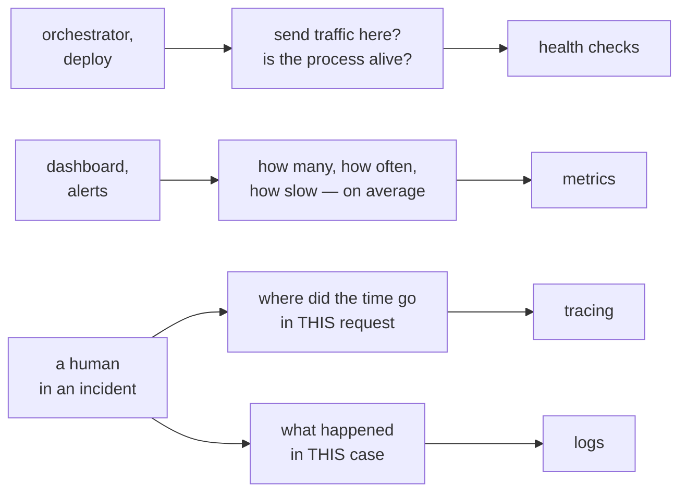
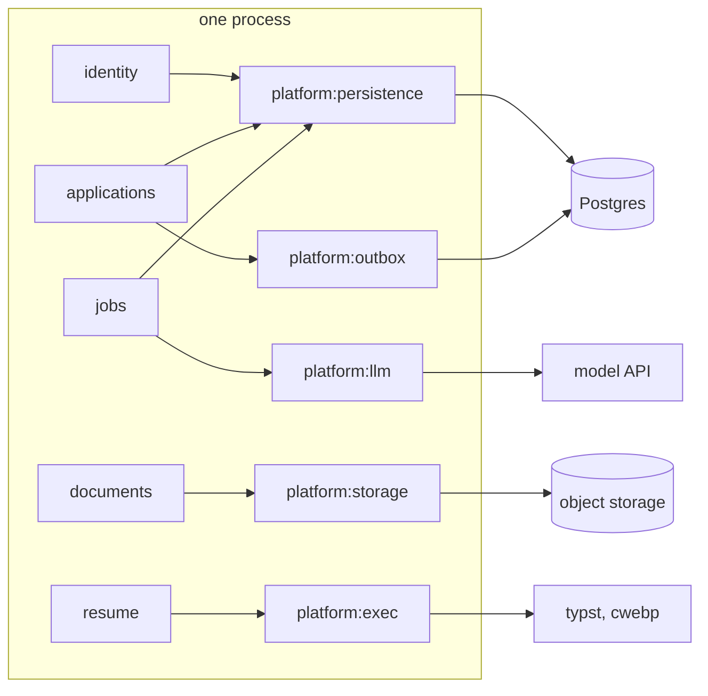
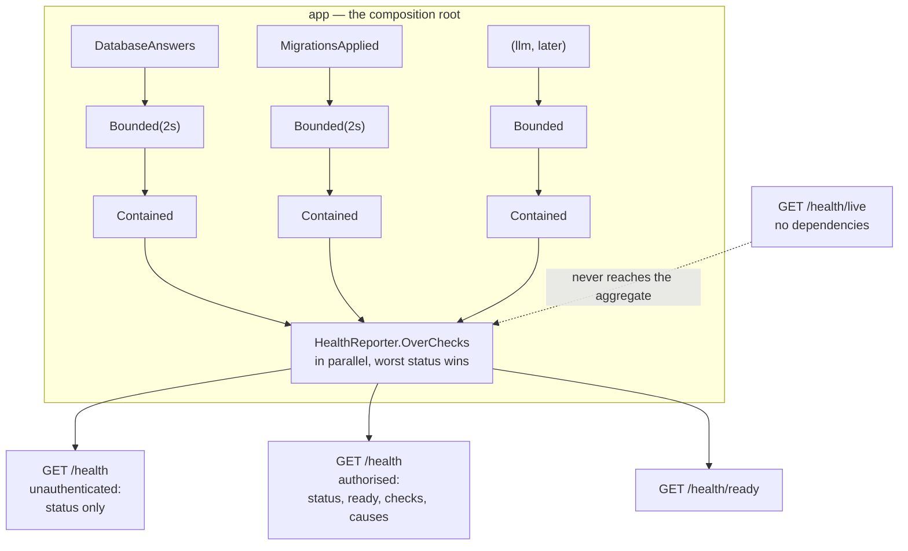
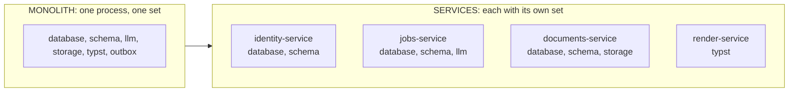
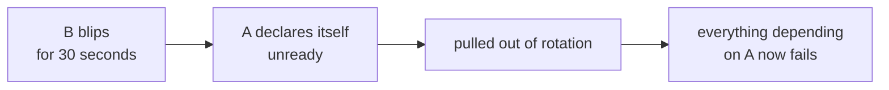
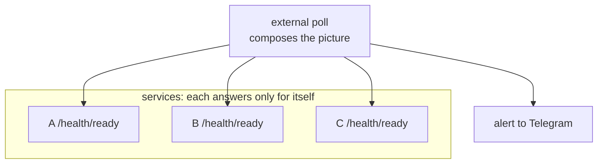
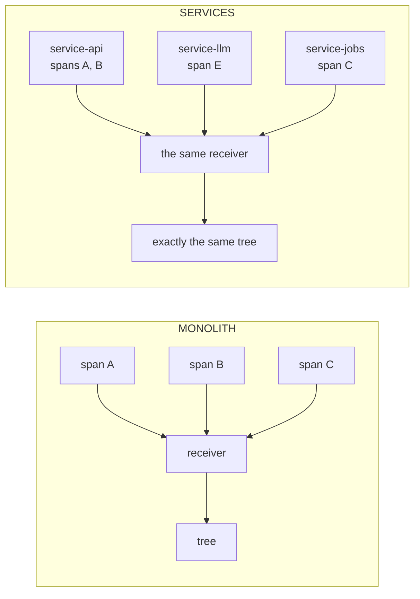

## Tallyvane — Observability: health checks, tracing, metrics, logs

> Layer: `platform:observability`, `platform:persistence`, `app`, `ops/`
> Status: sections 1–4 and 6 describe accepted decisions and code that exists today; section 5 is a strategy agreed on paper and only testable after the first service is extracted; section 8 states plainly what is missing.
> Parent documents: [ARCHITECTURE.md](../../ARCHITECTURE.md) §16.6, [ADR-054](../adr/ADR-054-health-check-shape.md), [ADR-055](../adr/ADR-055-health-response-shape.md), [ADR-056](../adr/ADR-056-request-identity.md), [ADR-051](../adr/ADR-051-migration-layout-and-ordering.md)
> Runnable example: `backend/playground/health/` — the whole composition, with output; `./gradlew :playground:health:run`

---

## 0. How to read this document

"Observability" covers four different things, solved by different mechanisms, for different readers. Confusing them is the common mistake and an expensive one: it produces health endpoints that try to narrate a request, and metrics that someone tries to read a single case out of.

The document separates the four signals first (section 1), then works through the one already built here — health checks (2–4) — then answers the question it was written for: **what happens to those checks when the modular monolith starts splitting into services** (5). After that: tracing (6), metrics and logs (7), and what does not exist (8).

Traps are collected in section 9 as a list of their own, because each one is somebody's production system that went down.

---

## Contents

1. [Four signals and who asks for them](#1-four-signals-and-who-asks-for-them)
2. [Health checks: two probes, two audiences](#2-health-checks-two-probes-two-audiences)
3. [Why there are fewer checks than modules](#3-why-there-are-fewer-checks-than-modules)
4. [How it is composed today](#4-how-it-is-composed-today)
5. [Migrating to services](#5-migrating-to-services)
6. [Tracing: how the chain is assembled](#6-tracing-how-the-chain-is-assembled)
7. [Metrics and logs](#7-metrics-and-logs)
8. [What does not fit in 2 GB, and what we do instead](#8-what-does-not-fit-in-2-gb-and-what-we-do-instead)
9. [Traps](#9-traps)
10. [Where we stand, by slice](#10-where-we-stand-by-slice)
11. [Open questions](#11-open-questions)

---

## 1. Four signals and who asks for them

The separation is not academic: each signal has its own reader, its own lifetime, and its own storage cost.



| Signal | Answers | Shape | Read by |
|---|---|---|---|
| Health checks | yes/no, about now | a snapshot | a machine: orchestrator, deploy |
| Metrics | how much, how long, over a period | numbers, aggregates | a human via a dashboard, automation via alerts |
| Tracing | where the time went in one request | a tree of intervals | a human in an incident |
| Logs | what happened in one case | lines with context | a human in an incident |

Two consequences worth keeping in mind.

**Tracing explains one case; a metric shows a trend.** "Where are we slow in general" is a question for metrics — a latency histogram per operation. "Why did this request take four seconds" is a question for a trace. Substituting one for the other is the usual mistake: a conclusion about the system drawn from a single trace, or a specific complaint answered with an average.

**A health check tells no story.** It does not know what was true a second ago, and it should not: its reader is a machine that needs "send traffic or not" in milliseconds.

---

## 2. Health checks: two probes, two audiences

### Two probes, because there are two questions

```
GET /api/v1/health/live    is the process alive → should the container be restarted
                           does NOT touch the database

GET /api/v1/health/ready   should traffic come here → should the deploy switch over
                           does touch the database

GET /api/v1/health         the aggregate, for a human and for alerts
```

Liveness not touching the database is protection against amplifying an outage rather than an optimisation. If the database is down, restarting the application does not help — but a liveness probe that checks the database starts failing, and the orchestrator restarts a healthy process in a loop. A second, self-inflicted failure is added to the real one.

### Two audiences, because dependency names are a map of the system

ADR-055: without authorisation, **one field** goes out.

```json
{ "status": "degraded" }
```

An authorised reader gets everything:

```json
{
  "status": "degraded",
  "ready": true,
  "checks": [
    { "name": "database", "status": "up", "took_ms": 3 },
    { "name": "llm", "status": "down", "took_ms": 2000,
      "cause": { "kind": "overran", "bound_ms": 2000 } }
  ]
}
```

A cause is an object discriminated by `kind` rather than a string: `refused` with `says`, `overran` with `bound_ms`, `threw` with `type`, `dependencies` with `names`, `behind` with `versions`. The last two have no public rendering at all.

An orchestrator needs no body: readiness travels in the status code. The body is for a human, and a human with access already knows what the system is built from.

### Three states, not two

`up`, `degraded`, `down` — and what separates the second from the third is each check's `requiredForReadiness` flag.

```
a check that is not required and is ailing  → status: degraded, ready: true   traffic flows
a check that is required and is down        → status: down,     ready: false  traffic stops
```

What that buys in practice: an unavailable model must not close down the two thirds of the product that need no model. An unavailable database must.

---

## 3. Why there are fewer checks than modules

The temptation is thirteen modules, thirteen checks. That is wrong, and the reason is structural.

**A check exists per external dependency that can become unavailable — not per module of code.** The `identity` module is compiled into the same process as the probe. If the process is alive, `identity` is alive; "unavailable" is meaningless about it.



The outside world begins where the platform ends, and that has a consequence worth stating: **no capability module contributes a check**, because none of them talks to the outside world directly. `documents` reaches storage through `platform:storage`; `resume` runs typst through `platform:exec`. The check belongs to whoever owns the connection.

| External dependency | Owner | Check | `requiredForReadiness` |
|---|---|---|---|
| Postgres | `platform:persistence` | `database` | yes |
| schema state | `platform:persistence` | `schema` | yes |
| model API | `platform:llm` | `llm` | no |
| object storage | `platform:storage` | `storage` | yes |
| `typst`, `cwebp` | `platform:exec` | `typst` | no |
| queue depth | `platform:outbox` | `outbox` | no |

Five or six checks, and that number does not grow with the number of modules.

**What is not a health check.** "1420 messages queued, the oldest nine minutes old" is a degradation once a threshold is crossed and a metric the rest of the time. Health answers a machine asking "should traffic come here"; "how is the system doing, hour by hour" is a human's question, and it belongs to metrics.

---

## 4. How it is composed today

The only place that knows the whole list is the composition root. A module registers itself nowhere: it **offers** a public type implementing `HealthCheck` and does not know whether anyone uses it. There is deliberately no registry — with one, adding a check becomes an invisible side effect inside a module instead of a line in the root's diff.



Two decorators around every check, and the order is one line in the root:

```kotlin
fun guarded(check: HealthCheck): HealthCheck =
    HealthCheck.Contained(HealthCheck.Bounded(check, bound, abandoned))
```

**`Bounded`** answers within its bound whatever the delegate does, by starting the delegate in a separate scope and awaiting that rather than the call itself. The reason is measured rather than assumed: coroutine cancellation is cooperative, so a delegate that blocks its thread — a JDBC socket read being the case that matters — never observes a timeout wrapped around it. What `Bounded` cannot do is free the occupied thread; that is the driver's timeouts.

**`Contained`** turns an exception into `Down` carrying the exception's **type** and nothing else: a driver's message carries hosts, ports and sometimes credentials, and §17 forbids those reaching a client.

The numbers below are output from `playground/health`, not claims:

```
=== five checks: two real, three stubbed
  aggregate: down  { kind: dependencies, names: [llm, storage, outbox] }
  ready:     false
  report took 2004 ms, checks summed to 2319 ms      ← parallel: total below the sum
  checks:
    database  up           85 ms
    schema    up          147 ms
    llm       down       2003 ms   { kind: overran, bound_ms: 2000 }   ← sleeps 10s
    storage   down         84 ms   { kind: threw, type: IllegalStateException }
    outbox    degraded      0 ms   { kind: refused, says: "queue depth 1420, oldest 9m" }
```

A total of 2004 ms against a sum of 2319 ms is the evidence for running in parallel: a sequential aggregator cannot produce a total below the sum.

---

## 5. Migrating to services

The section this document was written for. Split three ways: what **does not change** (most of it), what changes **mechanically**, and what **appears for the first time** — along with traps that cannot exist today because there is no second process.

### 5.1. What does not change at all

| What | Why it survives |
|---|---|
| The `HealthCheck` port | "A name, a readiness flag, `check()`" does not depend on how many processes there are |
| `Bounded`, `Contained` | Bounds and failure isolation are needed in any process |
| `HealthReporter.OverChecks` | The aggregator is **always** per process, in a monolith and in a service |
| Two probes, three states | The orchestrator's questions are the same |
| The response shape (ADR-055) | Deliberately in a shared ADR rather than in a module: otherwise monitoring needs a parser per service |
| "A check per external dependency" | It is the rule that decides which checks a given service inherits |

None of that is luck. It follows from two decisions: the aggregator is a pure fold with no lifecycle of its own (ADR-054), and the response shape is a shared contract (ADR-055).

### 5.2. What changes mechanically

**The set of checks divides by service**, along the same line it always divided by: what this process owns.



**There are as many database checks as there are services with a database.** Each has its own pool, so each has its own `DatabaseAnswers`. This is exactly why the check goes through the pool rather than a connection of its own: it answers "can **I** reach the database", and that statement stays true and meaningful inside every service. A check over its own connection would answer a question about the *server* — and in a world where the server is shared, every service would report the same fact about the server and none about itself.

**`MigrationsApplied` moves without edits**, and that follows from ADR-051 rather than from luck: Flyway is given one location, `classpath:db/migration`, and walks the classpath — and a classpath is the contents of one artefact. In the monolith the check sees every module's migrations; in a service, only its own. A registry of locations would have needed editing at exactly the moment of the split.

**Check names do not change.** Renaming `database` to `identity-database` is a trap: names end up in alert rules, and renaming unglues them silently. What distinguishes services is a service label applied by the collector, not a name rewritten inside it.

### 5.3. What appears for the first time: depending on your own service

In a monolith, calling a neighbouring module is a method call. After extraction it is a network call that can fail to arrive. A category of dependency appears that does not exist today, and with it the main trap of this section.

**The rule: a service's readiness must not depend on the health of the services it depends on.**

Three reasons, each a known way to take a whole system down.

**Cascade.** If A's readiness includes "B answers", a thirty-second blip in B makes A unready. The orchestrator pulls A out. Everything that depended on A starts failing too. One local blip becomes an outage wider than the original fault.



**Circular deadlock.** A checks B, B checks A. After a full restart neither can become ready, because each waits for the other. The rollout never converges, and only hands can fix it.

**It is not A's job.** B has its own probe and its own entry with the orchestrator. A reporting on B duplicates that and adds a second alert carrying no new fact.

**What A may legitimately report about B:** in readiness, nothing. In degradation, optionally the state of **its own** client towards B — whether the circuit breaker is open, how many consecutive failures. That is a statement about itself rather than about someone else's health, and it goes in with `requiredForReadiness = false`.

```kotlin
// Monolith: the contract is implemented locally
val jobs: JobsContracts = JobsWiring(platform, identity).contracts

// After extraction: the same contract over HTTP, consumers untouched
val jobs: JobsContracts = JobsOverHttp(platform.httpClient, config.jobsBaseUrl)
```

```kotlin
// BAD: makes this service's readiness depend on someone else's health
guarded(RemoteServiceUp("jobs", client, requiredForReadiness = true))

// GOOD: observes its own breaker, not another service's probe, and does not block traffic
guarded(JobsClientHealthy(breaker, requiredForReadiness = false))
```

### 5.4. Three more rules for the distributed case

**A check reaches one hop, preferably zero.** A does not check B's database, even when B's authorised body exposes it. A transitive check means three services report one fault, and only one of them can fix it.

**"Is the system as a whole healthy" is not a question for a service.** It is a legitimate question, answered by an **external** job that polls each service's readiness and composes the picture. That job is already planned here — the one that reports to Telegram (§16.6). Answering it from inside a service is precisely how the cascade gets built.



**A slow start is a separate probe, not a stretched liveness.** A service that takes a minute to come up will be killed by its liveness probe before it finishes. Kubernetes has a third probe for this, `startup`; in our compose file the same role is played by `start_period` on the healthcheck. Stretching the liveness timeout instead throws away its purpose — it stops catching a real hang.

### 5.5. Checklist for extracting a module into a service

1. The module's schema moves to its own database, so the new service gets `PostgresPersistence` and with it `database` and `schema`. The monolith loses nothing: its checks were always about itself.
2. The contract implementation in the caller becomes an HTTP client. Consumers are untouched — they depend only on contract interfaces.
3. The caller does **not** gain a required check for the new service. At most an optional one about its own client.
4. Check names are preserved; a collector-side label distinguishes services.
5. The external poll gains one more address.
6. The response shape does not fork: the same `status` without authorisation, the same breakdown with it.

No step requires rewriting `platform:observability`. That is the test of whether slices 4 and 10 were designed correctly — but a test on paper, which becomes a real one only at the first extraction.

---

## 6. Tracing: how the chain is assembled

The unit is a **span**: one interval of work. Its own id, its parent's id, a name, a start and an end, arbitrary attributes. That is all.

```
trace_id = 4bf92f3577b34da6a3ce929d0e0e4736

  span A  "POST /api/v1/applications"                     ├──────────────────────────────┤  240ms
  span B    "SubmitApplication use case"    parent=A        ├────────────────────────────┤  232ms
  span C      "identity.findUser"           parent=B          ├──┤                          12ms
  span D      "insert application"          parent=B             ├────┤                     28ms
  span E      "llm.extractSkills"           parent=B                  ├──────────────────┤ 180ms  ← the cost
  span F      "outbox.enqueue"              parent=B                                    ├─┤  4ms
```

**Nobody assembles that picture inside the application.** Each span leaves as its own message, independently of the others; the receiver builds the tree from `trace_id` and `parent_id`. The application only tags and emits.

Which is what makes the decision cheap for us: **a monolith and a set of services differ in nothing here** except how `trace_id` crosses a process boundary.



Propagation is standardised — the `traceparent` header from W3C Trace Context:

```
traceparent: 00-4bf92f3577b34da6a3ce929d0e0e4736-00f067aa0ba902b7-01
             ^^ ^^^^^^^^ trace_id (32 hex) ^^^^^ ^ span_id (16) ^ ^^ flags
```

That format was chosen (ADR-056) for exactly this reason: `TraceId`, `SpanId` and `TraceContext` already exist, the identifier survives coroutine boundaries, and it lands in every log line. What is missing: a `Span` type, emission, and reading the header on the way in (slice 11, the HTTP boundary).

### What a collector does, and what sinks without it

```
applications ──OTLP──▶ OpenTelemetry Collector ──┬──▶ traces (Jaeger / Tempo)
                       (sampling, filtering,      ├──▶ metrics (Prometheus / Mimir)
                        enrichment, batching)     └──▶ logs (Loki / Elasticsearch)
```

**Sampling.** Storing every span costs more than the system it observes. The decision is made either at the edge — a flag in `traceparent`, inherited by descendants — or in the collector once it has seen a whole trace, which allows keeping only the slow and the failed. The second is smarter and requires buffering.

**Enrichment.** The collector adds where a span came from: service name, version, instance. In a monolith that is one label; after the split, several — and queries over traces do not change. The same mechanism distinguishes two checks both named `database` in different services.

---

## 7. Metrics and logs

**Logs** are JSON, one object per line, carrying `trace_id` and `span_id` on every line (ADR-056). Level `WARN` means "a human needs to look at this", not "something unusual happened". The Logback configuration is split by ownership: the fragment belongs to `platform:observability`, and `app` includes it from its own `logback.xml`.

`trace_id` in logs is what ties the four signals together: it takes you from an alert into a trace, and from a trace into the log lines of that same request.

**Metrics** are listed in §16.6 and not yet implemented: number of captures, extraction success rate by confidence level, model call latency and cost, queue depth, age of the oldest undelivered record, time of the last successful backup, public page cache hit rate.

Worth noticing: "queue depth" appears both here and among the health checks, and that is not duplication. The metric answers "how did depth change over a day"; the check answers "have we crossed the threshold right now". One fact, two questions.

---

## 8. What does not fit in 2 GB, and what we do instead

The full stack — Jaeger, Prometheus, Grafana, Loki — will not fit on a 2 GB VPS: it would eat the memory the application is allotted (§16.2 leaves PostgreSQL 384 MB, the JVM 576 MB, and 512 MB for two Node processes).

The cheap 80% at our scale, in order of return:

1. **JSON logs with `trace_id`** — done. Zero extra infrastructure, and already enough to reconstruct one request's history.
2. **Health checks with articulate causes** — partly done. Enough for an orchestrator and an alert.
3. **Counters and histograms on an endpoint of our own** — not done. Cheapest when the application exposes them and an external poll collects them.
4. **Traces** — later, once there is somewhere to put them. The identifier format is standard precisely so that "later" rewrites nothing.

Item 4 is an ordering, not a refusal. Emitting traces with no store to receive them means writing code nobody can read.

---

## 9. Traps

Each one is somebody's production system that went down.

**A liveness probe that touches the database.** The database goes down → liveness fails → the orchestrator restarts a healthy process in a loop. A self-inflicted failure on top of the real one.

**Readiness that depends on someone else's health.** One service's blip pulls every service that checks it out of rotation. See 5.3.

**Circular readiness.** A waits for B, B waits for A; after a full restart it never converges.

**Transitive checks.** Three services report one fault, one can fix it, and there are three times as many alerts as facts.

**Renaming checks during a split.** Alert rules unglue silently — they referenced the old name and now match nothing.

**A timeout wrapped around a blocking call.** Coroutine cancellation is cooperative: a delegate stuck in a socket read never observes it. The bound comes either from starting the work in a separate scope (`Bounded`) or from the driver's own timeout — and only the second frees the thread.

**An exception message in a probe body.** Drivers put hosts, ports and sometimes credentials in the text. Only the type goes out (`Contained`).

**A public body listing dependency names.** A list of what the system is built from and what is currently broken is a ready-made map for anyone looking for somewhere to push.

**A check that heals.** A probe that applies migrations is always green: it reports on work it just did itself. The deploy applies, readiness verifies (ADR-051).

**Explaining one case with an average, or a system with one trace.** Two different questions, two different signals.

---

## 10. Where we stand, by slice

| Exists | Where |
|---|---|
| `Health`, `Ailment`, `HealthCheck`, `Bounded`, `Contained`, `HealthReport`, `HealthReporter.OverChecks` | `platform:observability`, slices 4 and 5 |
| `TraceId`, `SpanId`, `Trace`, `TraceContext`, JSON logs carrying them | `platform:observability`, slice 5 |
| `DatabaseAnswers`, `MigrationsApplied` | `platform:persistence`, slice 10 |
| The whole composition, with output | `playground/health`, a spike |

| Missing | Whose slice |
|---|---|
| Reading and emitting `traceparent` at the HTTP boundary | 11 |
| The `/health`, `/health/live`, `/health/ready` endpoints | 12 |
| Composing the check list, the scope for `Bounded`, per-check bounds | 13 |
| The metrics from §16.6 | unassigned |
| A `Span` type, trace export, a collector | undecided; and not needed until there is a store |
| The external poll and the Telegram alert | unassigned |

---

## 11. Open questions

**Whether each check gets its own bound or they share one.** In the spike it is shared (2 s) because that was easier to write, not because it was decided. A model call and a `select 1` do not deserve the same patience. Settled in slice 13, where the checks are composed.

**The degradation threshold for the queue.** Is "depth 1420" degraded or still normal? The number has to come from observation rather than from a guess, and until there is a queue there is nothing to observe.

**Who polls readiness, and how often.** The external job is planned in §16.6, but its interval, its behaviour under flapping, and the rule for how many consecutive failures count as an outage are all undefined.

**Metrics: format and transport.** An endpoint of our own in Prometheus format is the cheapest option, but nothing is decided and no slice is assigned.

**Revisit after the first extraction.** All of section 5 is strategy on paper. The first real extraction must either confirm it or show where it is naive — and then this document is corrected against the facts rather than defended.
