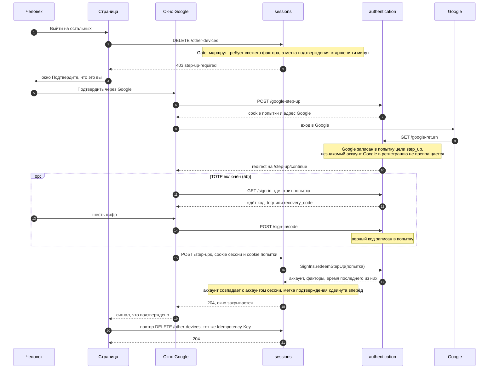
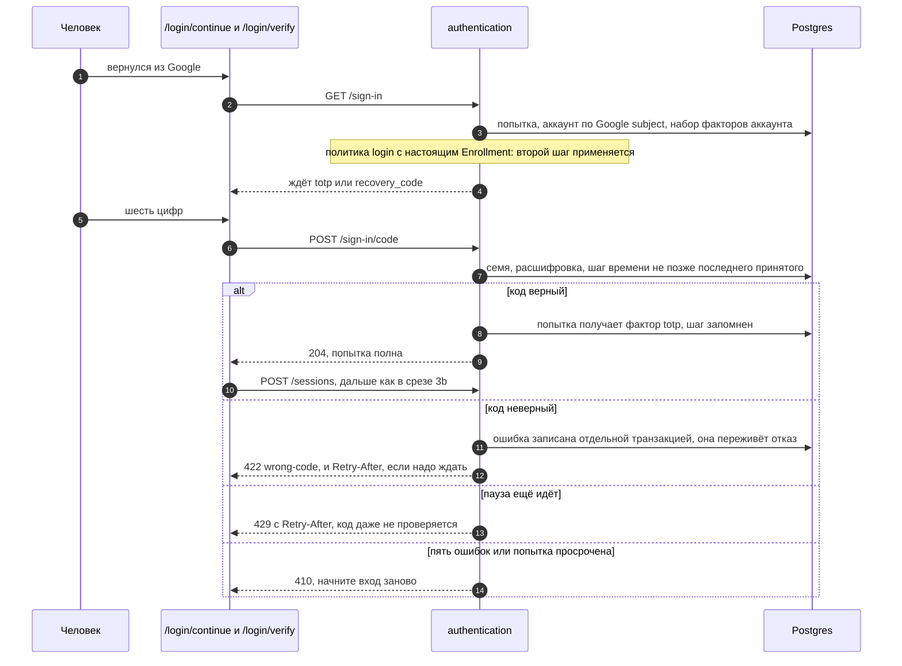
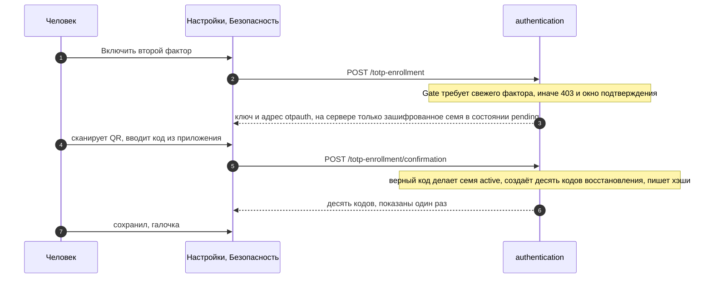
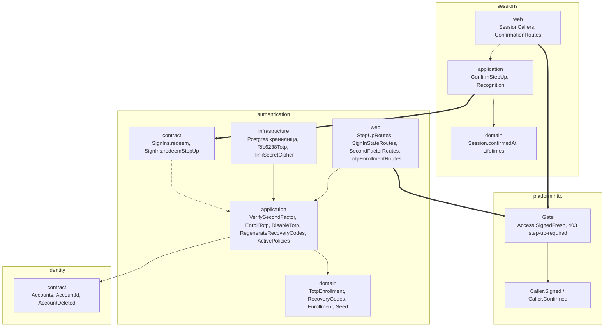
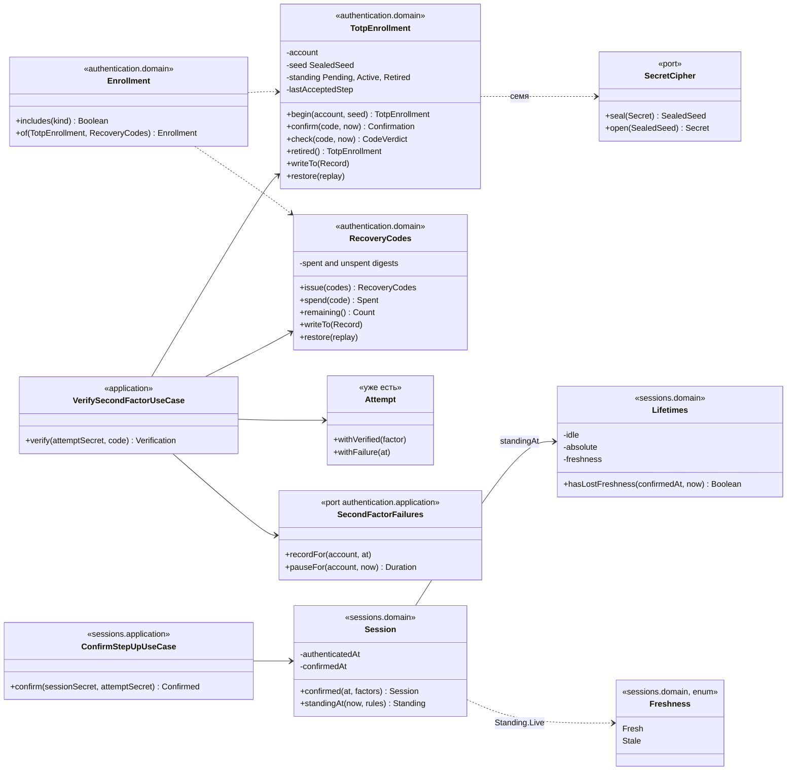

# Срез 5. Подтверждение свежим фактором и TOTP

> Слои: `platform:http`, `sessions`, `authentication`, `frontend-app`
> Статус: план принят Юрием 2026-10-03 (все четыре рекомендации). Реализуется тремя PR; в каждом PR этот документ правится вместе с кодом, если код отклонился от диаграмм. **5a реализован**, диаграммы ниже приведены к коду 5a (см. раздел «Что изменилось при реализации 5a»); части 5b пока по плану.
> Решение записано в [ADR-092](../adr/ADR-092-a-dangerous-act-asks-for-a-fresh-proof-and-the-session-remembers-it.md).
> Родительские документы: [ADR-078](../adr/ADR-078-factors-attempts-and-versioned-policies.md), [ADR-079](../adr/ADR-079-server-side-opaque-sessions.md), [ADR-082](../adr/ADR-082-second-factor-operations.md), [ADR-088](../adr/ADR-088-the-edge-decides-who-is-asking-and-closes-every-route-by-default.md), [ADR-090](../adr/ADR-090-devices-are-sessions-and-lifetimes-are-versions-owned-by-sessions.md)

Диаграммы здесь те же, что в плане, по которому написан код. Читать их нужно в таком порядке: что получится, как идёт запрос, кто от кого зависит, из каких классов состоит.

## 1. Что должно получиться

- Человек включает TOTP в настройках: сканирует QR, вводит первый код, получает десять кодов восстановления.
- При входе с включённым TOTP после Google появляется поле для шести цифр, рядом ссылка на код восстановления. Неверный код даёт растущую паузу, пять ошибок закрывают попытку.
- Опасное действие требует фактора не старше пяти минут. Если сессия «остыла», появляется окно «Подтвердите, что это вы»: Google, а при включённом TOTP ещё и код. Действие потом выполняется само.
- Закрывается отступление от ADR-079, записанное в ADR-090: выход на другом устройстве и «выйти на остальных» работали без подтверждения.

## 2. Порядок: три PR

| PR | Что внутри | Почему в этом порядке |
|---|---|---|
| **5a. Подтверждение** (бэкенд и окно во фронтенде) | Цель `step_up` работает. Метка подтверждения в сессии и срок свежести. Объявление «маршрут требует свежего фактора» (`Access.SignedFresh`) в `Gate` и ответ `403 step-up-required`. Охрана `DELETE /device/{id}` (чужого) и `DELETE /other-devices`. Окно подтверждения. TOTP ещё нет, подтверждает один Google. | Закрывает отступление ADR-090 первым и проверяется без TOTP. Окно нужно в том же PR, иначе экран «Устройства» получит 403 и не сумеет ответить. |
| **5b. TOTP (бэкенд)** | Включение в два шага, коды восстановления, проверка кода при входе и подтверждении, пауза и предел, счёт ошибок по аккаунту, отключение и перевыпуск под охраной из 5a. `Enrollment` становится настоящим. | Включение, отключение и перевыпуск сами опасные действия, значит 5a нужна раньше. |
| **5c. TOTP (фронтенд)** | `/login/verify`, поле кода в окне подтверждения, «Настройки → Безопасность», экран «Настройте второй фактор заново». | Как в срезе 4: бэкенд, потом экран. Пока 5c не слит, включить TOTP можно только через API. |

## 3. Принятые решения

| Развилка | Выбрано | Коротко почему |
|---|---|---|
| 1. Как подтверждение ложится в сессию | **A.** Метка `confirmedAt` меняется на месте, секрет cookie тот же. | Параллельные запросы не получают 401. Кража cookie и так отсекается «выйти на остальных», которое под охраной. ADR-079 уточняется: токен меняется при входе, а подтверждение действия не меняет того, кто держит сессию. |
| 2. Где живёт срок свежести | **B.** Третье число `freshness` в версиях сроков `sessions` рядом с `idle` и `absolute` (границы 1–15 минут, по умолчанию 5). | Те же версии, откат и журнал, тот же экран «Сроки сессий» в срезе 7, один запрос на каждый запрос. |
| 3. «Настройте заново» после кода восстановления | **B.** При входе по коду сервер списывает старое семя (`Retired`): принимаются только оставшиеся коды восстановления; новое включение создаёт семя и десять новых кодов. | Требование держится в данных, а не в состоянии сессии; потерянный телефон перестаёт что-либо значить сразу. |
| 4. Где считаются ошибки по аккаунту | **A.** Таблица в базе `authentication`. | Переживает перезапуск, не зависит от числа экземпляров. Правило: ошибки аккаунта за 15 минут, пауза = первая пауза, удвоенная на каждую следующую ошибку, не больше пяти минут. Коды восстановления проверяются без этой паузы. Блокировки аккаунта нет (ADR-082). |

Решено без развилок:

- **Опасные действия под охраной «свежий фактор»**: выйти на другом устройстве, выйти на остальных, начать включение TOTP, отключить TOTP, перевыпустить коды. Без охраны: выйти на этом устройстве, назвать устройство, список, подтверждение первого кода (сам код и есть подтверждение).
- **Включение тоже опасное**: иначе вор с украденной сессией включит свой TOTP на чужом аккаунте и запрёт хозяина. Пока TOTP не включён, подтверждение это один Google.
- **Свежесть объявляется на краю.** `authentication` не знает про сессии, поэтому `SessionCallers` сообщает `Gate`, свежий ли вызывающий (`Caller.Confirmed` вместо `Caller.Signed`), а маршрут объявляет `access = Access.SignedFresh`. Забыть охрану нельзя, ответ `403 step-up-required` единый.
- **Параметры TOTP**: HMAC-SHA1, 6 цифр, 30 секунд, принимается текущий шаг и по одному соседнему. Шаг принимается один раз: после принятого кода принимаются только шаги строго позже.
- **Семя**: 20 случайных байт, в базе зашифровано (Tink AES-256-GCM), новая переменная окружения `TOTP_KEYSET`.
- **Коды восстановления**: десять по 10 символов из 32 без похожих букв, показываются один раз, в базе ключевой хэш, каждый действует один раз.
- **Ошибки**: `403 step-up-required`, `403 forbidden` (чужое подтверждение в `POST /step-ups`), `409 conflict` (нечего принимать), `422 wrong-code`, `429` с `Retry-After`, `410` для закрытой попытки.

## 4. Как проходит подтверждение (5a, пунктиром 5b)

Если в Google вошёл другой аккаунт, `POST /step-ups` отвечает `403 forbidden`, попытка сгорает, окно предлагает начать заново. Подтверждение не выдаёт новую сессию: оно сдвигает метку существующей.

## 5. Как проходит вход с TOTP (5b)

## 6. Как проходит включение TOTP (5b)

## 7. Зависимости модулей бэкенда

Правила `modules.yaml` не меняются: `sessions → authentication → identity`, обратной стрелки нет.

Включение, отключение и перевыпуск живут в `authentication`, а свежесть сессии знает только `sessions`. Поэтому свежесть выражается на краю: `SessionCallers` говорит `Gate`, свежий ли вызывающий, маршрут объявляет `Access.SignedFresh` (как уже объявляет «публичный» или «только вошедший», ADR-088).

## 8. Классы

Поля приватные, состояние наружу только через `writeTo` и `restore` (ADR-085), никаких `data class` с открытыми полями.

**Как `Enrollment` попадает в политику.** Сегодня `ActivePolicies` передаёт `Enrollment.Unknown`. Попытка не выдаёт наружу, чей она аккаунт, зато `Progress.Complete` и `Restricted` несут `subject`. Поэтому `ActivePolicies` считает прогресс дважды: сначала с `Unknown` (Google пройден, кто это), потом, найдя аккаунт и его факторы, с настоящим `Enrollment`. Попытка и политика не меняются.

## 9. Что изменилось при реализации 5a

Код 5a отклонился от плана в мелочах; диаграммы выше уже исправлены. Решения при этом те же.

| В плане | В коде | Почему |
|---|---|---|
| `Access.SignedInFresh` | `Access.SignedFresh` | короче, читается рядом с `Signed` |
| `Caller.Signed` с признаком свежести | отдельный `Caller.Confirmed` | признак не нужен там, где свежесть не спрашивают; `Gate` смотрит на тип |
| `POST /google-sign-in` с целью `step-up` | отдельный `POST /google-step-up` | цель не приходит от клиента, её нельзя подменить |
| `SignIns.redeem(попытка, цель)` | `SignIns.redeemStepUp(попытка)` | вход и подтверждение нельзя перепутать: чужой тип попытки это «нечего принимать» |
| `403 step-up-wrong-account` | `403 forbidden` | такой тип в замкнутом наборе `Answers` не нужен: окно реагирует на статус |
| Метка подтверждения | `confirmedAt` в записи сессии (`Session.Record`), а читатели получают готовое решение `Freshness` в `Standing.Live` и `Resolution.SignedIn` | никто, кроме сессии, не считает «давно ли», и все согласны, что такое «недавно» |

## 10. Что не входит

Журнал и письма (срез 6), экран политик и «Сроки сессий» (срез 7; срок свежести станет там редактируемым), обязательный TOTP администратора и принудительная настройка (срез 7), токены расширения и мобильного клиента (срез 8), passkey. Публикатора `AccountDeleted` по-прежнему нет.
