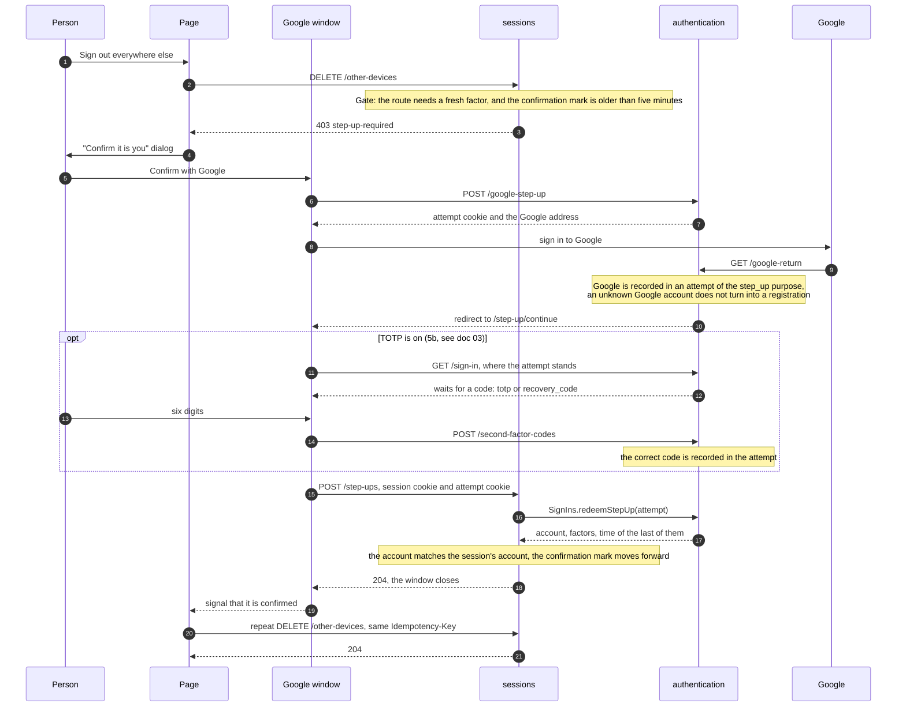
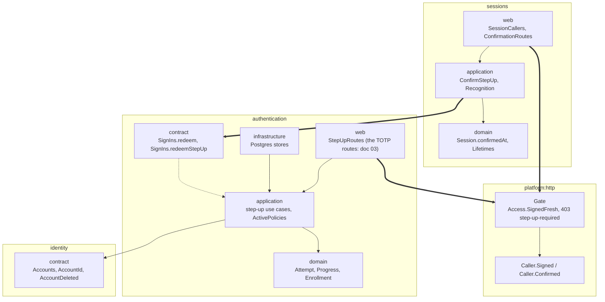
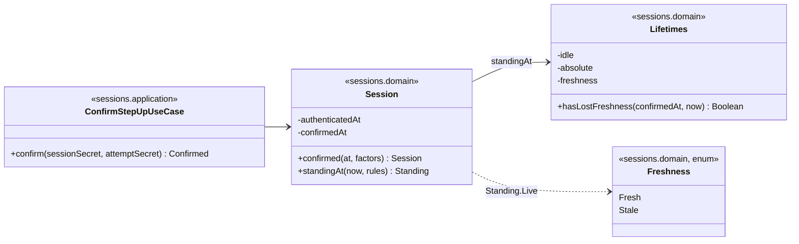

# Slice 5. Confirming with a fresh factor, and TOTP

> Layers: `platform:http`, `sessions`, `authentication`, `frontend-app`
> Status: plan accepted by Yurii on 2026-10-03 (all four recommendations). Delivered as three PRs; each PR edits this document together with the code if the code departs from the diagrams. **5a is implemented**, and the diagrams below are brought in line with the 5a code (see "What changed while implementing 5a"). **5b is implemented**, and its diagrams, now brought in line with the code, live in [03-authentication-slice-5b-totp.md](03-authentication-slice-5b-totp.md); 5c, the screens, is in [04-authentication-slice-5c-totp-screens.md](04-authentication-slice-5c-totp-screens.md).
> The decisions are recorded in [ADR-092](../adr/ADR-092-a-dangerous-act-asks-for-a-fresh-proof-and-the-session-remembers-it.md) (forks 1 and 2, 5a) and [ADR-093](../adr/ADR-093-totp-is-an-enrolment-with-a-standing-and-recovery-codes-retire-it.md) (forks 3 and 4, 5b).
> Parent documents: [ADR-078](../adr/ADR-078-factors-attempts-and-versioned-policies.md), [ADR-079](../adr/ADR-079-server-side-opaque-sessions.md), [ADR-082](../adr/ADR-082-second-factor-operations.md), [ADR-088](../adr/ADR-088-the-edge-decides-who-is-asking-and-closes-every-route-by-default.md), [ADR-090](../adr/ADR-090-devices-are-sessions-and-lifetimes-are-versions-owned-by-sessions.md)

The diagrams here are the ones from the plan the code was written by. Read them in this order: what we get, how a request flows, who depends on whom, which classes it is made of.

## 1. What we should end up with

- A person turns on TOTP in settings: scans a QR code, enters the first code, receives ten recovery codes.
- Signing in with TOTP on, a six-digit field appears after Google, with a link to use a recovery code instead. A wrong code brings a growing pause, and five mistakes close the attempt.
- A dangerous act needs a factor no older than five minutes. If the session has "gone cold", a "Confirm it is you" dialog appears: Google, plus a code when TOTP is on. The act then runs by itself.
- The departure from ADR-079 recorded in ADR-090 is closed: signing out another device and "sign out everywhere else" used to work without confirmation.

## 2. Order: three PRs

| PR | What is inside | Why in this order |
|---|---|---|
| **5a. Confirmation** (backend and the dialog in the frontend) | The `step_up` purpose works. A confirmation mark in the session and a freshness window. The declaration "this route needs a fresh factor" (`Access.SignedFresh`) in `Gate` and the `403 step-up-required` answer. Guards on `DELETE /device/{id}` (another device) and `DELETE /other-devices`. The confirmation dialog. No TOTP yet, Google alone confirms. | Closes the ADR-090 departure first and can be verified without TOTP. The dialog is needed in the same PR, otherwise the Devices screen would get a 403 it cannot answer. |
| **5b. TOTP (backend)**, see [03](03-authentication-slice-5b-totp.md) | Two-step enabling, recovery codes, code check at sign-in and at confirmation, pause and limit, failure counting per account, disabling and reissuing under the guard from 5a. `Enrollment` becomes real. | Enabling, disabling and reissuing are themselves dangerous acts, so 5a is needed first. |
| **5c. TOTP (frontend)** | `/login/verify`, a code field in the confirmation dialog, "Settings → Security", the "Set up the second factor again" screen. | As in slice 4: backend first, then the screen. Until 5c is merged, TOTP can only be enabled through the API. |

## 3. Decisions taken

| Fork | Chosen | Why, in short |
|---|---|---|
| 1. How a confirmation lands in the session | **A.** The `confirmedAt` mark changes in place, the cookie secret stays the same. | Parallel requests do not get a 401. Cookie theft is already cut off by "sign out everywhere else", which is guarded. ADR-079 is refined: the token changes at sign-in, and confirming an act does not change who holds the session. |
| 2. Where the freshness window lives | **B.** A third number, `freshness`, in the `sessions` lifetime versions next to `idle` and `absolute` (bounds 1–15 minutes, default 5). | The same versions, rollback and journal, the same "Session lifetimes" screen in slice 7, one query per request. |
| 3. "Set up again" after a recovery code | **B.** On a recovery-code sign-in the server retires the old seed (`Retired`): only the remaining recovery codes are accepted; enabling again creates a new seed and ten new codes. | The requirement is held in data, not in session state; a lost phone stops mattering immediately. |
| 4. Where per-account failures are counted | **A.** A table in the `authentication` database. | Survives a restart, does not depend on the number of instances. The rule: account failures in 15 minutes, pause = the first pause doubled for every further failure, at most five minutes. Recovery codes are checked without this pause. There is no account lockout (ADR-082). |

Decided without a fork:

- **Dangerous acts under the "fresh factor" guard**: sign out another device, sign out everywhere else, begin enabling TOTP, disable TOTP, reissue the codes. Without the guard: sign out this device, name a device, the list, confirming the first code (the code itself is the confirmation).
- **Enabling is dangerous too**: otherwise a thief holding a stolen session would enable their own TOTP on someone else's account and lock the owner out. While TOTP is off, confirming means Google alone.
- **Freshness is declared at the edge.** `authentication` knows nothing about sessions, so `SessionCallers` tells `Gate` whether the caller is fresh (`Caller.Confirmed` instead of `Caller.Signed`), and the route declares `access = Access.SignedFresh`. The guard cannot be forgotten, and the `403 step-up-required` answer is uniform.
- **TOTP parameters**: HMAC-SHA1, 6 digits, 30 seconds, the current step and one neighbour on each side are accepted. A step is accepted once: after an accepted code only strictly later steps are accepted.
- **Seed**: 20 random bytes, encrypted in the database (Tink AES-256-GCM), a new environment variable `TALLYVANE_TOTP_KEYSET` (`TOTP_KEYSET` in `ops/.env`).
- **Recovery codes**: ten codes of 10 characters from an alphabet of 32 without look-alike letters, shown once, a keyed hash in the database, each valid once.
- **Errors**: `403 step-up-required`, `403 forbidden` (someone else's confirmation at `POST /step-ups`), `409 conflict` (nothing to take), `422 wrong-code`, `429` with `Retry-After`, `410` for a closed attempt.

## 4. How a confirmation goes (5a, with the second step of 5b)

If a different account signed in to Google, `POST /step-ups` answers `403 forbidden`, the attempt is spent, and the dialog offers to start over. A confirmation does not grant a new session: it moves the mark of the existing one.

## 5. TOTP at sign-in, enabling, disabling and reissuing (5b)

The sequence diagrams for these flows, the routes, the classes and the tables of 5b are in [03-authentication-slice-5b-totp.md](03-authentication-slice-5b-totp.md), which the 5b code was written from.

## 6. Backend module dependencies

The `modules.yaml` rules do not change: `sessions → authentication → identity`, with no arrow back.

Enabling, disabling and reissuing (5b, doc 03) live in `authentication`, while only `sessions` knows how fresh a session is. So freshness is expressed at the edge: `SessionCallers` tells `Gate` whether the caller is fresh, and the route declares `Access.SignedFresh` (the way it already declares "public" or "signed in only", ADR-088).

## 7. Classes

Fields are private, state goes out only through `writeTo` and `restore` (ADR-085), and there are no `data class`es with open fields.

The classes of TOTP itself (`TotpEnrollment`, `RecoveryCodes`, the ports and use cases of 5b) are in [03](03-authentication-slice-5b-totp.md#7-classes).

## 8. What changed while implementing 5a

The 5a code departed from the plan in small ways; the diagrams above are already corrected. The decisions are the same.

| In the plan | In the code | Why |
|---|---|---|
| `Access.SignedInFresh` | `Access.SignedFresh` | shorter, reads well next to `Signed` |
| `Caller.Signed` with a freshness flag | a separate `Caller.Confirmed` | the flag is not needed where freshness is not asked about; `Gate` looks at the type |
| `POST /google-sign-in` with the `step-up` purpose | a separate `POST /google-step-up` | the purpose does not come from the client, so it cannot be forged |
| `SignIns.redeem(attempt, purpose)` | `SignIns.redeemStepUp(attempt)` | a sign-in and a confirmation cannot be mixed up: an attempt of the other kind is "nothing to take" |
| `403 step-up-wrong-account` | `403 forbidden` | the closed set of `Answers` does not need such a type: the dialog reacts to the status |
| The confirmation mark | `confirmedAt` in the session record (`Session.Record`), and readers get a ready decision, `Freshness`, in `Standing.Live` and `Resolution.SignedIn` | nobody except the session computes "how long ago", and everyone agrees on what "recent" means |
| `Departures` built inside the two begin use cases | one `Departures` built by the composition root and passed to both as a constructor dependency | review feedback: building a collaborator inside a class breaks DI and open/closed, and one shared instance avoids the duplication |

## 9. Out of scope

The journal and emails (slice 6), the policy screen and "Session lifetimes" (slice 7; the freshness window becomes editable there), mandatory TOTP for administrators and forced setup (slice 7), extension and mobile client tokens (slice 8), passkeys. There is still no publisher of `AccountDeleted`.
