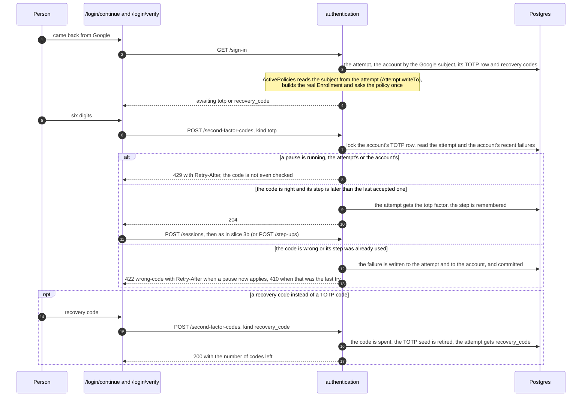
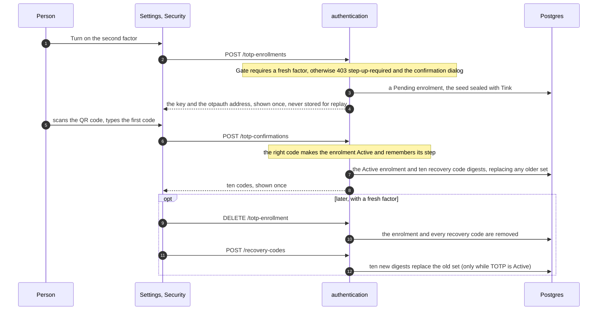
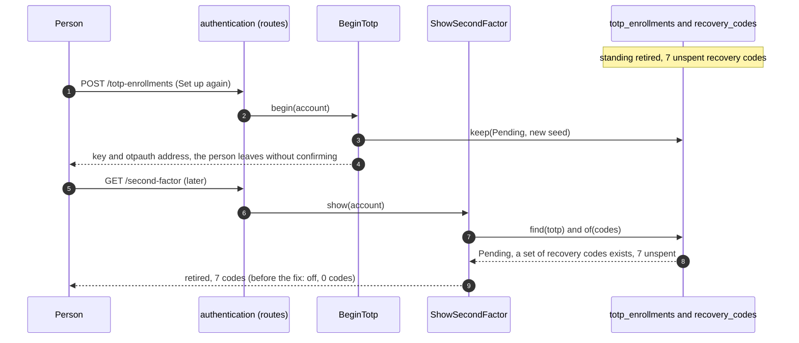
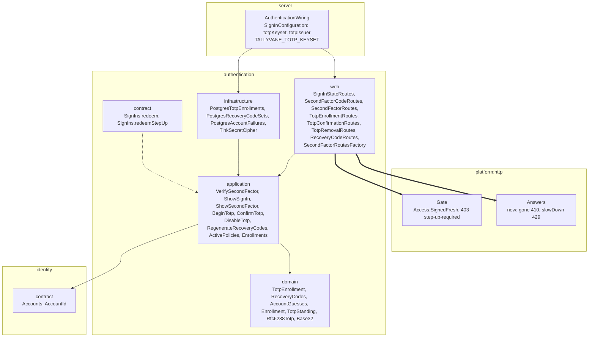
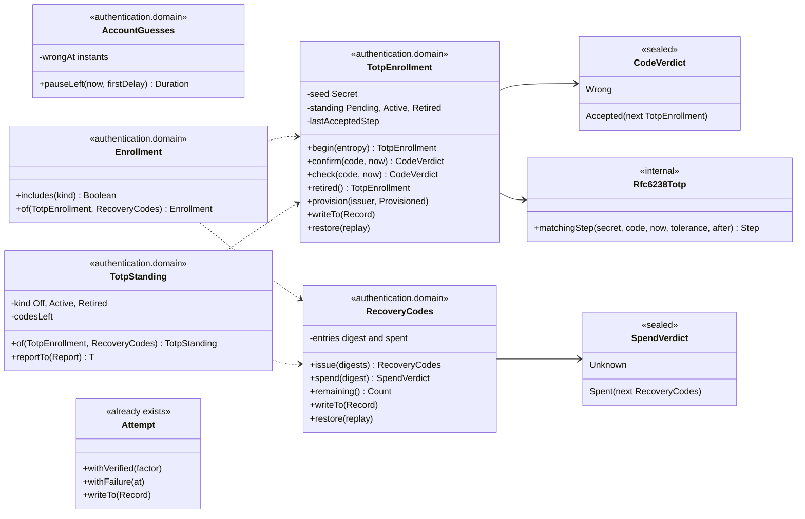
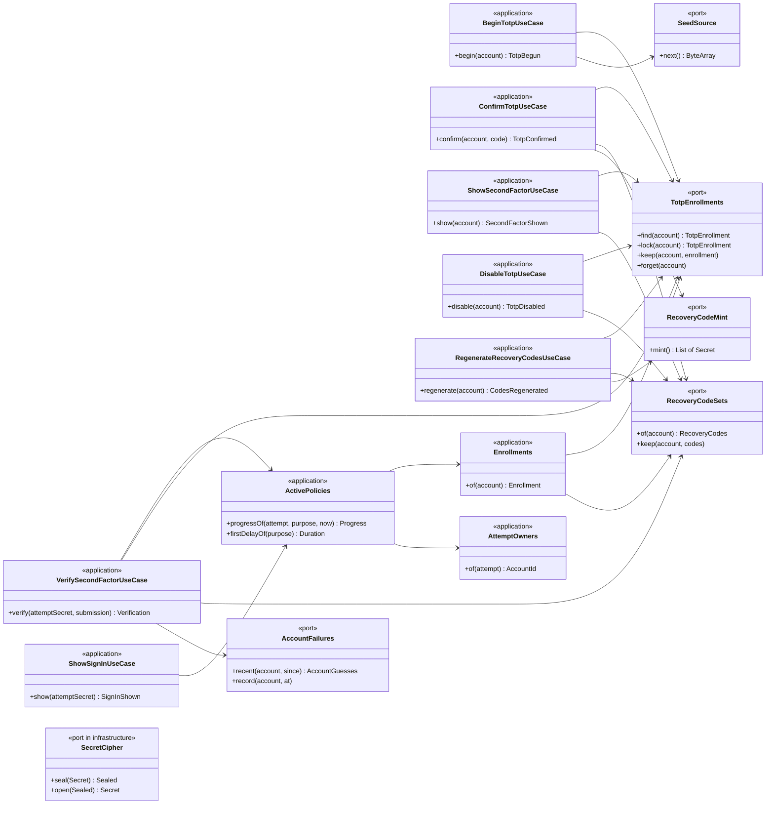
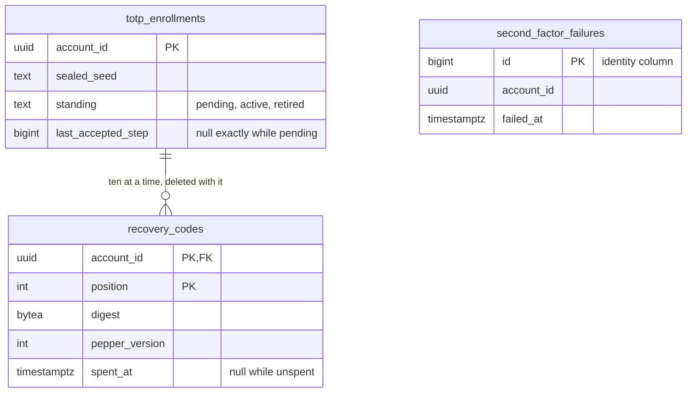

# Slice 5b. TOTP on the backend

> Layers: `platform:http`, `authentication`, `server`
> Status: plan accepted by Yurii on 2026-10-03 as part of slice 5 (all four recommendations). **5b is implemented**: the diagrams below are brought in line with the code (see "What changed while implementing" at the end). If the code departs from a diagram again, the same PR changes the diagram. Setting TOTP up again over a retired seed was fixed afterwards (see the end of section 5, the `TotpStanding` class in section 7, and the last item in section 11).
> The decision is recorded in [ADR-093](../adr/ADR-093-totp-is-an-enrolment-with-a-standing-and-recovery-codes-retire-it.md).
> Parent documents: [02-authentication-slice-5.md](02-authentication-slice-5.md) (the slice plan and 5a), [ADR-078](../adr/ADR-078-factors-attempts-and-versioned-policies.md), [ADR-082](../adr/ADR-082-second-factor-operations.md), [ADR-092](../adr/ADR-092-a-dangerous-act-asks-for-a-fresh-proof-and-the-session-remembers-it.md)

Read it in this order: what we get, which routes exist, how a request flows, who depends on whom, which classes it is made of, what is stored.

## 1. What we should end up with

- A signed-in person turns TOTP on through the API: the server hands out a key (and an `otpauth://` address) once, the person types the first code from their authenticator, and receives ten recovery codes, shown once.
- Signing in with TOTP on, the attempt waits for `totp` or `recovery_code` after Google. The attempt can be asked where it stands (`GET /sign-in`) and answered with a code. A wrong code brings a growing pause, five wrong answers close the attempt, and the account has its own failure counter that outlives any single attempt.
- A confirmation of a dangerous act (5a) asks for the same second step when TOTP is on.
- Disabling TOTP, reissuing the recovery codes and beginning to enable TOTP are dangerous acts and sit behind the 5a guard (`Access.SignedFresh`).
- A recovery-code sign-in spends the code and retires the TOTP seed: only the remaining recovery codes work until the person enables TOTP again, which creates a new seed and ten new codes.
- The frontend (5c) is not in this PR: until it lands, TOTP can be driven through the API only.

## 2. Decisions

The four forks of slice 5 were answered with the recommendations (see [02](02-authentication-slice-5.md#3-decisions-taken)); the ones that shape 5b are fork 3 (a recovery-code sign-in retires the seed) and fork 4 (failures per account live in a table in the `authentication` database).

Decided while planning 5b, without a new fork:

- **TOTP parameters.** HMAC-SHA1, 6 digits, 30-second step, the current step and one neighbour on each side are accepted. A step is accepted once: after an accepted code only strictly later steps are accepted. The three candidate codes are compared in constant time.
- **The seed.** 20 random bytes, written as base32, encrypted in the database with Tink AES-256-GCM under a keyset from a new environment variable `TALLYVANE_TOTP_KEYSET`. The ciphertext carries Tink's own key id, so a rotated keyset can still open older rows. The domain object holds the seed as a `Secret` and tells it to the store through a record; the store seals it on the way down and opens it on the way up, so no domain class ever meets a cipher.
- **Recovery codes.** Ten codes of ten characters from a 32-letter alphabet without look-alikes (`ABCDE-FGHJK` when shown), 50 bits each, kept as keyed digests under the same pepper as attempts, each valid once. Typing ignores case, dashes and spaces.
- **Standing of an enrolment.** `Pending` (begun, not confirmed, counts for nothing), `Active`, `Retired` (the seed no longer works, the remaining recovery codes do). Beginning while `Active` is a conflict; beginning while `Pending` or `Retired` starts over. Confirming replaces the whole set of recovery codes. What the settings screen is told (`off`, `active`, `retired`) is read by `TotpStanding` from the enrolment and the recovery codes together: a `Pending` enrolment with a set of recovery codes kept beside it is `retired`, because that set exists only once a first code was confirmed.
- **What counts as enrolled.** TOTP is enrolled while the standing is `Active`. A recovery code is enrolled while at least one is unspent. So the second step applies to a person with an active seed or with unspent codes. When a `Retired` person spends their last code nothing is enrolled any more and Google alone signs them in, the same as for a person who disabled TOTP. The alternative, a second step nobody can pass, is the account lockout ADR-082 refuses.
- **Any accepted recovery code retires the seed**, at sign-in and at confirmation alike.
- **One pass through the policy.** The attempt already tells its Google subject through `Attempt.writeTo`, so `ActivePolicies` reads the subject from there, finds the account, builds the real `Enrollment` and asks the policy once. This replaces "compute progress twice" from the slice plan: the answer is the same and there is no intermediate `Progress` to take a subject from.
- **Failures.** Wrong TOTP codes are written to the attempt and to `second_factor_failures` in one transaction that commits even though the answer is a refusal. A wrong recovery code is written to the attempt only, since 50 bits cannot be guessed, and is checked without the account pause. The account pause counts failures of the last 15 minutes: the policy's first delay, doubled for every further failure, at most five minutes. There is no account lockout (ADR-082).
- **A request that loses a race** (the attempt changed under it) answers `409` and the client asks again; it never records a failure it did not cause.
- **The edge.** Beginning, disabling and reissuing declare `Access.SignedFresh`. Showing the standing and confirming the first code only need `Access.Signed`; the first code is itself the proof. The answers that carry a key or codes are withheld from idempotent replay (`SecretAnswer`).
- **Two new meanings in `Answers`**: `gone` (410, the attempt is over) and `slowDown` (429). The `Retry-After` header is set by the route from the failure.
- **Labels.** The `otpauth://` address names only the issuer; the account label arrives with a profile contract from `identity`.

## 3. Routes

One route module per use case (`web-one-usecase`) and one segment per base path, as in `sessions`.

| Route | Who may call | Use case | Answers |
|---|---|---|---|
| `GET /sign-in` | holder of the attempt cookie | `ShowSignIn` | the state: `awaiting` (with the kinds accepted), `paused` (`retryAfter`), `complete`, `restricted`, `exhausted`, `expired`; `404` without a sign-in or confirmation |
| `POST /second-factor-codes` `{kind, code}` | holder of the attempt cookie | `VerifySecondFactor` | `204` for a TOTP code, `200 {recoveryCodesRemaining}` for a recovery code, `422 wrong-code` (+`Retry-After`), `429` (+`Retry-After`), `410` the attempt is over, `409` when the attempt does not wait for this kind of answer or another request changed it first, `400` for an unknown `kind` |
| `GET /second-factor` | signed in | `ShowSecondFactor` | `{standing: off|active|retired, recoveryCodesRemaining}` |
| `POST /totp-enrollments` | signed in, fresh | `BeginTotp` | `200 {key, uri}` shown once; `409` when already active |
| `POST /totp-confirmations` `{code}` | signed in | `ConfirmTotp` | `200 {recoveryCodes}` shown once; `422 wrong-code`; `409` when nothing was begun |
| `DELETE /totp-enrollment` | signed in, fresh | `DisableTotp` | `204`; `409` when there is none |
| `POST /recovery-codes` | signed in, fresh | `RegenerateRecoveryCodes` | `200 {recoveryCodes}` shown once; `409` unless TOTP is active |

## 4. How a sign-in with TOTP goes

## 5. How enabling, disabling and reissuing go

### Setting up again after a recovery-code sign-in

A recovery-code sign-in retires the seed but leaves the unspent recovery codes. Beginning again replaces the retired row with a `Pending` one, so the row alone no longer says that the person had TOTP. `ShowSecondFactor` therefore asks `TotpStanding`, which reads the row and the recovery codes together.

## 6. Backend module dependencies

The `modules.yaml` rules do not change: `sessions → authentication → identity`, with no arrow back. The new arrows are inside `authentication`, plus the platform edges named below.

`sessions` does not change: it already redeems through `SignIns`, and now the policy it asks about knows the real enrolment.

## 7. Classes

Fields are private, state goes out only through `writeTo` and comes back through `restore` (ADR-085), and there are no `data class`es with open fields. First the domain, which knows nothing of a database, a cipher or an account:

Then the application, with its ports and the use cases that carry the transaction boundaries:

`ActivePolicies` keeps `progressOf` and its constructor takes the policy versions, `AttemptOwners` and `Enrollments`. `AttemptOwners` asks the attempt for its Google subject by having it tell its state to a small record and asks `Accounts` whose account that is; `Enrollments` says what shape of second factor the account has set up. `VerifySecondFactor` uses the same `AttemptOwners` to know whose failures to count, so no other class learns an account from an attempt.

## 8. What is stored

All three tables live in the `authentication` schema. `account_id` names an `identity` account by value, with no foreign key across schemas (`own-schema-only`); the only foreign key is inside the schema, from `recovery_codes` to `totp_enrollments`, with `on delete cascade`. `recovery_codes` is unique on `(account_id, digest, pepper_version)`, so a code is one row. A check says an enrolment has accepted no step exactly while it is pending. Old failure rows are removed when a new one is written. Disabling removes the enrolment row and, with it, the codes. The sealed seed is the only column that needs the keyset; the migration is `V20261003150000__second_factor_storage.sql`.

## 9. Configuration

`TALLYVANE_TOTP_KEYSET` is a Tink keyset in JSON form (AES-256-GCM). The server refuses to start without it. `ops/README.md` documents how to generate one (`tinkey create-keyset --key-template AES256_GCM --out-format json`), `ops/.env.example` and `docker-compose.yml` carry the variable, and the local stand ships a local-only keyset. The issuer shown in authenticator apps is `SignInConfiguration.totpIssuer`.

## 10. Out of scope

The screens (5c: `/login/verify`, a code field in the confirmation dialog, Settings → Security, "Set up the second factor again"), the journal and emails (slice 6), forced setup and mandatory TOTP for administrators (slice 7; `admin_login` with an account that has nothing enrolled stays `restricted`, which nothing redeems yet), the account label in the `otpauth://` address, cleaning up old attempts.

## 11. What changed while implementing

The flows and the module arrows above are as planned. These are the places where the code differs from what the plan drew or said, and the diagrams are corrected to match.

- **Port names.** `TotpEnrollments` and `RecoveryCodeSets` say `keep` (not `save`), because they replace what is there; `RecoveryCodeSets` reads with `of(account)` (not `find`). `ActivePolicies` gained `firstDelayOf(purpose)`, which `VerifySecondFactor` uses to turn the policy's first delay into the account pause.
- **Domain.** `Rfc6238Totp.matchingStep` takes the tolerance and the step after which a code may be taken (the single-use rule), and returns the matching step or null. `TotpEnrollment.provision` takes the issuer and a `Provisioned` callback that receives the key and the `otpauth://` address as `Secret`s, so neither is ever a `String` field on a domain class.
- **Tables.** `begun_at` was dropped, since nothing reads it. `recovery_codes` cascades from `totp_enrollments` and is unique on `(account_id, digest, pepper_version)`; `second_factor_failures` has an identity column.
- **Web.** The seven new route modules are built by their own `SecondFactorRoutesFactory`, because adding them to `AuthenticationRoutesFactory` went over the function-count limit; the older routes stay where they were. `SignInShown.Shown` carries the moment it was asked and has a `Report` of its own that tells how long a pause still lasts, so the route needs neither the clock nor the domain's `Progress`. An unknown `kind` in `POST /second-factor-codes` is a `400`.
- **Rulings.** `VerifySecondFactor` decides in a private `Ruling` whether what was recorded stays, because a `Verdict` may only be the last expression of the transactional block (`no-verdict-in-signature`): a wrong code commits its failure; a right code that lost a race to change the attempt (`409`) rolls back, so the code is not spent for nothing; a wrong code that lost the race still commits the account's failure.
- **First code.** A wrong first code at `POST /totp-confirmations` commits nothing and has no limit of its own: the enrolment is still `Pending`, counts for nothing, and the person is signed in already, so there is nothing to guess towards.
- **The label.** The `otpauth://` address names the issuer only, as planned; the account label waits for a profile contract from `identity`.
- **What a step offers.** `Step.requestFrom` takes the enrolment and offers only the kinds the account can pass, so a person whose seed was retired is shown `recovery_code` alone, and a TOTP code sent to them anyway is answered `409` and counts against nobody. Found in review.
- **First beginnings take turns.** `for update` cannot lock a row that does not exist yet, so `PostgresTotpEnrollments.lock` first takes a transaction-scoped advisory lock named after the account. Two first-time `POST /totp-enrollments` at once then run one after the other (the second starts over, as for any `Pending` enrolment) instead of one of them failing on the primary key. Found in review.
- **Pepper rotation.** Recovery codes are digests under the token pepper and `Digests` knows one pepper only, as it does for sessions and attempts, so ADR-079's "old digests are checked with the version they were made with" is not yet true anywhere. Rotating `TOKEN_PEPPER` would make every unspent recovery code fail until that exists; it is a platform change and is left to its own slice.
- **Open point for the owner.** A `Retired` person who has spent every recovery code is signed in by Google alone again (`Enrollment.of`, one line). That follows ADR-082's no-lockout rule; making them set TOTP up again first is a decision for slice 7 (forced setup).
- **Setting up again over a retired seed** (found in the review of the 5c screens). `BeginTotp` replaces a `Retired` row with a `Pending` one, and `ShowSecondFactor` only knew `Active` and `Retired`, so a person who pressed "Set up again" and left was told `off` with no recovery codes while their unspent codes still worked. Signing in was never affected, since `Enrollment.of` counts a `Pending` seed for nothing and the codes still pass; the settings screen hid the controls and said there was no protection. `TotpStanding` now reads the enrolment and the recovery codes together: a `Pending` enrolment with a set of recovery codes beside it is `retired`. That holds because the only way a set comes to exist is `ConfirmTotp`, and `forget` removes the set with the enrolment. No migration and no change to the API or the frontend; the answer is still `off`, `active` or `retired`.
