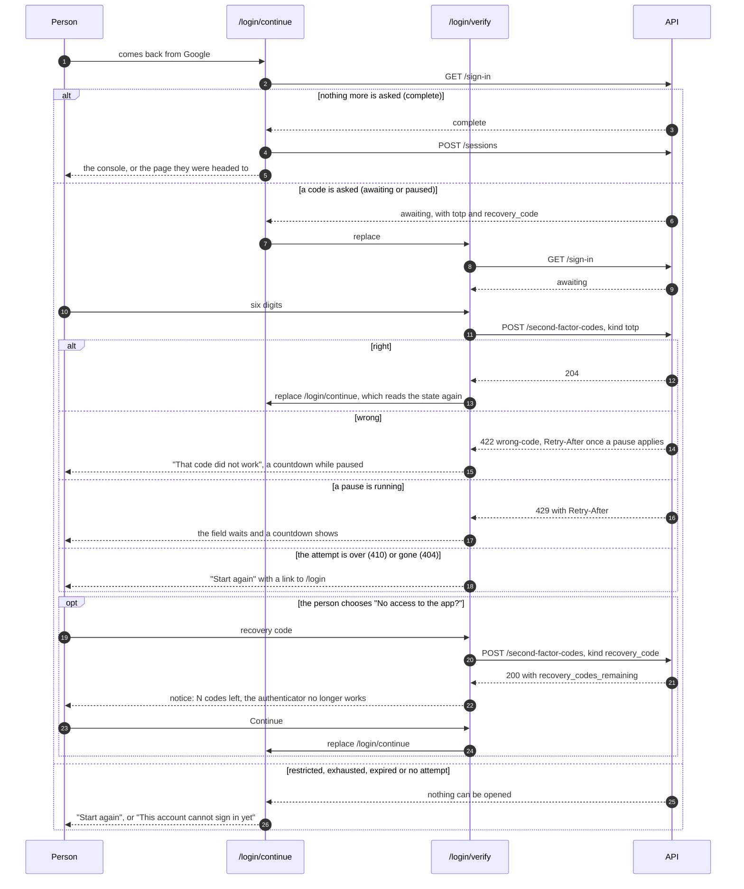
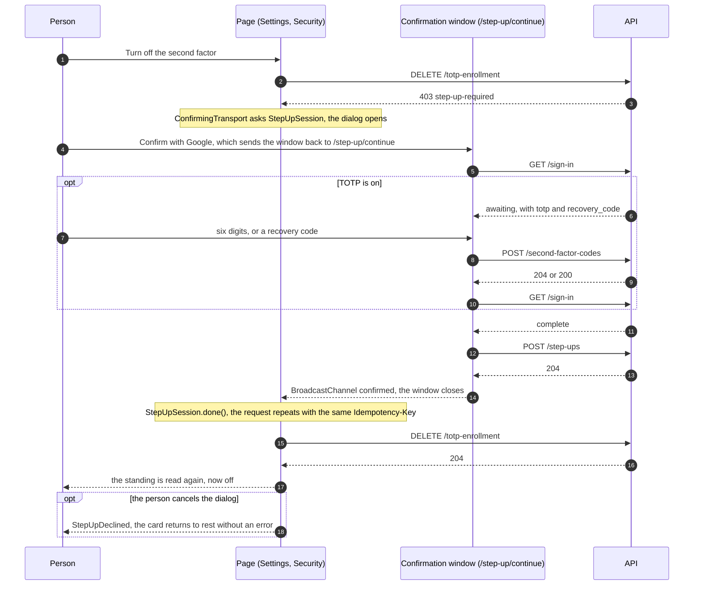
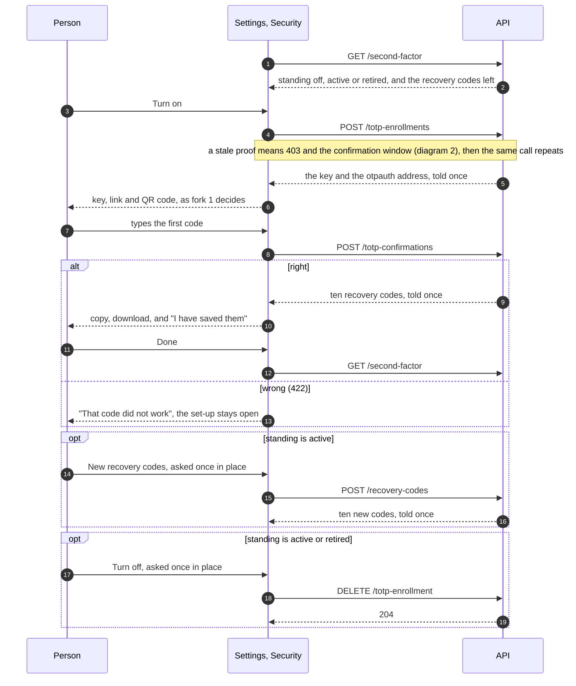
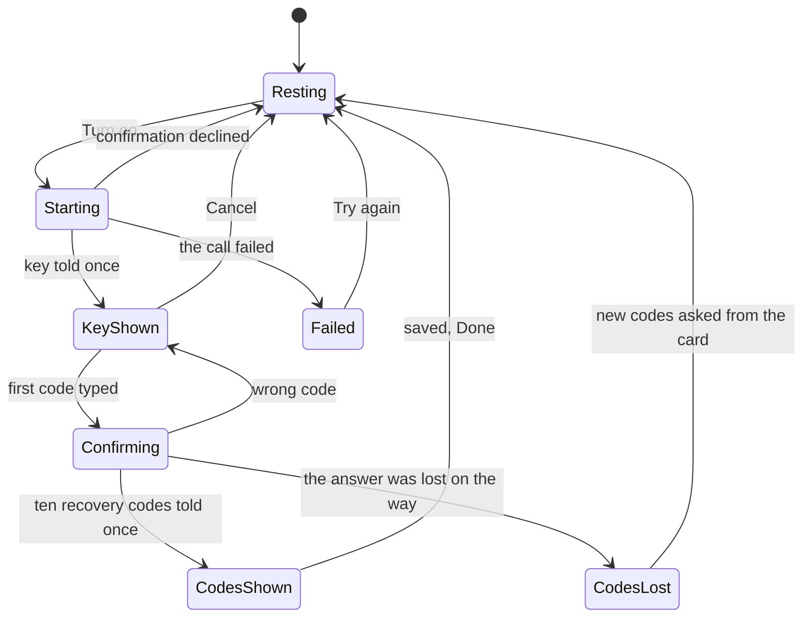
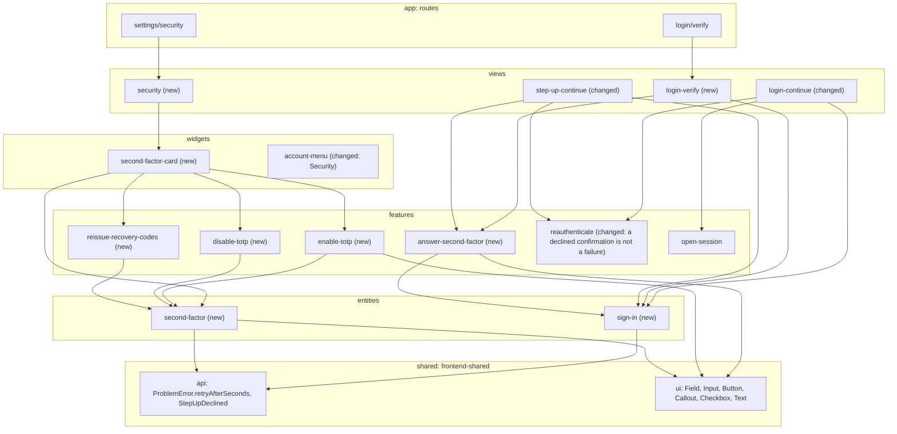
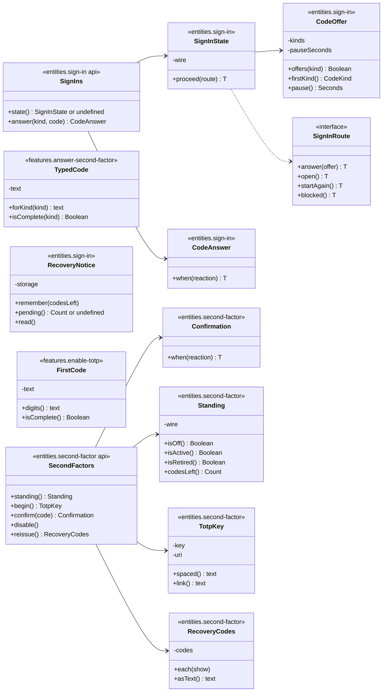

# Slice 5c. The TOTP screens

> Layers: `frontend-app`, `frontend-shared`
> Status: plan accepted by Yurii on 2026-10-03 (both forks, the recommended option each time). The diagrams below are the ones the code is written from. If the code departs from a diagram, the same PR changes the diagram.
> The decision is recorded in [ADR-094](../adr/ADR-094-the-code-screens-ask-the-server-where-the-attempt-stands.md).
> Parent documents: [02-authentication-slice-5.md](02-authentication-slice-5.md) (the slice plan and 5a), [03-authentication-slice-5b-totp.md](03-authentication-slice-5b-totp.md) (the backend this slice draws screens for), [ADR-089](../adr/ADR-089-the-console-talks-to-the-api-through-a-chain-of-one-job-transports.md), [ADR-091](../adr/ADR-091-the-devices-screen-saves-a-name-once-and-asks-in-place.md), [ADR-092](../adr/ADR-092-a-dangerous-act-asks-for-a-fresh-proof-and-the-session-remembers-it.md), [ADR-093](../adr/ADR-093-totp-is-an-enrolment-with-a-standing-and-recovery-codes-retire-it.md)

Read it in this order: what we get, how a sign-in and a confirmation flow, how the settings card flows, who depends on whom, which classes it is made of.

## 1. What we should end up with

- **Signing in with TOTP on.** After Google the person lands on `/login/verify`: a field for six digits and a link "No access to the app?" that turns the field into one for a recovery code. A wrong code is answered with a message and then a countdown of the pause. A closed attempt is explained and leads back to `/login`.
- **Confirming a dangerous act.** With TOTP on, the same field appears after Google in the same pop-up window (`/step-up/continue`), as slice 5 drew it. The dialog on the page behind only changes its words.
- **Settings, Security** (`/settings/security`): turn TOTP on (key, link and QR code shown once, the first code, ten recovery codes shown once with copy, download and "I have saved them"), turn it off, ask for new recovery codes. The `retired` standing (the old seed was retired by a recovery-code sign-in) is shown plainly, with "Set up again".
- **After a recovery-code sign-in** a notice stands before the console: how many codes are left, that the authenticator no longer works, and the buttons "Set up now" and "Continue".

The backend and `docs/openapi.yaml` do not change: the seven routes of 5b are all there and their types are generated.

## 2. Decisions

Both forks were answered with the recommendation.

| Fork | Chosen | Why, in short |
|---|---|---|
| 1. How the key is shown | **B.** A QR code drawn in the browser by the `qrcode` library, behind a `QrCode` primitive in `frontend-shared`, next to the key to type and the `otpauth://` link. | Scanning is how people expect to set an authenticator up, and the library is hidden behind one primitive so nothing else knows it. |
| 2. After a recovery-code sign-in | **A.** One notice before the console: codes left, the authenticator no longer works, "Set up now" and "Continue". | A person who lost a phone must not miss that their protection now stands on a few written codes. |

Decided without a fork:

- **`/login/continue` is the dispatcher.** It alone reads `GET /sign-in` and decides: `complete` opens the session, `awaiting` or `paused` goes on to `/login/verify`, anything else says "start again". `/login/verify` only asks for the code and goes back to the dispatcher. So the code page survives a refresh and the back button: every page reads the state again instead of remembering it.
- **The code is asked in the confirmation window**, with the same form, and the window ends with `POST /step-ups` instead of `POST /sessions`. Features do not know each other, so the two pages (views) put the form (`answer-second-factor`) together with `reauthenticate`.
- **The address.** `/settings/security`, next to `/settings/devices`, a "Security" item in the account menu. The pages stay separate (ADR-091); joining them into one Settings screen is for when the journal arrives (slice 6).
- **The field.** Six digits, `inputmode=numeric`, `autocomplete=one-time-code`; spaces and dashes are ignored. A recovery code ignores case, dashes and spaces, as on the server. It is sent by the button or Enter and never automatically on the sixth digit: every wrong code lengthens the pause.
- **The pause.** Seconds count down on screen ("Try again in 4 s"), the field and the button wait, and a screen reader hears it once, not every second. Messages say nothing a guesser could use ("That code did not work").
- **Turning off and reissuing ask once, in place** (as "Sign out everywhere else", ADR-091), in front of the confirmation dialog, not instead of it. Turning off says the recovery codes stop working too; reissuing says the old codes stop working.
- **Cancelling the confirmation dialog is not an error.** `StepUpDeclined` lets the card return to rest without a red message, where any other failure shows one.
- **Lost answers.** The answers that are told once are not replayed by the server. If one is lost (a `409` without `Retry-After`): for the key the card simply starts over; for the recovery codes it says in words that TOTP is on and the codes did not arrive, and leads to "New recovery codes".
- **Recovery codes.** Copy, download as `.txt`, and a box "I have saved the codes" that opens "Done". The key, the link, the QR code and the codes live only in the memory of the component: not in storage, not in logs, gone when the person leaves the page (the codes can be reissued).
- **Strings** are English, in `en.json`, none in markup.

## 3. How a sign-in goes (diagram 1)

## 4. How the confirmation window goes (diagram 2)

The window does what the sign-in dispatcher does, and ends by calling `POST /step-ups` instead of `POST /sessions`. It uses the same code form.

## 5. How Security works (diagram 3)

Enabling inside the card goes by steps, and each step lives in one place:

## 6. Module dependencies (diagram 4)

Feature-Sliced Design layers, arrows only downwards. The code page (a view) puts the feature "answer with a code" together with the sign-in entity; the confirmation window puts the same feature together with `reauthenticate`. Features do not know each other, which is why the code form cannot live inside `reauthenticate`: the gluing is done in the views layer, as `login-continue` already does.

## 7. Classes (diagram 5)

The same rules as on the backend and in slice 4: fields are private, behaviour is in methods, no bags of fields go outwards. An answer of the server becomes an object at the border (`SignIns`, `SecondFactors`), and the pages ask the object what to do (`proceed`, `when`) instead of taking the answer apart.

Other changes in shared code: `ProblemError.retryAfterSeconds()` and the kinds `gone` and `slow-down`; `StepUpDeclined` in `shared/api`, with which `StepUpSession.cancel` rejects the waiting requests; strings in `en.json`; a "Security" item in the account menu; the `QrCode` primitive in `frontend-shared`.

## 8. Out of scope

The backend and `docs/openapi.yaml` (unchanged); the journal and emails (slice 6); forced set-up and mandatory TOTP for administrators (slice 7: here "Set up again" is only offered, not required); the Devices screen stays a page of its own. Rotating `TOKEN_PEPPER` still makes unspent recovery codes fail (see doc 03), which belongs to a platform slice of its own.

## 9. What changed while implementing

The screens follow the diagrams. Where the code differs from them, or the plan said nothing, this is what happened:

- **`Confirmation` at the border.** `SecondFactors.confirm` returns a `Confirmation` (`confirmed`, `wrong`, `conflict`) that the page reads with `when`, the same way `CodeAnswer` is read, instead of the page catching a 422 itself. Diagram 5 shows it.
- **`FirstCode` next to `TypedCode`.** Turning TOTP on only ever takes six digits, so it has its own small class in `features/enable-totp` rather than reusing `TypedCode`, which also knows recovery codes. Features cannot import each other, so sharing was not an option anyway.
- **`useCodeEntry`.** The field of the second step is split into a hook (what is typed, what is awaited, what the server said) and `SecondFactorForm` (what each of those looks like), to stay under the function size and complexity limits.
- **A wrong code clears itself when the person types.** The design system's `Field` marks the control invalid while an error is shown, and the Base UI `Form` refuses to submit an invalid field, so without this a second try after a wrong code was silently not sent. Found by driving the screens in Chromium. The same goes for the first-code field when turning TOTP on.
- **The recovery-code notice survives a reload.** The server forgets that a recovery code was used as soon as it is accepted (the attempt is then just complete), so the page keeps the number of codes left in this tab (`RecoveryNotice`, session storage, nothing secret) until the person has read the notice. Found in review.
- **`StepUpDeclined` has its own file** (one class per file) and `Api.ResponseBody` now distributes over the success responses, so a call with a `204` or a `200` with a body types correctly.
- **`Redirect` in `shared/navigation`.** The dispatcher and the verify page both need "go there, show a spinner meanwhile" from inside a render, which has to happen from an effect.
- **`ConfirmStepUp keepOpen`.** In the confirmation window the code is asked in the same window, so after the confirmation the window must not close before the code step is done; the new prop lets the window decide.
- **Set-up states.** The "confirming" state of turning TOTP on is its own state, and the key step carries the mistake (`none`, `wrong`, `failed`), so the key and the QR code stay on screen across a wrong code and a retry.
- **A line under the title of the confirmation window** (`stepUpContinue.lead`) says an app code may be asked, because the window now sometimes shows a field.

How it was checked: unit tests of the border classes and the client chain over a fake `fetch`; type check, lint and the architecture check; `next build`; and the screens driven in Chromium against a stand-in API that follows the contract of `POST /second-factor-codes`, `GET /sign-in` and the enrollment routes (code and recovery-code sign-in, a pause and an exhausted attempt, turning on with the QR code, recovery codes, reissue, turning off, a retired authenticator, and the confirmation window asking for a code). It was not run against the real backend or the real Google.
