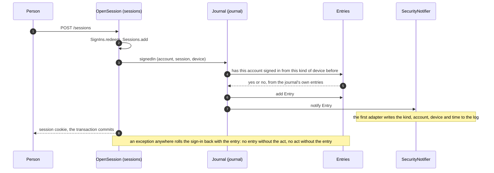
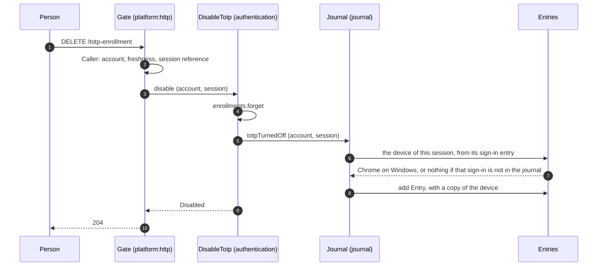
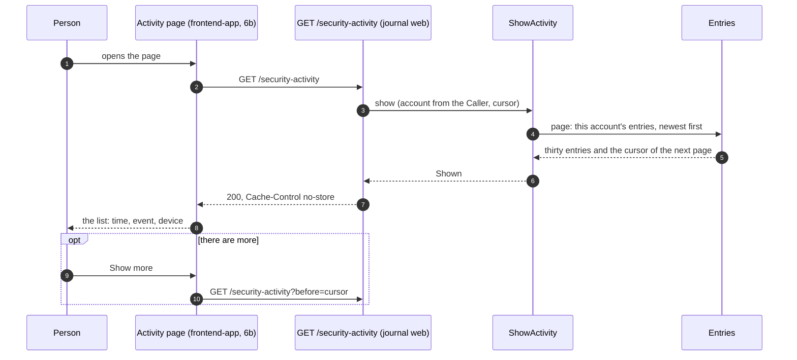
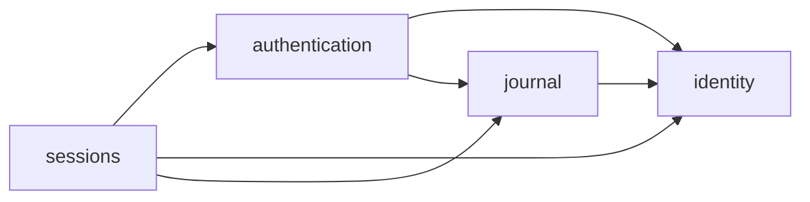
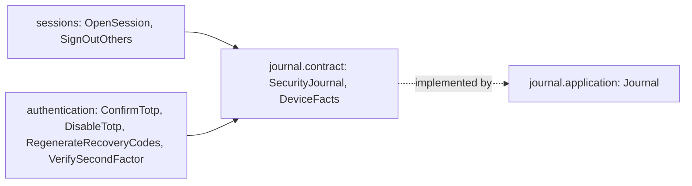
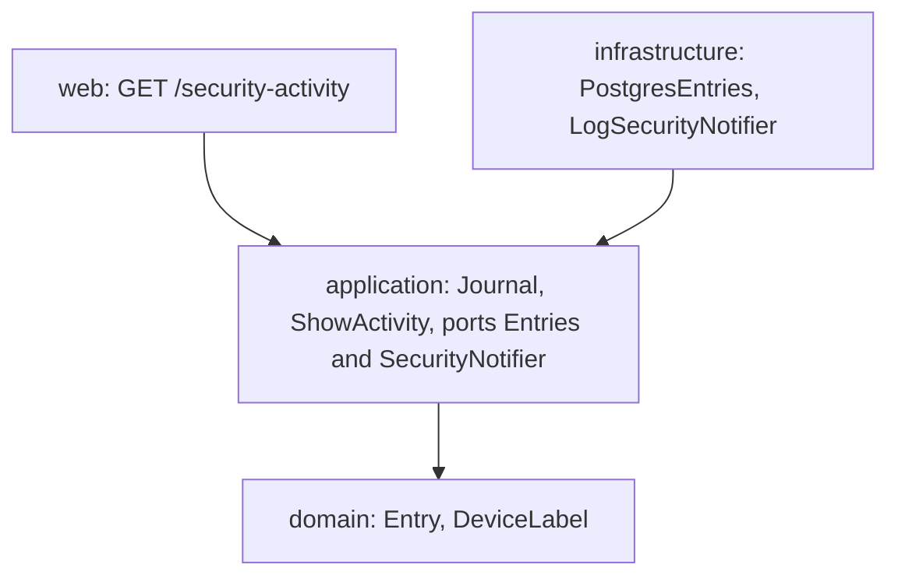
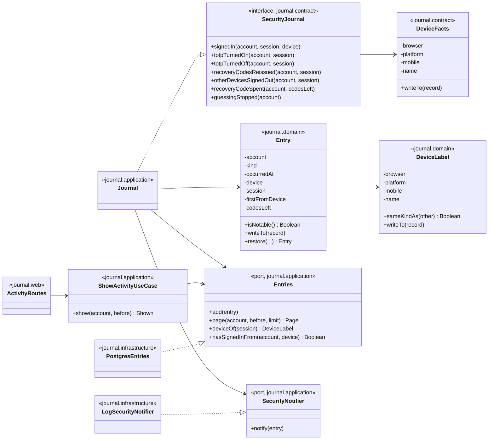

# Slice 6. The security journal

> Layers: `backend` (6a), then `frontend-app` (6b, its own PR)
> Status: plan accepted by Yurii on 2026-10-06 ("by the recommendation"). The diagrams below are the ones the code is written from. If the code departs from a diagram, the same PR changes the diagram.
> The decision is recorded in [ADR-095](../adr/ADR-095-the-journal-is-told-what-happened-through-its-contract.md).
> Parent documents: [ADR-083](../adr/ADR-083-security-journal-and-notifier.md) (what the journal and the notifier are), [ADR-076](../adr/ADR-076-authentication-is-three-modules.md) (the modules), [02-authentication-slice-5.md](02-authentication-slice-5.md) (step-up, which the journal records the outcome of), [03-authentication-slice-5b-totp.md](03-authentication-slice-5b-totp.md) (TOTP and recovery codes)

Read it in this order: what we get, which forks were answered, how an entry gets written, how a person reads the journal, who depends on whom, which classes it is made of.

## 1. What we should end up with

- **A journal the person can read.** `GET /api/v1/security-activity` answers the signed-in person with their own entries, newest first, thirty at a time, with a cursor for the next page. Each entry has the time, what happened and the device.
- **The entries**: a sign-in (with whether it is the first from that kind of device), TOTP turned on, TOTP turned off, a recovery code spent (with how many are left), recovery codes issued again, signing out on every other device, and a guess stopped (an attempt closed after its wrong codes).
- **A `SecurityNotifier` port** with one adapter that writes the notable entries to the log: the kind of event, the account, the device and the time. No token, code, secret or address ever reaches a record or the log.
- **Not here**: the Activity page (slice 6b), email, the policy journal of the admin (slice 7), the calendar link (slice 9).

## 2. Decisions

All four forks were answered with the recommendation.

| Fork | Chosen | Why, in short |
|---|---|---|
| 1. Which device the entries about the second factor name | **B.** The request carries an opaque reference to its session (`Caller`), the use case passes it to the journal, and the journal finds the device in its own entry for that sign-in. | "TOTP turned off from Chrome on Windows" is the entry that tells the owner "this was not me". `sessions` is never asked. |
| 2. What "a new device" means | **C.** A sign-in is marked "first" when the account has no earlier sign-in in the journal from the same browser, the same system and the same class (phone or not). The name does not count. | No new state. It is a hint, not a protection: someone on the same browser and system is not flagged. A device cookie (B) stays the way out when email arrives. |
| 3. Failures | **B.** The list of ADR-083 and one entry, "guess stopped", when an attempt closes after its wrong codes. | The earliest alarm there is: someone passed Google and failed the code. One entry per attempt, so the journal cannot be filled by guessing. |
| 4. Where the Activity page lives | **A.** Its own page, `/settings/activity`. | Like Devices: it loads on its own, and a growing list does not crowd the Security card. |

Decided without a fork, and where the first plan (the Artifact of 2026-10-06) was simplified while writing this document:

- **The journal is told, not subscribing.** The first plan had three modules publish events through the bus and the journal listen, which made the journal read the contracts of all three. It is simpler the other way round: `journal` has a contract, `SecurityJournal`, with one method for each thing that can happen, and the use cases that cause it call it inside their own transaction. The journal then reads nobody but `identity`'s `AccountId`; `sessions` and `authentication` read the journal as they read `identity`. The record is still written in the transaction of the act, so an act that rolls back leaves no record and a record that fails takes the act with it (ADR-052). ADR-095 records this as a refinement of ADR-083, which said the journal "listens".
- **The module is called `journal`.** It owns the journal and the notifier port.
- **The notifier is called inside the transaction**, right after the entry is written. There is no "after commit" hook and `platform:outbox` is empty. The log adapter cannot be harmed by that, though a line can remain for an act that rolls back. The rule for the port, written in ADR-095: an adapter does no irreversible input/output inside the transaction; an email adapter puts the message in a queue.
- **What counts as notable** is decided in the domain (`Entry.isNotable()`), not in an adapter: TOTP turned off, a recovery code spent, signing out elsewhere, a guess stopped, and a first sign-in from a device.
- **What is kept.** The kind, the account, the time, a copy of the device (browser, system, phone or not, name) as it was, the session reference of a sign-in, the codes left. A later rename or sign-out of the device changes nothing in the journal. No address: nothing stores one, and the journal does not become the first place.
- **Reading.** Closed to anyone not signed in; no fresh proof needed; `Cache-Control: no-store`; keyset paging by the entry number, newest first; nobody edits or deletes a row.
- **Account deletion.** Nothing publishes a deletion yet. When it arrives it must remove the person's entries (a line in ADR-095), as it removes their sessions.
- **No retention yet.** Entries are kept. A period is chosen when there is data to choose it by.
- **Two PRs.** 6a is this document, ADR-095 and the backend. 6b is the page, in its own thread.

## 3. How an entry is written (diagram 1)

A sign-in. The same shape holds for every entry: the use case does its work and tells the journal inside the same transaction.

## 4. An entry about the second factor (diagram 2)

Turning TOTP off. The request carries a reference to its session, so the journal can name the device without asking `sessions`.

## 5. How a person reads the journal (diagram 3)

## 6. Module dependencies (diagram 4)

Three small pictures. An arrow reads "depends on".

**4a. Who depends on whom.** The order of ADR-076 is unchanged; the journal is one more module at the bottom, like `identity`, and reads nothing but `identity`'s `AccountId`.

**4b. What the journal's contract is.** The contract is the only part of the journal the others see. Everything else sits behind it.

**4c. Inside the journal.** The same four layers as every module. Arrows go down only.

What changes outside the journal: `Caller.Signed` and `Caller.Confirmed` carry the session reference (`Requester.session()`); `sessions` gets nothing new but the calls; `modules.yaml` gains `journal` and the `reads` lines; `Wiring` builds the journal first and hands it to the two modules.

## 7. Classes (diagram 5)

Fields are private, behaviour is in methods, data leaves only through `writeTo` and `reportTo`, collaborators arrive in the constructor and nothing builds them inside a class.

The table is `journal.entries`: `id` (a sequence, which is also the order and the cursor), `account_id` (not a foreign key, as in `sessions`), `kind`, `occurred_at`, the copy of the device (`browser`, `platform`, `mobile`, `device_name`, all null when no device is known), `session_id` (only on a sign-in entry), `first_from_device`, `codes_left`. Indexes: `(account_id, id desc)` for the pages, `(session_id)` where it is set, and `(account_id, browser, platform, mobile)` for "has this account signed in from this kind of device". The migration only adds a table (ADR-066).

## 8. Out of scope

Email and the queue it needs; the admin's policy journal (slice 7); the calendar link (slice 9); an address or place on an entry; search and filters; the admin reading other people's journals; keeping entries for a period; the Activity page (6b).

## 9. What changed while implementing

- **The factors of a sign-in are not kept.** The first plan listed them on the sign-in entry. `sessions` learns them as `Proof`s of the `authentication` contract, and `authentication` now reads the journal, so the journal reading that contract would close a circle in diagram 4a. Words in place of the type would work, but no reader of the journal needs them yet: the entries that matter (a recovery code spent, TOTP turned off) say what they are. A later slice adds them by a new column and one more argument if a person asks for it.
- **`DeviceWords` moved from `sessions:web` to `sessions:application`** and is public, because `OpenSession` tells the journal the device in the words the API uses, and the page for devices answers in the same ones.
- **`Caller.Signed` and `Caller.Confirmed` carry the session reference** as drawn, which changed their constructors in `platform:http` and the tests that build them.
- **The migration command carries the journal's migration.** `backend/migrate` lists the modules whose migrations it applies, and `journal:infrastructure` was missing from it (found in review of the PR).
- **A cursor is a position, not a ticket.** Any positive whole number is accepted, and what it can show is still only the signed-in person's own entries, so a number from another account or a very large one shows nothing it should not. `400` is for what is not such a number.
- **"First from this kind of device" can be said twice.** Two sign-ins of one account from one kind of device that commit at the same instant can both find no earlier entry and both be marked first. The mark is a hint (decision 2), the cost is one extra line in the log, and serialising sign-ins to prevent it would make `OpenSession` wait on a lock for nothing a person can act on.
