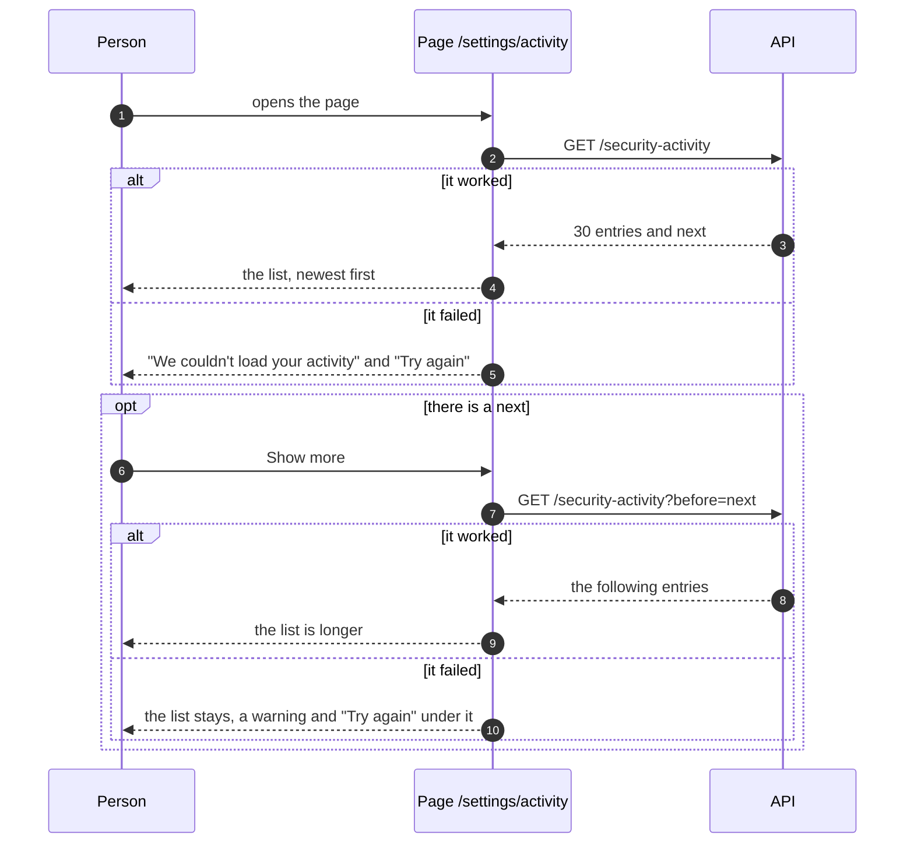
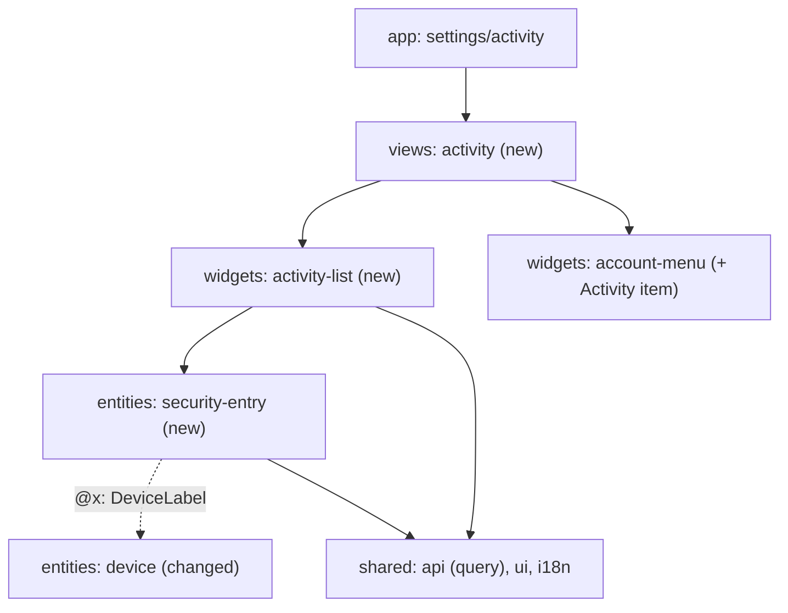
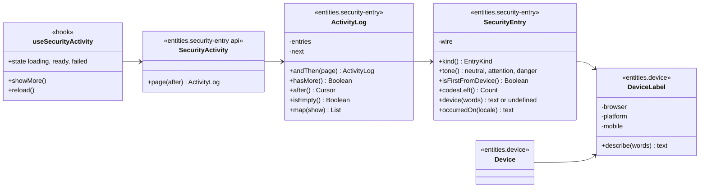

# Slice 6b. The Activity page

> Layers: `frontend-app`, `frontend-shared` (the backend and `docs/openapi.yaml` do not change)
> Status: plan accepted by Yurii on 2026-10-07 (both forks, the recommended option each time). The diagrams below are the ones the code is written from. If the code departs from a diagram, the same PR changes the diagram.
> The decision is recorded in [ADR-096](../adr/ADR-096-the-activity-page-reads-the-journal-a-page-at-a-time.md).
> Parent documents: [05-authentication-slice-6-journal.md](05-authentication-slice-6-journal.md) (the journal and the route this page reads), [ADR-095](../adr/ADR-095-the-journal-is-told-what-happened-through-its-contract.md), [ADR-091](../adr/ADR-091-the-devices-screen-saves-a-name-once-and-asks-in-place.md) (the screen this one is modelled on)

Read it in this order: what we get, which forks were answered, how the page reads the journal, who depends on whom, which classes it is made of.

## 1. What we should end up with

- **A page** at `/settings/activity`, reached from an "Activity" item in the account menu, next to "Security" and "Devices".
- **A list of entries**, newest first: what happened, on which device, when. Thirty at a time, more on request.
- **Notable entries are visible at a glance.** The server decides which entries are notable (`Entry.isNotable()`, ADR-095): a first sign-in from a device, TOTP turned off, a recovery code spent, signing out on every other device, a guess stopped. They carry a badge; routine entries do not.
- **Empty, loading and failed states** shown the way the Devices page shows them.

## 2. Decisions

Both forks were answered with the recommendation.

| Fork | Chosen | Why, in short |
|---|---|---|
| 1. How the next page loads | **A.** A "Show more" button. | The person asks, the list below does not jump, and keyboard and screen reader need nothing extra. Infinite scroll would add an observer, a second path for the keyboard and a failure state in the middle of scrolling, for a page whose first entries are what is read. |
| 2. How the time is shown | **A.** Date and time on every entry, in the person's zone, in a flat list. | A security journal answers "was that me last night?", so the exact time matters more than "3 hours ago". Grouping by day would need local-day grouping code, headings and tests on the day boundary. |

Decided without a fork:

- **The address.** `/settings/activity`, linked from the account menu only; the console's side navigation is for the job search (ADR-091).
- **One name for a device.** The words "Chrome on Windows · mobile" are made in one place, `DeviceLabel` in `entities/device`. `Device` (the Devices page) and `SecurityEntry` (this page) both use it, the entry through the `@x` public interface that ARCHITECTURE §12.4 allows between entities. Copying the browser and system tables would make one word a change in two places.
- **The client learns query parameters.** `Api.get` takes a typed `query` option, as `put` and `delete` take `params`: the path stays the key the specification spells (`"/security-activity"`), and the names and values of the query come from the operation, so a misspelt `before` is a compile error. A cursor is passed back exactly as the server gave it; the client never builds one.
- **The text of an entry.** Its name and badge on the first line, then the date and time, then the device when there is one: "Work laptop · Chrome on Windows", or "Chrome on Windows" when the device has no name. An entry without a device (a recovery code spent and a guess stopped happen before any session exists; a session older than the journal has none either) has no device line.
- **Badges.** "New device" for a first sign-in and "Security change" for TOTP turned off, a recovery code spent and signing out elsewhere, both in the `attention` tone; a stopped guess is "Stopped" in the `danger` tone. The client only paints what the server decided is notable.
- **Reading.** When the page opens and on "Try again"; no polling. A failed first read says so and offers a retry. A failed "Show more" leaves the list as it is and shows a warning with a retry under it. An ended session and a missing sign-in are handled by the chain of transports (ADR-089), as on every screen.
- **The key of a row.** An entry has no identifier on the wire, so a row is keyed by its position. The list only grows at its end and is replaced whole on a reload, so a position does not change meaning.
- **An empty journal.** The journal has kept entries since 6a was deployed, so a person may have none yet: "Nothing here yet. Sign-ins and changes to your security will show up here."
- **Styling** only with Tailwind classes on the tokens of the design system, through the primitives of `frontend-shared`; no inline styles and no colours in the code.
- **Strings** are English, in `en.json`, none in markup.

## 3. How a person reads the journal (diagram 1)

The page is read on the client, like Devices, because the times depend on the person's zone. The cursor is held by the list, not by the page.

## 4. Module dependencies (diagram 2)

One entity slice, one widget, one view and one route. Arrows only downwards. The only link between neighbours is the entry entity taking "how to name a device" from the device entity through its `@x` interface.

## 5. Classes (diagram 3)

The same rules as before: fields are private, behaviour is in methods. The answer of the server becomes an object at the border (`SecurityActivity`), and the screen asks the object (what are you called, are you notable) instead of taking the answer apart.

What else changes in shared code: `Api.get` gets the typed `query` option; `en.json` gets an `activity` section and the account menu an item.

## 6. What changed while implementing

- **No right-hand column for the time.** The first layout put the time at the right of each entry. On a phone it squeezed the name into a narrow column, so the entry is a plain stack: name and badge, time, device. The design system has no breakpoints to choose a layout by.
- **The entries are not an `<ol>`.** Raw JSX elements are banned outside `shared/ui` and there is no list primitive, so the rows are a `Stack` of cards, as on the Devices page. A `List` primitive is a change of its own.
- **The query option takes strings, numbers and booleans** (`Query` in `Api.ts`), not anything: a value that is none of them has no honest text form.

## 7. Out of scope

The backend and `openapi.yaml`; email and notifications (the future `SecurityNotifier` adapters); search and filters; "this was not me" and signing out of a session from an entry; deleting entries; the admin's policy journal (slice 7). The Security page stays a page of its own.
