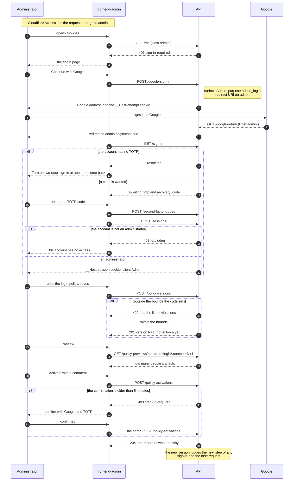
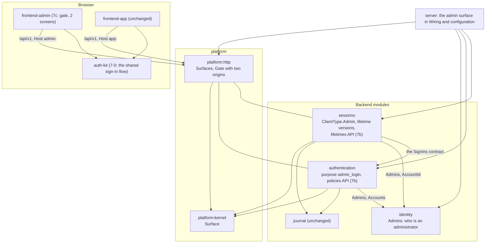
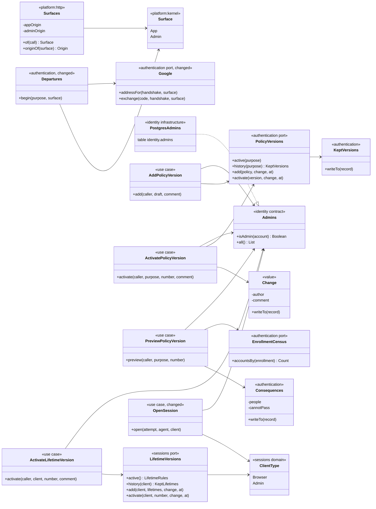

# Slice 7. The administrator signs in, and the sign-in policy and session lifetimes become editable

> Layers: `platform:kernel`, `platform:http`, `identity`, `authentication`, `sessions`, `server`, `ops` (7a); the same plus `docs/openapi.yaml` (7b); `frontend-admin` and a shared sign-in package (7-0, 7c)
> Status: plan accepted by Yurii on 2026-10-07. The diagrams below are the ones the code is written from. If the code departs from a diagram, the same PR changes the diagram.
> The decisions are recorded in [ADR-097](../adr/ADR-097-the-admin-surface-is-a-second-door-with-its-own-session-type.md) (7a); the records for 7b and 7c are added with their PRs.
> Parent documents: [ADR-078](../adr/ADR-078-factors-attempts-and-versioned-policies.md) (policies, bounds, floors), [ADR-079](../adr/ADR-079-server-side-opaque-sessions.md) (sessions), [ADR-090](../adr/ADR-090-devices-are-sessions-and-lifetimes-are-versions-owned-by-sessions.md) (lifetimes as versions), [ADR-092](../adr/ADR-092-a-dangerous-act-asks-for-a-fresh-proof-and-the-session-remembers-it.md) (fresh proof), [ADR-032](../adr/ADR-032-subdomain-split-and-admin-isolation.md) (the admin host)

Read it in this order: what we get and how it is cut into pull requests, which forks were answered, how an administrator signs in and changes a policy, who depends on whom, which classes it is made of.

## 1. What we should end up with

- **An administrator signs in on `admin.<domain>`** with Google, then a TOTP or recovery code, always (the `admin_login` purpose, which exists and is in force from version 1 but which nothing begins today). Cloudflare Access stays the first door; `admin_login` is the second. The session lives only on `admin.` and has lifetimes of its own.
- **Sign-in policies are editable** for every purpose: a list of versions with the author, the time and the comment, a new version, a preview of its consequences, activation and rollback.
- **Session lifetimes are editable** the same way, for the browser and for the administrator.
- **The bounds stay in code.** A version outside them cannot be saved; the answer names every violation.
- **Activation and rollback ask for a fresh proof** (Google and TOTP, five minutes, ADR-092) and record who did it and why.

### Pull requests

| PR | What is inside |
|---|---|
| **7-0** `frontend-app` and a new package | The sign-in flow moves from `frontend-app` into a shared package `auth-kit`, behaviour unchanged. |
| **7a** backend | Who an administrator is, the second door (`admin.`), the `admin_login` sign-in, the session type `Admin` with its own lifetimes. |
| **7b** backend | Versions of policies and of lifetimes: list, create, preview, activate and roll back, with author and comment. |
| **7c** `frontend-admin` | Sign-in on `auth-kit`, the gate, the two screens. |

This document covers 7a and 7b in full and shows where 7c sits. The classes of the screens are drawn in the plan of 7c.

## 2. Decisions

All five forks were answered on 2026-10-07. Four took the recommended option; fork 4 took the other one.

| Fork | Chosen | Why, in short |
|---|---|---|
| 1. How an account is known to be an administrator | **A.** A table `identity.admins` and a script `ops/grant-admin.sh`. | The right can be given and taken without a restart, it has a date, and it matches the set-of-capabilities model of ARCHITECTURE §7.4. The check in every request is one indexed lookup. |
| 2. A policy that demands a second factor from everybody | **B.** Forbidden by the bounds check for every purpose except `admin_login`; no session "only for setting up". | Building that session touches `Gate`, `Caller` and the sessions schema for one act. Meanwhile nobody can be locked out by a policy. The open flag of 5b (a retired seed and no codes left means Google alone is enough) stays open. |
| 3. Where author and comment are kept | **A.** Columns on the version and activation tables. | One row says what, when, who and why; history and rollback stay one structure (ADR-078). |
| 4. Sign-in screens in `frontend-admin` | **B.** A shared package `auth-kit`. | A bug in the sign-in is fixed once. What the sign-in asks for is decided by the server per purpose (`login` and `admin_login` have their own policies), so the package knows nothing about the two apps; the apps pass in their texts, frame and landing pages. |
| 5. Verify the Cloudflare Access header in Ktor | **A.** No. | ADR-032 made Access the network layer and `admin_login` the application layer; each does its own job, and a dependency on Cloudflare's keys is avoided. |

Decided without a fork:

- **Both hosts are served by the same routes.** Which door a request came through is read from its `Host` (`Surfaces`), never from a path or a body. The door decides the purpose of an attempt (`login` or `admin_login`), the redirect URI sent to Google, the page the browser is sent back to and the type of the session issued.
- **A session belongs to one door.** The server compares the type of the session with the door of the request: an `Admin` session does not work on `app.` and a `Browser` session does not work on `admin.`, even if the secret is carried over by hand. A session that does not fit is answered like an ended one, and is not deleted.
- **An unsafe request must come from the origin of its own door.** The `Origin` is compared with the origin of the door the `Host` names, so the origin of `admin.` is not accepted on `app.`.
- **An unknown Google account is not registered on `admin.`.** The browser is sent back to `/login?problem=refused`.
- **A person without TOTP is not let into `admin.`.** `GET /sign-in` says `restricted`; the page tells them to turn on two-step sign-in on `app.` and come back (no session is issued for it).
- **Admin routes answer only on `admin.`** and every use case checks that the account is still an administrator; taking the right away works from the next request (7b).
- **A new version needs no confirmation, its activation does.** A version in the list changes nothing until it is made active. A rollback is the activation of an earlier version.
- **A preview is of a kept version** (`GET /policy-previews?purpose=…&number=…`), the same for a new version and for a rollback; there is no draft on the server.
- **An activation that would leave no administrator able to sign in is refused** (`409 would-lock-out-every-administrator`). An emergency way, a row of SQL that adds an activation of the previous version, goes into the ops runbook.
- **Lifetimes of the administrator by default:** idle one hour, absolute eight hours, freshness five minutes. They are values, changed on the new screen.
- **Deploy.** A second redirect URI is registered with Google, `https://admin.<domain>/api/v1/google-return`, and the server gets `TALLYVANE_ADMIN_ORIGIN`.
- **Strings** on the screens are English, in the translations of the shared package or of the app.

## 3. How an administrator signs in and changes a policy (diagram 1)

## 4. Module dependencies (diagram 2)

No module is added. The direction of reading is as before, `sessions` to `authentication` to `identity`; the one new line is that `sessions` and `authentication` ask `identity` whether an account is an administrator.

## 5. Classes (diagram 3)

The same rules as before: fields are private, behaviour is in methods, state leaves through a `Record` or a `Report`. Names are provisional until the code is written.

## 6. What changed while implementing

Slice 7a is built. The diagrams above are the ones it was written from; this is where the code differs from them or adds to them.

- **`Admins` offers one method.** Diagram 3 shows `all()` as well. Nothing in 7a needs the list of administrators; it comes with 7b, where an activation that would lock out every administrator is refused.
- **`BeginSignIn.begin(surface)` chooses the purpose.** The door is passed down to the application layer and the use case maps it (`App` to `login`, `Admin` to `admin_login`), so the web layer does not know purposes. `Departures.begin(purpose, surface)` and `Google.addressFor / exchange(…, surface)` are as drawn; `ContinueWithGoogle` and `BeginStepUp` take the surface too, and `GoogleReturnRoutes` reads it from the `Host` of the return.
- **The step-up confirmation is per door as well.** `ConfirmStepUp.confirm(session, attempt, surface)` recognises the session on the door of the request, so a session of the other door confirms nothing and the confirmation is not spent. This is not in the diagrams; without it the one route that reads the session cookie itself would have been the way round the rule that a session works only on its own door.
- **`ClientType` knows its door** (`ClientType.on(surface)`), which is the only place `Surface` and the kinds of session meet. `Session.isHeldOn(surface)` is what `Recognition` asks.
- **A stranger on `admin.` is turned back in `GoogleTrips.land`**, in the transaction that records Google's answer: the attempt is forgotten and the browser is sent to `/login?problem=refused`.
- **The refusal of a non-administrator keeps the sign-in.** `OpenSession` rolls back when `Admins` says no, so the completed sign-in is still kept and ends on its own. The answer is `403 forbidden`, not a code of its own.
- **Configuration.** `TALLYVANE_ADMIN_ORIGIN` is mandatory and must have another host than `TALLYVANE_APP_ORIGIN`; the server refuses to start otherwise, naming the variable. `ops/docker-compose.yml` defaults it to `https://admin.<DOMAIN>`.
- **No `admin` lifetime row is seeded (ADR-066).** The previous release reads every lifetime row it finds and does not know the word `admin`, so a row added by the migration would make it fail while the two colours run side by side. Instead `ClientType.Admin` carries starting lifetimes (an hour idle, eight hours absolute, five minutes of freshness) that `LifetimeRules` uses while no version of the administrators' lifetimes is kept, and the reading of the lifetime versions skips a kind it does not know. The first version row is added by the versions API of slice 7b, in a release after this one. The same tolerance lets a later release add a kind of client without stopping this one.
- **Not verified here.** A real Google sign-in on `admin.`, Cloudflare Access in front of it, and the deploy steps (the second redirect URI at Google, `TALLYVANE_ADMIN_ORIGIN`, `ops/grant-admin.sh`). The integration tests ran against PostgreSQL 16, not the 17 image of the fixture.

### Deploy checklist for 7a

1. Register `https://admin.<domain>/api/v1/google-return` as a second authorised redirect URI of the Google OAuth client.
2. Set `ADMIN_ORIGIN` in the server's `.env` if the admin host is not `admin.<DOMAIN>`.
3. After the deploy, sign in once on `app.` with the administrator's Google account, turn TOTP on, then run `ops/grant-admin.sh <email>` on the server.
