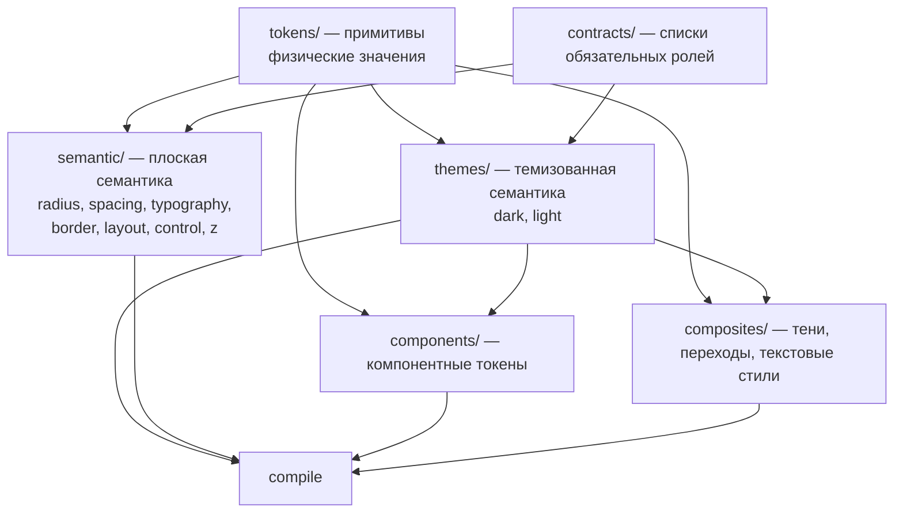

## Tallyvane — Дизайн-токены

> Слой FSD: `shared/ui/theme`
> Статус: структура утверждена, палитра утверждена по итогам прототипа, кегли предварительные
> Родительский документ: [ARCHITECTURE.md](../../ARCHITECTURE.md), раздел 12.10

---

## 0. Про статус этого документа

**Палитра прошла проверку прототипом и переписана по её итогам.** Первая версия — тёплая нейтраль с янтарным акцентом — была собрана, показана и отвергнута: интерфейс прочитался как приложение для пасеки, потому что нейтральная шкала и акцент лежали в одной жёлто-оранжевой области и усиливали друг друга.

Изменилось два решения, оба зафиксированы в разделах ниже вместе с причиной. Насыщенность нейтралей упала с двенадцати процентов до трёх-восьми. Акцент стал монохромным, а янтарь оставлен исключительно за смыслом «требует внимания».

Ровно это и есть то, ради чего архитектура устроена так, как устроена: ниже слоя примитивов везде лежат `{ссылки}`, а не значения, поэтому полная смена палитры после сборки экрана обошлась в правку одного файла примитивов и нескольких строк в теме.

Что остаётся предварительным: шкала кеглей и шаги пространства — они проверяются на плотных таблицах, а не на одном экране.
Что менять дорого: состав контракта, то есть список обязательных ролей — он завязан на то, что структурно потребляет библиотека компонентов.

Источником истины является **код**, а не этот документ. Модули TypeScript компилируются в `generated/tokens.css` и `generated/resolved.ts`; документ описывает замысел и объясняет решения.

---

## Оглавление

1. [Слои и порядок](#1-слои-и-порядок)
2. [Примитивы](#2-примитивы)
3. [Контракты](#3-контракты)
4. [Темизованная семантика](#4-темизованная-семантика)
5. [Плоская семантика](#5-плоская-семантика)
6. [Компонентные токены](#6-компонентные-токены)
7. [Композиты](#7-композиты)
8. [Типографика](#8-типографика)
9. [Сетка и плотность](#9-сетка-и-плотность)
10. [Сборка и вывод](#10-сборка-и-вывод)
11. [Адаптеры](#11-адаптеры)
12. [Переключение темы](#12-переключение-темы)
13. [Что проверяется](#13-что-проверяется)
14. [Открытые вопросы](#14-открытые-вопросы)

---

## 1. Слои и порядок



Три правила, определяющие всё остальное.

**Роль ссылается только на примитив.** Роль, ссылающаяся на другую роль, — нарушение DS004, потому что цепочка ролей делает невозможным ответ на вопрос «какое физическое значение здесь окажется» без прохода по всему графу.

**Композит может ссылаться и на примитив, и на роль.** Тень с бренд-подсветкой законно указывает на `interactivePrimary`: это не косвенность ради косвенности, а именно то, что имелось в виду.

**Компонентные токены контракта не имеют.** Компонент сам решает, какая у него форма; не написать для него токенов — ничего не ломает.

---

## 2. Примитивы

Все цвета — строки `hsl()`, а не разложенные объекты. Причина сугубо практическая: строковый литерал получает подсветку образцом цвета прямо в редакторе, объект — нет.

### 2.1. Нейтральная шкала

Один тон на всю шкалу — 30 градусов. **Насыщенность держится в пределах трёх-восьми процентов и падает к тёмному концу.** Это переписано после первого прототипа: изначально насыщенность росла к тёмному, до двенадцати процентов, по рассуждению «иначе тёмные шаги уплощаются в мёртвый серый». Рассуждение оказалось неверным на практике — двенадцать процентов на почти-чёрном дают уже не тёплый серый, а коричневый, и вместе с янтарным акцентом весь интерфейс прочитался как приложение для пасеки. Теплота должна быть шёпотом, а не заявлением.

```typescript
// tokens/color.ts
export const color = definePrimitives({
  neutral: {
    0:    'hsl(30 8% 99%)',
    50:   'hsl(30 7% 97%)',
    100:  'hsl(30 6% 94%)',
    200:  'hsl(30 6% 88%)',
    300:  'hsl(30 5% 83%)',
    400:  'hsl(30 4% 68%)',
    500:  'hsl(30 3% 54%)',
    600:  'hsl(30 3% 42%)',
    700:  'hsl(30 4% 31%)',
    800:  'hsl(30 4% 22%)',
    900:  'hsl(30 4% 15%)',
    950:  'hsl(30 4% 10%)',
    1000: 'hsl(30 5%  7%)',
  },
```

Шаг 300 стоит на 83, а не на 80, и это единственное значение шкалы, выбранное измерением, а не глазом. Считать нужно по худшему случаю, а он не там, где кажется: тесно не на самой тёмной поверхности, а на вставке — она светлее прочих тёмных, и приглушённому тексту на ней контраста остаётся меньше всего. Против неё роль обязана взять Lc 75; при 80 процентах светлоты выходило 72.8, при 83 — 77.5. Три процента — разница между тремя различимыми уровнями серого текста и двумя.

### 2.2. Янтарь — только внимание

Янтарь означает «требует тебя» и больше ничего. Фирменного акцента у продукта нет вовсе: кнопка основного действия — светлая нейтраль, а **цвет в интерфейсе появляется исключительно там, где несёт статус**.

Это отмена предыдущего решения, и отменено оно результатом, а не спором. Изначально янтарь служил и акцентом, и предупреждением, по рассуждению «в трекере поиска работы призыв к действию и есть „обрати внимание“, значит хватит одного цвета». Логика была стройной, но вместе с тёплой нейтралью дала мёд и воск, а главное — обесценила сам сигнал: когда янтарным покрашены и кнопки, и бейджи, и полоса прогресса, янтарный перестаёт что-либо значить.

Монохромный акцент решает обе задачи разом. На экране, где единственные цветные пиксели — это статусы, янтарное «требует внимания» видно мгновенно, потому что ему никто не мешает.

```typescript
  amber: {
    50:  'hsl(37 75% 96%)',
    100: 'hsl(37 72% 90%)',
    200: 'hsl(37 70% 82%)',
    300: 'hsl(37 72% 74%)',
    400: 'hsl(37 74% 69%)',
    500: 'hsl(37 75% 64%)',
    600: 'hsl(37 78% 54%)',
    700: 'hsl(37 80% 42%)',
    800: 'hsl(37 82% 30%)',
    900: 'hsl(37 85% 20%)',
    950: 'hsl(37 88% 12%)',
  },
```

### 2.3. Статусные шкалы

Все три уведены к тёплой базе: зелёный в оливковый, красный в кирпичный, синий в припылённый. Чистые цвета на тёплом фоне выглядят наклеенными.

Каждая шкала полная, от 50 до 950, и это не запас на будущее. Роль выбирает ступень по измеренному контрасту против конкретной поверхности, а не по номеру — так что светлые концы нужны тёмной теме, тёмные светлой, а середина уходит на заливки. Синий изначально обрывался на четырёх ступенях, и обоих нужных концов у него просто не было.

```typescript
  green: {
    50:  'hsl(131 60% 96%)',
    100: 'hsl(131 55% 90%)',
    200: 'hsl(131 50% 82%)',
    300: 'hsl(131 52% 75%)',
    400: 'hsl(131 52% 71%)',
    500: 'hsl(131 53% 67%)',
    600: 'hsl(131 55% 56%)',
    700: 'hsl(131 58% 44%)',
    800: 'hsl(131 62% 32%)',
    900: 'hsl(131 68% 21%)',
    950: 'hsl(131 72% 12%)',
  },
  red: {
    50:  'hsl(0 85% 97%)',
    100: 'hsl(0 82% 92%)',
    200: 'hsl(0 80% 85%)',
    300: 'hsl(0 78% 76%)',
    400: 'hsl(0 76% 68%)',
    500: 'hsl(0 74% 60%)',
    600: 'hsl(0 70% 50%)',
    700: 'hsl(0 68% 42%)',
    800: 'hsl(0 65% 32%)',
    900: 'hsl(0 62% 22%)',
    950: 'hsl(0 60% 12%)',
  },
  blue: {
    50:  'hsl(205 30% 96%)',
    100: 'hsl(205 28% 90%)',
    200: 'hsl(205 26% 82%)',
    300: 'hsl(205 22% 70%)',
    400: 'hsl(205 24% 60%)',
    500: 'hsl(205 26% 48%)',
    600: 'hsl(205 28% 38%)',
    700: 'hsl(205 30% 30%)',
    800: 'hsl(205 34% 22%)',
    900: 'hsl(205 38% 15%)',
    950: 'hsl(205 42% 9%)',
  },
```

**Равная светлота — не равный контраст, и на это шкалы разошлись сильнее всего.** Зелёный и жёлтый — самые люминантные тона, какие есть: при светлоте 42 процента зелёная заливка ещё не несла белый текст (Lc 57), тогда как красная и синяя на той же глубине уже проходили. Красный наоборот, наименее люминантный, и его светлый конец пришлось брать на ступень выше соседних. Поэтому роли ссылаются на разные номера ступеней у разных тонов; один номер на все четыре выглядел бы опрятно в исходнике и был бы неверен на экране.

### 2.4. Наложения

Не цветовая шкала, а шкала интенсивности. Один и тот же шаг означает одну и ту же силу поверх любой базы; **базу выбирает тема, интенсивность — никогда**. Благодаря этому `surfaceRowHover` в обеих темах ссылается на осмысленно разные наложения, но с одинаковым номером шага.

```typescript
  overlayWhite: {
    4:  'hsl(0 0% 100% /  4%)',
    8:  'hsl(0 0% 100% /  8%)',
    12: 'hsl(0 0% 100% / 12%)',
    16: 'hsl(0 0% 100% / 16%)',
    24: 'hsl(0 0% 100% / 24%)',
    32: 'hsl(0 0% 100% / 32%)',
  },
  overlayBlack: {
    4:  'hsl(0 0% 0% /  4%)',
    8:  'hsl(0 0% 0% /  8%)',
    12: 'hsl(0 0% 0% / 12%)',
    16: 'hsl(0 0% 0% / 16%)',
    24: 'hsl(0 0% 0% / 24%)',
    32: 'hsl(0 0% 0% / 32%)',
  },
  scrim: {
    dark:  'hsl(30 5% 7% / 80%)',
    light: 'hsl(30 8% 99% / 80%)',
  },
});
```

Обе плёнки берут крайние ступени нейтрали, а не чистые чёрный и белый. Тёмная раньше стояла на двенадцати процентах насыщенности — вдвое выше потолка самой шкалы, то есть нарушала правило «теплота шёпотом» в единственном месте, где этого никто бы не заметил. У светлой оттенок был объявлен при нулевой насыщенности, где он не делает ничего.

Подложки статусных бейджей отдельными примитивами **не заводятся**. Вместо `alpha-amber-14` как значения пишется выражение `alpha({color.amber.500}, 14%)` прямо в роли: компилятор разрешит его в `hsl(38 80% 50% / 14%)`. Так подложка не может разъехаться со своим основным цветом, потому что это буквально он же.

### 2.5. Остальные примитивы

`tokens/dimension.ts` — шкала пространства с шагом 4 и ритмом 8. `tokens/radius.ts` — шаги скругления. `tokens/border.ts` — толщины линий, отдельно от пространства: толщина линии и зазор между элементами меряются одной единицей и не имеют друг к другу отношения. `tokens/motion.ts` — длительности и кривые. `tokens/typography.ts` — семейства, кегли, интерлиньяжи, начертания, трекинг. `tokens/layout.ts` — структурные длины. `tokens/z-index.ts` — перекладины лестницы наложения.

Брейкпоинтов среди примитивов нет намеренно: наши 640, 768, 1024, 1280 и 1536 совпадают с умолчаниями Tailwind, и второй экземпляр пришлось бы держать в синхроне без всякой выгоды.

Значения приведены в разделах [8](#8-типографика) и [9](#9-сетка-и-плотность).

---

## 3. Контракты

Единственное место, где живёт список обязательных ролей. Тип выводится из того же массива, поэтому второго, синхронизируемого руками интерфейса не существует.

```typescript
// contracts/color.ts
export const colorContract = defineContract({
  category: 'color',
  required: [
    // поверхности
    'surfacePrimary', 'surfaceElevated', 'surfaceInset',
    'surfaceRowHover', 'surfaceSelected', 'surfaceOverlay',
    // текст
    'textPrimary', 'textSecondary', 'textMuted', 'textDisabled',
    'textOnAccent', 'textOnSolid',
    // границы
    'borderSubtle', 'borderDefault', 'borderStrong', 'borderFocus',
    // интерактив
    'interactivePrimary', 'interactivePrimaryHover',
    'interactivePrimaryPressed', 'interactivePrimarySubtle',
    'interactivePrimaryText',
    // статусы
    'statusSuccess', 'statusSuccessSubtle', 'statusSuccessText',
    'statusDanger',  'statusDangerSubtle',  'statusDangerText',
    'statusAttention', 'statusAttentionSubtle', 'statusAttentionText',
    'statusInfo',    'statusInfoSubtle',    'statusInfoText',
  ],
});
```

Обязательным считается то, что структурно потребляет библиотека компонентов, а не то, что кажется красивым набором. Роль, которая нужна ровно одному компоненту, обязательной не является и в контракт не попадает — она либо необязательная роль темы, либо компонентный токен.

`statusAttention` и `interactivePrimary` указывают на один и тот же шаг янтаря, и это нормально: **две роли с совпадающим значением — не дублирование, а два разных смысла**, которые завтра могут разойтись. Дублированием было бы одно имя на два смысла.

---

## 4. Темизованная семантика

Тема никогда не изобретает цвет, она направляет роль на шаг шкалы.

```typescript
// themes/dark.ts
export const darkTheme = defineTheme(colorContract, mergeTokenTree(sharedColorRoles, {
  surfacePrimary:  '{color.neutral.1000}',
  surfaceElevated: '{color.neutral.950}',
  surfaceInset:    '{color.neutral.900}',
  surfaceRowHover: '{color.overlayWhite.4}',
  surfaceSelected: '{color.overlayWhite.12}',
  surfaceOverlay:  '{color.scrim.dark}',

  textPrimary:   '{color.neutral.100}',
  textSecondary: '{color.neutral.200}',
  textMuted:     '{color.neutral.300}',
  textDisabled:  '{color.neutral.500}',
  textOnAccent:  '{color.neutral.1000}',

  borderSubtle:  '{color.overlayWhite.8}',
  borderDefault: '{color.overlayWhite.12}',
  borderStrong:  '{color.overlayWhite.24}',
  borderFocus:   '{color.neutral.0}',

  interactivePrimary:        '{color.neutral.100}',  // монохромный акцент
  interactivePrimaryHover:   '{color.neutral.0}',    // светлеет — направление тёмной темы
  interactivePrimaryPressed: '{color.neutral.200}',
  interactivePrimarySubtle:  '{color.overlayWhite.12}',
  interactivePrimaryText:    '{color.neutral.100}',

  statusSuccessText:   '{color.green.200}',
  statusDangerText:    '{color.red.100}',   // на ступень светлее соседей: красный наименее люминантен
  statusAttentionText: '{color.amber.200}',
  statusInfoText:      '{color.blue.200}',
}));
```

Три уровня текста сидят в узкой полосе, и узость измерена, а не выбрана: против вставки — худшей из тёмных поверхностей, см. §2.1 — роль обязана взять Lc 75, что не пропускает ничего ниже примерно 82 процентов светлоты. Ступени 94, 88 и 83 дают там 95.0, 85.0 и 77.5: различимы рядом друг с другом, и каждая берёт порог. На основной поверхности запас больше — 97.6, 87.5 и 80.0, — но выбирает шкалу не она. `textDisabled` держится только за уровень «беглого взгляда»: выглядеть недоступным — вся его работа.

`surfaceSelected` — наложение, а не подкраска. В первой версии здесь стоял янтарный оттенок, и это предшествовало решению, что янтарь означает «требует тебя» и ничего больше: выбранная строка ни о чём не просит, а красить её сигнальным цветом значит потратить единственный сигнал интерфейса.

Роли, одинаковые в обеих темах, вынесены в `themes/shared-roles.ts` и подмешиваются, а не дублируются. Состав узкий: **заливка** статуса — фиксированный сигнал, несущий собственный текст, поэтому смену темы переживает нетронутой. Всё, чья работа — контрастировать со страницей, не годится, и потому акцент, кольцо фокуса и **текстовые** цвета статусов живут в темах порознь.

```typescript
// themes/shared-roles.ts
export const sharedColorRoles = {
  statusSuccess:        '{color.green.800}',
  statusSuccessSubtle:  'alpha({color.green.500}, 14%)',
  statusDanger:         '{color.red.700}',
  statusDangerSubtle:   'alpha({color.red.500}, 14%)',
  statusAttention:      '{color.amber.800}',
  statusAttentionSubtle:'alpha({color.amber.500}, 14%)',
  statusInfo:           '{color.blue.600}',
  statusInfoSubtle:     'alpha({color.blue.500}, 14%)',

  textOnSolid:          '{color.neutral.0}',
};
```

Заливки глубокие, а не полутоновые, и это исправление. На половине светлоты они были негодны в обе стороны разом: янтарная давала Lc 48.4 против белого текста и Lc 57.8 против чёрного, зелёная — 64.4 и 42.5. Ни одно из четырёх чисел не достаёт до Lc 75, который нужен тексту бейджа, а выбор между ними — это выбор, каким из двух способов не пройти.

Уйти вниз, а не вверх, потому что тёмная заливка с белым текстом сохраняет цвет насыщенным; светлая с чёрным берёт тот же порог, но выцветает в пастель, а пастельный сигнальный цвет уже не сигнал. Ступени разные у разных тонов — 800 у зелёного и янтарного, 700 у красного, 600 у синего — ровно потому, что тона расходятся по люминантности (§2.3).

Кольцо фокуса тоже монохромное, и это не педантизм. Янтарное кольцо было бы соблазнительно — фокус ведь тоже про внимание, — но тогда на экране появилось бы два разных янтарных сигнала: «эта запись требует действия» и «курсор сейчас здесь». Первый касается работы, второй — навигации, и путать их нельзя. Чистый белый на тёмном фоне заметен не хуже и ничего не означает, кроме «ты здесь».

В светлой теме направление наведения инвертируется — не светлеет, а темнеет, — и наложения берутся из `overlayBlack`. Её роли текста зеркальны тёмным: ступени 1000, 800 и 700 против 100, 200 и 300, и полоса шире, потому что на светлом фоне порог отсекает снизу, а места под ним больше.

### 4.1. Отображение статусов подачи на цвет

Статусов подачи десять, различимых цветов четыре. Цвет несёт не статус, а **отношение статуса к действию**; сам статус читается словом.

| Статус | Роль |
| --- | --- |
| Saved | нейтраль |
| Applied, Acknowledged | `statusInfo` — мяч на их стороне |
| Screening, Interviewing | `statusAttention` — идёт процесс, надо готовиться |
| Offer | `statusSuccess` |
| Rejected, Closed | `statusDanger`, приглушённо |
| Withdrawn | нейтраль, приглушённо — решение принято мной |
| Ghosted | `statusAttention`, приглушённо — пинговать или хоронить |

---

## 5. Плоская семантика

Категории без оси тем: скругление и пространство одинаковы в тёмной и светлой. Механизм тот же `defineTheme`, вызванный один раз.

```typescript
// semantic/radius.ts
export const radiusRole = defineTheme(radiusContract, {
  chip:    '{radius.sm}',
  control: '{radius.md}',
  card:    '{radius.lg}',
  panel:   '{radius.xl}',
  pill:    '{radius.full}',
});

// semantic/spacing.ts
export const spacingRole = defineTheme(spacingContract, {
  inlineTight:   '{dimension.1}',   // иконка и текст
  inline:        '{dimension.2}',
  stackTight:    '{dimension.3}',
  stack:         '{dimension.4}',   // внутри карточки
  groupGap:      '{dimension.6}',   // между карточками
  sectionGap:    '{dimension.8}',
  screenPadding: '{dimension.6}',
});

// semantic/control.ts — геометрия контролов, без оси тем
export const controlRole = defineTheme(controlContract, {
  heightSm: '{dimension.8}',  // 32
  heightMd: '{dimension.10}', // 40
  heightLg: '{dimension.12}', // 48
  icon:     '{dimension.4}',  // 16 — глиф внутри триггера
  box:      '{dimension.5}',  // 20 — чекбокс / радио / бегунок / точка рейтинга
});
```

`icon` и `box` — роли, а не именованные константы в компоненте: `const ICON_SIZE = 16` не делает число ресурсом. Адаптер отдаёт `--control-icon` и `--control-box`. 14px на шкале 4px нет; глифы, которые раньше были 14, выровнены на `icon`.

Слой выглядит тонкой прослойкой ровно до дня, когда карточкам понадобится другое скругление без изменения смысла шага `lg` везде, где он ещё используется. В этот день правка — одна строка вместо поиска и замены по всем компонентам.

---

## 6. Компонентные токены

Контракта нет, форма свободна. Заводятся тогда, когда значение нужно ровно одному компоненту и общего смысла не несёт.

```typescript
// components/status-badge.ts
export const statusBadgeTokens = defineComponentTokens('statusBadge', {
  paddingX:   '{dimension.2}',
  paddingY:   '{dimension.1}',
  // Капсула, а не шаг `chip`: шесть пикселей скругления на бейдже высотой
  // около двадцати четырёх читаются как скруглённый прямоугольник, то есть
  // как маленькая кнопка, — а статус не нажимают.
  radius:     '{semantic.radius.pill}',
  dotSize:    '{dimension.2}',
});

// components/timeline-connector.ts — вертикальный волосок между событиями
// истории подачи. Толщина линии не отступ, поэтому в шкале пространства ей
// не место; обе величины идут через роли, потому что коннектор — это
// буквально граница, повёрнутая вертикально.
export const timelineConnectorTokens = defineComponentTokens('timelineConnector', {
  color: '{theme.color.borderDefault}',
  width: '{semantic.border.default}',
});

// components/pipeline-row.ts
export const pipelineRowTokens = defineComponentTokens('pipelineRow', {
  heightComfortable: '52px',
  heightCompact:     '40px',
  hoverSurface:      '{theme.color.surfaceRowHover}',
});
```

Граница между компонентным токеном и глобальной ролью проводится не вкусом, а графом использования: если к примитиву напрямую тянутся два независимых компонента, движок сообщает DS201, и это значит, что у смысла нет имени — его надо поднять в роль. Если у роли ровно один потребитель, движок сообщает DS102, и роль надо опустить сюда. По этому правилу заведены `scrollArea.thickness` (через `{semantic.spacing.inline}`, не напрямую в `{dimension.2}` — иначе DS201 против `statusBadge`), геометрия `switch`, `drawer.width` (`{layout.448}`), `fileDrop.filenameMaxWidth` (`{layout.256}`). Глиф зоны сброса — `calc(var(--control-icon) * 1.5)` на месте вызова, не второй потребитель `dimension.6`.

---

## 7. Композиты

Рецепты, собирающие несколько значений в одно.

```typescript
// composites/shadows.ts
export const shadows = defineComposite('shadow', {
  elevation1: [{ x: 0, y: 1,  blur: 2,  color: 'alpha({color.neutral.1000}, 40%)' }],
  elevation2: [{ x: 0, y: 4,  blur: 12, color: 'alpha({color.neutral.1000}, 40%)' }],
  elevation3: [{ x: 0, y: 12, blur: 32, color: 'alpha({color.neutral.1000}, 60%)' }],
});

// composites/transitions.ts
export const transitions = defineComposite('transition', {
  hover:  { duration: '{motion.duration.fast}', easing: '{motion.easing.standard}' },
  popover:{ duration: '{motion.duration.base}', easing: '{motion.easing.out}'      },
  drawer: { duration: '{motion.duration.slow}', easing: '{motion.easing.standard}' },
});
```

Переход остаётся двумя переменными и не склеивается в шорткат на выходе. Из пары шорткат собирается там, где он применяется, и вызывающий при этом сам решает, какое свойство анимируется; готовый шорткат разобрать обратно нельзя, а пропущенное в нём свойство молча означает `all`.

Тень применяется только к тому, что действительно всплывает над содержимым. Карточка в потоке страницы отделяется границей и фоном: на тёмном фоне тень почти не читается, а имитация подъёмом яркости быстро превращает экран в кашу из серых прямоугольников.

---

## 8. Типографика

Гарнитура интерфейса — IBM Plex Sans, чисел и моноширинного — IBM Plex Mono. Обе с открытой лицензией и из одного семейства, поэтому вместе выглядят родными.

Кегли, интерлиньяжи и начертания живут примитивами; готовые стили собираются композитом, чтобы применяться одним токеном, а не четырьмя.

```typescript
// composites/text-styles.ts
export const textStyles = defineComposite('text', {
  // Публичные маркетинговые страницы, не консоль: единственный fluid-шаг.
  hero:        { size: '{typography.size.9}', line: '{typography.line.9}', weight: '{typography.weight.bold}',      tracking: '{typography.tracking.tightest}' },
  display:     { size: '{typography.size.8}', line: '{typography.line.8}', weight: '{typography.weight.semibold}', tracking: '{typography.tracking.tightest}' },
  title1:      { size: '{typography.size.7}', line: '{typography.line.7}', weight: '{typography.weight.semibold}', tracking: '{typography.tracking.tighter}'  },
  title2:      { size: '{typography.size.6}', line: '{typography.line.6}', weight: '{typography.weight.semibold}', tracking: '{typography.tracking.tight}'    },
  title3:      { size: '{typography.size.5}', line: '{typography.line.5}', weight: '{typography.weight.semibold}', tracking: '{typography.tracking.snug}'     },
  body:        { size: '{typography.size.4}', line: '{typography.line.4}', weight: '{typography.weight.regular}',  tracking: '{typography.tracking.normal}'   },
  bodyStrong:  { size: '{typography.size.4}', line: '{typography.line.4}', weight: '{typography.weight.medium}',   tracking: '{typography.tracking.normal}'   },
  small:       { size: '{typography.size.3}', line: '{typography.line.3}', weight: '{typography.weight.regular}',  tracking: '{typography.tracking.normal}'   },
  caption:     { size: '{typography.size.2}', line: '{typography.line.2}', weight: '{typography.weight.regular}',  tracking: '{typography.tracking.normal}'   },
  overline:    { size: '{typography.size.1}', line: '{typography.line.1}', weight: '{typography.weight.medium}',   tracking: '{typography.tracking.wide}'     },

  // Табличные цифры, которых требует текст ниже: без собственного стиля их
  // некому нести. Делит ступень со `small` — колонка чисел живёт в плотных
  // таблицах, — и единственный ссылается на моноширинную гарнитуру.
  numeric:     { family: '{semantic.typography.familyNumeric}',
                 size: '{typography.size.3}', line: '{typography.line.3}', weight: '{typography.weight.regular}',  tracking: '{typography.tracking.normal}'   },
});
```

Трекинг задан ссылками на шкалу, а не литералами: иначе значение вроде `-0.015em` живёт в композите отдельной копией и расходится со шкалой при первой же её перенастройке.

| Шаг | Кегль / интерлиньяж | Где |
| --- | --- | --- |
| 9 | 36→56, `clamp()` | Заголовок публичной маркетинговой страницы (`hero`); единственный fluid-шаг |
| 8 | 36 / 44 | Крупные числа аналитики, заголовок пустого состояния |
| 7 | 28 / 36 | Заголовок экрана |
| 6 | 24 / 32 | Заголовок секции |
| 5 | 20 / 28 | Заголовок карточки |
| 4 | 18 / 26 | Основной текст |
| 3 | 17 / 24 | Плотные таблицы, метаданные |
| 2 | 16 / 22 | Подписи, сноски |
| 1 | 15 / 20 | Надзаголовки капсом |

**Шкала целиком стоит на ступень выше первой редакции — 15…36 вместо 11…32 — и причина измеренная, а не вкусовая.** Требование к контрасту снижается скачком на определённых кеглях: неосновному тексту нужен Lc 90 ниже 15 пикселей и всего Lc 75 от них, основному — Lc 90 ниже 18 и Lc 75 от них. При прежней шкале — 11, 13, 14, 16 — каждый стиль лежал по строгую сторону обоих скачков, а Lc 90 на почти чёрной странице пропускает только светлоту выше 91 процента. Три уровня серого текста становились невозможны: они существовали, но ни один не отличался от соседа.

Начало с 15, а не с 11, возвращает весь приглушённый диапазон. Цена — чуть менее плотный интерфейс; альтернатива — интерфейс с одним пригодным цветом текста.

**Табличные цифры обязательны** во всех таблицах, суммах и датах: без них колонка зарплат перестаёт выравниваться по разряду, а таймлайн дёргается. Дополнительно включается перечёркнутый ноль, чтобы он не путался с буквой в идентификаторах вакансий. Обе возможности у IBM Plex есть.

Абзацы описания вакансии и текст брифа ограничены 72 символами в строке — не ради красоты: строки длиннее восьмидесяти заметно замедляют чтение, а бриф читают в спешке.

---

## 9. Сетка и плотность

### 9.1. Шкала пространства

Базовая единица 4, ритм 8. Значение вне шкалы — ошибка сборки, а не стилистическая вольность.

| Шаг | px | Шаг | px |
| --- | --- | --- | --- |
| 1 | 4 | 8 | 32 |
| 2 | 8 | 10 | 40 |
| 3 | 12 | 12 | 48 |
| 4 | 16 | 16 | 64 |
| 5 | 20 | 20 | 80 |
| 6 | 24 | | |

### 9.2. Скругления

| Шаг | px | Где |
| --- | --- | --- |
| `sm` | 6 | Бейджи, чекбоксы |
| `md` | 10 | Кнопки, поля, пункты меню |
| `lg` | 14 | Карточки |
| `xl` | 20 | Панели, выдвижные слои |
| `full` | 9999 | Аватары, круглые индикаторы |

Скругления крупнее типичных для дев-инструментов — это часть тёплого характера. Толщина границы всегда 1 пиксель; 2 пикселя только у кольца фокуса.

### 9.3. Раскладка

Максимальная ширина консоли 1280. Бриф — исключение до 1600: он обязан уместиться в один экран на мониторе 17–24 дюйма, а три колонки внутри 1280 получаются слишком узкими для чтения. Боковая навигация 240 в развёрнутом виде и 64 в свёрнутом. Выдвижной слой — 448 (28rem). Максимум имени файла в зоне сброса — 256 (16rem). Оба последних — примитивы раскладки, потребляемые компонентными токенами (`drawer.width`, `fileDrop.filenameMaxWidth`), а не ролями с одним потребителем.

Брейкпоинты: 640, 768, 1024, 1280, 1536.

### 9.4. Плотность

Отдельная коллекция с двумя режимами, переключаемая пользователем.

| Параметр | Просторный | Плотный |
| --- | --- | --- |
| Высота строки таблицы | 52 | 40 |
| Внутренний отступ карточки | шаг 6 | шаг 4 |
| Кегль в таблицах | 4 | 3 |
| Высота кнопки и поля | 40 | 32 |

Просторный по умолчанию — это было прямым требованием. Плотный существует для пайплайна, где после сотни подач важнее видеть много строк сразу.

---

## 10. Сборка и вывод

```typescript
// compiler.config.ts — только сборка, ноль логики
const compilerInput: CompilerInput = {
  primitives: { color, dimension, radius, border, typography, motion, layout, z: zIndex },
  contracts: {
    color: colorContract, radius: radiusContract, spacing: spacingContract,
    typography: typographyContract, border: borderContract,
    layout: layoutContract, control: controlContract, z: zIndexContract,
  },
  themes: { dark: { color: darkTheme }, light: { color: lightTheme } },
  flatSemantics: {
    radius: radiusRole, spacing: spacingRole, typography: typographyRole,
    border: borderRole, layout: layoutRole, control: controlRole, z: zIndexRole,
  },
  components: [statusBadgeTokens, timelineConnectorTokens],
  composites: [shadows, textStyles, transitions],
};
```

Контрактов восемь, а не три, и плоских семантик семь, а не две — прямое следствие правила, что имя класса никогда не разрешается в примитив. Раз наружу выходят только роли, роль нужна каждой категории, включая раскладку, геометрию контролов и порядок наложения: там примитив хранит меру, а роль — назначение.

Тёмная тема стоит первой не по алфавиту. Первая тема компилируется в `:root`, остальные в переопределения `.theme-<имя>`, и перестановка этих двух строк молча меняет тему, на которую страница откатывается до применения любого класса.

Валидации здесь нет намеренно: она уже отработала внутри каждого `defineXxx` в момент импорта соответствующего модуля.

`scripts/generate-design-tokens.ts` — **единственное место во всём проекте, где импортируется компилятор.** Он пишет два артефакта, оба коммитятся: `generated/tokens.css` с переменными `--ds-*` и `generated/resolved.ts` с теми же данными, но уже без ссылок.

Две команды: `tokens:generate` перезаписывает артефакты, `tokens:check` падает, если результат отличается от закоммиченного. Вторая входит в `pnpm arch`.

---

## 11. Адаптеры

`adapters/tailwind.css` — мост между сгенерированными `--ds-*` и именами, которые читает `@theme` Tailwind. Это единственное место, где переменная токена превращается в имя класса.

Любой не-CSS потребитель — генератор OG-картинок, диаграммы, будущий рендер PDF-превью — читает **только** `generated/resolved.ts`. Ни компилятор, ни исходники темы ему недоступны.

Здесь же причина, по которой `alpha()` компилируется в `hsl(H S% L% / A%)`, а не в `color-mix()`: браузер понимает оба, а библиотеки, разбирающие цвет своими силами, — только первое. Ошибка такого рода проявляется не на сборке, а живым сломанным рендером, поэтому решение принято на уровне компилятора, а не заплаткой у потребителя.

---

## 12. Переключение темы

Провайдер живёт в `shared/ui/theme/provider/` и вешает класс `theme-dark` либо `theme-light` на корневой элемент.

Два момента, на которых легко получить трудноуловимые баги.

**Первый рендер обязан совпадать на сервере и на клиенте.** Попытка прочитать сохранённое предпочтение прямо в рендере даёт классическое расхождение гидратации: сервер всегда отдаёт тёмную, а клиент до первого эффекта уже знает про сохранённую светлую.

Оба источника состояния живут вне React — один в `localStorage`, другой в операционной системе, — и оба читаются через `useSyncExternalStore`, а не переносятся в состояние эффектом. Это не стилистика. Первая редакция копировала их эффектом после монтирования: расхождение при этом исчезает, но ценой лишнего рендера всего дерева, и до него на экране стоит неверная тема. `useSyncExternalStore` существует ровно для такой формы — он отдаёт серверный снимок во время гидратации и переключается на живой сразу после, и React знает, что эти двое различаются намеренно.

**Мигание неправильной темы гасится не эффектом, а встроенным скриптом**, выполняющимся при разборе HTML до старта гидратации. Эффект остаётся запасным путём — и должен быть layout-эффектом, а не обычным: строгий режим в разработке перемонтирует дерево и сбрасывает классы на корневом элементе, а layout-эффект возвращает их до отрисовки.

---

## 13. Что проверяется

Компилятором на этапе `tokens:check`:

| Правило | Что ловит |
| --- | --- |
| DS001 | Сырое значение цвета вне слоя примитивов |
| DS002 | Ссылка, которая никуда не разрешается |
| DS003 | Примитив, импортирующий вышележащий слой — ловится циклическим импортом TypeScript |
| DS004 | Роль, ссылающаяся на роль вместо примитива |
| DS005 | Недостающий обязательный ключ контракта |
| DS006 | Необязательный ключ, который есть в одной теме и отсутствует в другой |
| DS007 | Две категории, порождающие одно имя переменной |
| DS101 | Роль, которую не использует никто |
| DS102 | Роль ровно с одним потребителем |
| DS201, DS202 | Примитив, к которому напрямую тянутся два независимых потребителя |

Правилами ESLint по месту использования: `no-raw-color-value`, `no-arbitrary-color-class`, `no-raw-dimension-value`, `no-arbitrary-dimension-class`, `no-raw-icon-size`, `no-unnamed-z-index-class`. Порогов у размерных правил нет: любой голый литерал сообщается безусловно. Именованная константа (`const BOX = "1.25rem"`), `N + "px"` и `` `w-[${N}px]` `` — тот же хардкод, не исключение. Разрешено: единица `ch` (метрики шрифта, не шкала), `var()` / `calc()` / `clamp()` / `min()` / `max()`, runtime (параметр, вызов, член) и полный `@architecture-exception` с именем правила и ADR. `eslint-disable` не годится. `no-raw-icon-size` закрывает третий канал: Lucide `size={16}` — SVG-атрибут, который правило стилей не видит; замена — `h-(--control-icon)`.

`no-unnamed-z-index-class` закрывает дыру, которую тема закрыть не может: `z-10` и `z-50` Tailwind собирает арифметически, не заглядывая в тему, поэтому очистка пространства имён их не убирает, а именованные слои лишь добавляются рядом. Единственное оставшееся место для запрета — там, где написан класс.

Генератором, на каждом запуске: **ни одно имя класса не разрешается в примитив**. Мост — единственное место, где токен получает имя класса, а значит единственное, где границу можно проломить; зарегистрировав `--color-x: var(--ds-color-neutral-700)`, вы выдаёте всему проекту класс `bg-x` навсегда. Сверка идёт по точному списку переменных, которые выдали примитивные слои, потому что по форме имени роль от примитива не отличить: и то и другое компилируется в `--ds-color-*`. Там же ловится ссылка на переменную, которой компилятор не объявлял, — после переименования роли она разрешается в ничто, объявление отбрасывается, и стиль просто отсутствует.

Браузерными наборами, порознь: структурная доступность через axe; контраст по **WCAG 2.2 AA** — юридический пол, на который ссылаются ADA, Section 508 и European Accessibility Act; контраст по **APCA** — планка качества, где уровень зависит от назначения текста, а не от одного порога на всё. Наборы раздельны намеренно: модели расходятся в обе стороны, и объединённый вердикт скрывал бы, какая из них возразила. Неизмеримое axe считает провалом наравне с нарушением — пара, которую не смогли померить, это неизвестная пара, а не проходящая.

Ещё не написаны: наличие всех семи состояний у интерактивного компонента и табличные цифры в числовых колонках — обе упираются в отсутствие компонентов. Ветка сниженной анимации, отражение при 320 пикселях и видимость фокуса вынесены в план `.cursor/plans/testing-coverage-gaps.plan.md`.

---

## 14. Открытые вопросы

**Значения.** Вся палитра, вся шкала кеглей и все скругления предварительны — см. раздел 0.

**Иконки.** Набор не выбран. Кандидаты: Lucide как нейтральный стандарт и Phosphor, у которого есть варианты толщины, что лучше ложится на два режима плотности.

**Логотип.** Не проработан. Очевидная линия, учитывая имя, — засечки счёта, складывающиеся в стрелку флюгера.

**Светлая тема.** Контраст выверен — оба набора проходят в обеих темах. Не выверен характер: тёплая шкала на светлом фоне может дать желтизну, которой на тёмном не видно, и это глазами, а не измерением.

**Состав контракта.** Приведённый список выведен из ожидаемого набора компонентов, а не из существующего. После сборки первого экрана часть ролей окажется лишней, а часть недостающей — и это нормальный порядок: контракт уточняется по факту потребления, ровно на то и рассчитаны DS101 и DS102.
