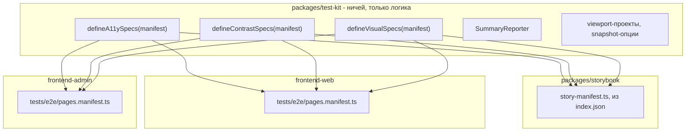
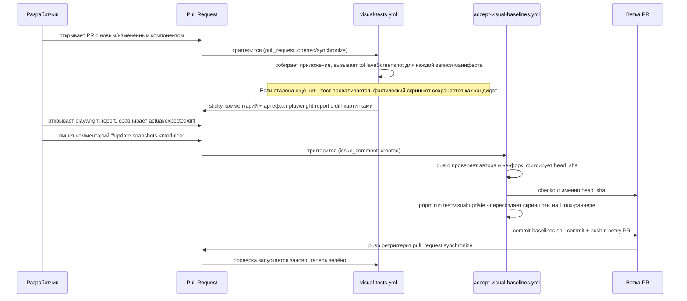
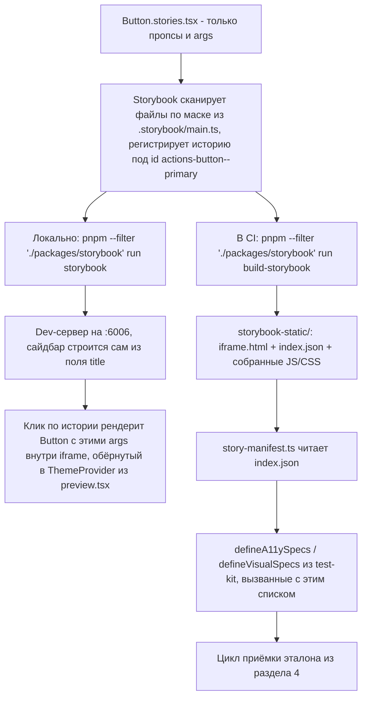

## Tallyvane — Архитектура тестирования компонентов и экранов

> Слой: `packages/test-kit`, `packages/storybook`, `frontend-web/tests/e2e`, `frontend-admin/tests/e2e`, `.github/workflows/`
> Статус: специфицирует целевую архитектуру. Раздел 2 описывает код, уже существующий в репозитории сегодня; всё остальное — спроектировано и согласовано, но ещё не реализовано.
> Родительские документы: [ARCHITECTURE.md](../../ARCHITECTURE.md), [ADR-032](../adr/ADR-032-subdomain-split-and-admin-isolation.md), `.cursor/rules/development-methodology.mdc`, план `Tier 0 design system primitives`

---

## 0. Как читать этот документ

Три равноправных потребителя нуждаются в одной и той же проверке — доступность, контраст, визуальная регрессия: приложение `frontend-web`, приложение `frontend-admin` и витрина переиспользуемых компонентов на Storybook. Ключевой принцип, определяющий всё остальное: **логика проверки не принадлежит ни одному из потребителей** — она вынесена в отдельный пакет, который каждый из трёх просто вызывает со своим списком того, что проверять.

Документ идёт от уже существующего кода (раздел 2) к полной целевой картине (разделы 4–9), с явным разделением по всему тексту, что уже реализовано, а что — специфицировано и ждёт реализации.

---

## Оглавление

1. [Принцип: что проверяется отделено от того, как проверяется](#1-принцип-что-проверяется-отделено-от-того-как-проверяется)
2. [Что уже существует в репозитории](#2-что-уже-существует-в-репозитории)
3. [Почему проверки разделены именно так](#3-почему-проверки-разделены-именно-так)
4. [Жизненный цикл одного скриншота](#4-жизненный-цикл-одного-скриншота)
5. [Целевая архитектура: test-kit и три равноправных потребителя](#5-целевая-архитектура-test-kit-и-три-равноправных-потребителя)
6. [Альтернативы, которые не подходят](#6-альтернативы-которые-не-подходят)
7. [Storybook: витрина компонентов](#7-storybook-витрина-компонентов)
8. [От файла истории до iframe](#8-от-файла-истории-до-iframe)
9. [Практика: как мне...](#9-практика-как-мне)
10. [Открытые вопросы](#10-открытые-вопросы)

---

## 1. Принцип: что проверяется отделено от того, как проверяется



Ни `frontend-web`, ни `frontend-admin`, ни `packages/storybook` не хранят собственную копию того, что означает тег `wcag22a`, как считается APCA или какие опции у `toHaveScreenshot`. Эта логика существует один раз, в пакете, который не принадлежит никому из трёх. У каждого потребителя остаётся только его собственный список того, что именно проверять — свой набор страниц или свой набор историй компонентов.

Это то же самое отношение, что уже существует между `packages/design-tokens` и `frontend-shared`: инструмент, обслуживающий нескольких потребителей, живёт отдельно от любого из них, даже когда сегодня у него фактически один потребитель.

---

## 2. Что уже существует в репозитории

`frontend-web/tests/e2e/` сегодня содержит рабочую, но пока не вынесенную реализацию всей проверочной логики. Она проверяет одну страницу — `frontend-web/app/storybook/page.tsx`, показывающую токены дизайн-системы.

### 2.1. Список того, что проверяется

```typescript
// frontend-web/tests/e2e/pages.manifest.ts
export const pagesManifest = [
    { name: "storybook", path: "/storybook" },
] as const;
```

Список отдельным файлом, чтобы добавление экрана было строкой, а не правкой нескольких спек.

### 2.2. Четыре независимых проверки

| Файл | Вопрос, на который отвечает | Инструмент |
| --- | --- | --- |
| `a11y.spec.ts` | Правильная ли структура: роли, имена, лейблы форм, порядок заголовков | `axe-core` через `@axe-core/playwright` |
| `contrast-wcag.spec.ts` | Проходит ли контраст текста порог WCAG 2.2 AA | `axe-core`, только правила `color-contrast*` |
| `contrast-apca.spec.ts` | Проходит ли контраст порог APCA | `apca-w3` |
| `visual.spec.ts` | Совпадает ли картинка с прошлым разом | `expect(page).toHaveScreenshot()` |

### 2.3. Как запускается браузер

`frontend-web/playwright.config.ts`: три проекта (`desktop` 1440×900, `tablet` 834×1194, `mobile` 390×844), `webServer`, который сам собирает и запускает приложение, путь готовности `/storybook`.

---

## 3. Почему проверки разделены именно так

**Доступность и контраст — разные файлы.** `a11y.spec.ts` исключает правила `color-contrast*`. Сломанный landmark и нечитаемая пара цветов — разные проблемы с разными владельцами. Контраст к тому же меряется двумя разными моделями (WCAG и APCA), которые иногда расходятся во мнении.

**Оставшиеся structural `violations[]` проваливают сборку.** Первый черновик валил только axe `critical`/`serious` и прикладывал остальное: в PR #7 это дало successful job при 1458 `moderate` находках, почти все — `landmark-one-main` и `page-has-heading-one` на изолированных Storybook-стори. Фильтр по impact убран.

**`axe-incomplete` не проваливает сборку.** Это не провал и не проход — "машина не смогла оценить". Результат прикладывается к отчёту, чтобы неизвестность осталась видимой, а не потерялась в зелёной галочке.

**Storybook вызывает `defineA11ySpecs(manifest, { surface: "component" })`.** Изолированная стори — не страница: требовать `<main>` и `h1` у Button, или оборачивать каждую iframe в фейковые landmarks, подменяет вопрос. Закрытый список page-scoped правил (`page-has-heading-one`, `landmark-one-main`, `bypass`, `document-title`, `region`) живёт в `test-kit`, не у потребителя. Страницы (`frontend-web`, позже `frontend-admin`) остаются на дефолте `"document"`.

**Обычная проверка никогда не запускается с `--update-snapshots`.** Проверка, которая сама переписывает своё ожидание при провале, не способна провалиться в принципе — и потому бесполезна как проверка.

**Обновление эталона — отдельный workflow**, запускается только по явной команде `/update-snapshots`, только от owner/member/collaborator. Разделение полномочий: один процесс имеет право писать в репозиторий, другой — нет.

**Эталоны создаются строго в CI.** Технический факт: рендеринг шрифтов на Linux и на Windows/macOS отличается на уровне пикселей, поэтому локальный эталон не совпадёт с тем, что видит CI.

**`toHaveScreenshot` и структурный `summary.json` — разные механизмы**: первый — для человека, разбирающего конкретный diff; второй — для скрипта, формирующего комментарий в PR.

---

## 4. Жизненный цикл одного скриншота



Конечный автомат из двух состояний; переход между ними — всегда явное решение человека, никогда не побочный эффект прогона.

---

## 5. Целевая архитектура: test-kit и три равноправных потребителя

### 5.1. `packages/test-kit`

Ничей пакет, экспортирующий проверочную логику как функции, параметризованные списком того, что проверять:

```ts
// packages/test-kit/src/specs/a11y.ts
export function defineA11ySpecs(
    manifest: readonly { name: string; path: string }[],
    options?: { readonly surface?: "document" | "component" },
) {
    for (const entry of manifest) {
        for (const theme of THEMES) {
            test(`${entry.name} @ ${theme} — a11y`, async ({ page }, testInfo) => { /* AxeBuilder, теги, remaining violations fail */ });
        }
    }
}
```

Экспортирует: `defineA11ySpecs`, `defineContrastSpecs` (WCAG и APCA), `defineVisualSpecs`, `SummaryReporter`, утилиту переключения темы, а также переиспользуемые куски конфигурации Playwright — три проекта viewport'ов и опции `toHaveScreenshot`. `webServer`, `testDir` и `snapshotDir` остаются за каждым потребителем отдельно, поскольку они у каждого свои по определению — разные приложения, разные порты, разные команды сборки.

### 5.2. Три вызывающих места

```ts
// frontend-web/tests/e2e/a11y.spec.ts
import { defineA11ySpecs } from "test-kit/specs/a11y";
import { pagesManifest } from "./pages.manifest";
defineA11ySpecs(pagesManifest);
```

```ts
// packages/storybook/tests/e2e/a11y.spec.ts
import { defineA11ySpecs } from "test-kit/specs/a11y";
import { readStoryManifest } from "./story-manifest";
defineA11ySpecs(readStoryManifest(), { surface: "component" });
```

```ts
// frontend-admin/tests/e2e/a11y.spec.ts — когда появится
import { defineA11ySpecs } from "test-kit/specs/a11y";
import { pagesManifest } from "./pages.manifest";
defineA11ySpecs(pagesManifest);
```

Три файла из нескольких строк каждый, отличающихся источником списка; Storybook дополнительно передаёт `{ surface: "component" }`, потому что стори — не страница. Добавление `frontend-admin` в проверку не требует ни одной правки в `test-kit` или в двух других местах — только его собственный `pages.manifest.ts` и такой же `.spec.ts` с дефолтной поверхностью `"document"`.

### 5.3. CI

`visual-tests.yml` и `accept-visual-baselines.yml` работают как матрица по целям (`frontend-web`, `packages/storybook`, позже `frontend-admin`), а не как один job с зашитым путём. `.github/scripts/commit-baselines.sh` уже принимает произвольное число путей одной командой — сюда просто передаётся столько путей, сколько целей в матрице.

---

## 6. Альтернативы, которые не подходят

**Ручные Next.js-страницы, показывающие варианты компонента, по одной на категорию.** Каждая такая страница — вёрстка, которую пишет и поддерживает человек; она растёт без предела по мере добавления компонентов и вариантов, и ничего не подсказывает, когда компонент уже показан, а когда ещё нет.

**Готовые обёртки для визуальной регрессии поверх Storybook** (`storywright`, `lost-pixel`). `storywright` имеет порядка двух звёзд на GitHub — недостаточно проверенный пакет для инфраструктуры CI. Репозиторий `lost-pixel`, при 1.7k звёзд, помечен на GitHub как `ARCHIVED`, а его README продвигает платную SaaS-платформу как способ получить полноценный интерфейс ревью — открытое ядро фактически не развивается.

**Проверочная логика, физически размещённая внутри одного из приложений.** [ADR-032](../adr/ADR-032-subdomain-split-and-admin-isolation.md) выделил `frontend-admin` в отдельное приложение именно для того, чтобы разработчик был физически не в состоянии затянуть код одного приложения в другое. Логика проверки, живущая внутри `frontend-web`, но нужная и `frontend-admin`, создаёt ровно такую зависимость от "соседа" — тот же класс связанности, который ADR-032 запрещает для прикладного кода, просто в тестовом. `.github/scripts/commit-baselines.sh` уже принимает произвольное число путей — инфраструктура приёмки эталонов рассчитана на несколько независимых наборов тестов с самого начала.

**Отдельный визуальный движок** (`@storybook/test-runner`, сторонние скриншот-раннеры). Не нужен: у Storybook при сборке уже есть `index.json` со списком историй, а `AxeBuilder` и `toHaveScreenshot` из уже работающего Playwright-стека прекрасно применяются к любому URL, включая страницу истории. Добавление нового движка означало бы вторую, отдельно поддерживаемую версию logic уже решённой задачи.

---

## 7. Storybook: витрина компонентов

`packages/storybook` — отдельный workspace-пакет (тем же рассуждением, что и `test-kit`: обслуживает нескольких потребителей, поэтому не встроен ни в одного из них). Сегодня его единственный источник компонентов — `frontend-shared`; по мере того как Tier 3+ компоненты появляются в `frontend-web/src` и `frontend-admin/src`, он начинает читать истории и оттуда, ничего не перестраивая.

### 7.1. Что для этого пишется руками, а что — нет

```
packages/frontend-shared/src/shared/ui/button/
  Button.tsx           - компонент
  Button.test.tsx      - Vitest: роли, клавиатура, варианты
  Button.stories.tsx   - Storybook: не страница, только данные для показа
  index.ts             - публичный API директории
```

```tsx
import type { Meta, StoryObj } from "@storybook/nextjs-vite";
import { Button } from "./Button";

const meta: Meta<typeof Button> = { title: "Actions/Button", component: Button };
export default meta;

export const Primary: StoryObj<typeof Button> = { args: { tone: "primary", children: "Save" } };
export const Neutral: StoryObj<typeof Button> = { args: { tone: "neutral", children: "Cancel" } };
export const Ghost: StoryObj<typeof Button> = { args: { tone: "ghost", children: "Dismiss" } };
export const Danger: StoryObj<typeof Button> = { args: { tone: "danger", children: "Delete" } };
```

Ни `<div>`, ни навигации, ни роутов — сайдбар, страницу и iframe для каждого варианта строит сам пакет `storybook`, один раз, для всех компонентов сразу.

### 7.2. Подключение токенов и темы

Цепочка импортов CSS — та же, что уже используется приложением, в том же порядке (порядок load-bearing: генерируемые токены объявляют `--ds-*`-переменные, адаптер маппит их на имена, которые читает Tailwind — обратный порядок разрешает `var(--ds-*)` в ничто):

```1:17:frontend-web/app/globals.css
@import "tailwindcss";
@import "frontend-shared/ui/theme/generated/tokens.css";
@import "frontend-shared/ui/theme/adapters/tailwind.css";
```

`postcss.config.mjs` внутри `packages/storybook` идентичен тому, что уже используется в `frontend-web` (`{ plugins: { "@tailwindcss/postcss": {} } }`) — Vite сам подхватывает этот файл, отдельный плагин `@tailwindcss/vite` не нужен.

`.storybook/preview.tsx` оборачивает каждую историю в настоящий `ThemeProvider` (не упрощённый тумблер класса), с глобальным переключателем темы в тулбаре Storybook, вызывающим его реальный `setPreference`:

```tsx
import type { Preview } from "@storybook/nextjs-vite";
import { ThemeProvider, useTheme } from "frontend-shared/ui/theme";
import "./preview.css";

function ThemeSync({ themeFromToolbar, children }: { themeFromToolbar: "dark" | "light"; children: React.ReactNode }) {
    const { preference, setPreference } = useTheme();
    React.useEffect(() => {
        if (preference !== themeFromToolbar) setPreference(themeFromToolbar);
    }, [themeFromToolbar, preference, setPreference]);
    return <>{children}</>;
}

const preview: Preview = {
    globalTypes: { theme: { toolbar: { items: ["dark", "light"], dynamicTitle: true } } },
    initialGlobals: { theme: "dark" },
    decorators: [(Story, ctx) => (
        <ThemeProvider>
            <ThemeSync themeFromToolbar={ctx.globals.theme}>
                <div className="bg-surface-primary text-text-primary"><Story /></div>
            </ThemeSync>
        </ThemeProvider>
    )],
};
export default preview;
```

`ThemeInitScript` сюда не переносится: он устраняет мигание темы при серверном рендере до гидратации, а iframe Storybook рендерится полностью на клиенте — мигать нечему.

---

## 8. От файла истории до iframe



**Локальная разработка.** Dev-сервер не рендерит ничего заранее — клик по истории монтирует компонент с указанными `args` внутри `iframe`. Обёртка настраивается один раз в `preview.tsx` и применяется ко всем историям автоматически.

**Сборка для CI.** Компиляция через Vite в статику. `index.json` — список id историй; `iframe.html` рендерит ровно один компонент по параметру `?id=`. Дальше — те же функции из `test-kit`, что использует `frontend-web`.

---

## 9. Практика: как мне...

### 9.1. ...добавить проверки для нового компонента

1. Написать `NewThing.tsx` в `packages/frontend-shared/src/shared/ui/new-thing/`.
2. Рядом добавить `NewThing.stories.tsx` — по одному экспорту на документированный вариант/тон/размер.
3. Ничего не редактировать в `test-kit`, в `pages.manifest.ts` или в CI — `story-manifest.ts` подхватит историю сам при следующей сборке Storybook.
4. Открыть PR. Первый прогон **специально провалится** — эталона для новой истории ещё нет. Это ожидаемо.
5. Проверить `playwright-report` из артефактов: компонент выглядит так, как задумано?
6. Если да — комментарий `/update-snapshots packages/storybook`. Эталон появится автоматически, проверка перезапустится и станет зелёной.

### 9.2. ...добавить новый вариант к существующему компоненту

Добавить ещё один `export const` в `.stories.tsx`. Дальше — шаги 4–6 из 9.1.

### 9.3. ...обновить эталон после осознанного изменения дизайна

Изменение стиля меняет пиксели существующей истории → проверка проваливается → diff в отчёте → `/update-snapshots packages/storybook`.

### 9.4. ...прогнать проверки локально

```bash
pnpm --filter "./frontend-web" run test:a11y
pnpm --filter "./frontend-web" run test:visual
pnpm --filter "./packages/storybook" run test:a11y
pnpm --filter "./packages/storybook" run test:visual
```

Локально сгенерированный `--update-snapshots` не годится как источник истины из-за разницы в рендеринге шрифтов между ОС (раздел 3) — годится только чтобы посмотреть глазами.

### 9.5. ...разобраться, почему упал CI

- Красный `test:a11y` → attachment `axe-results`: `id` правила, `impact`, задетые узлы.
- Красный `test:contrast` → attachment `wcag-contrast-results` / `apca-findings`.
- Красный `test:visual` → `playwright-report`, actual/expected/diff рядом.
- Комментарий к PR — сводка по всем прогонам сразу.

### 9.6. ...добавить целую новую страницу приложения

Одна строка в `pages.manifest.ts` соответствующего приложения — `defineA11ySpecs`/`defineVisualSpecs` подхватят её автоматически.

### 9.7. ...подключить frontend-admin к проверке

`tests/e2e/pages.manifest.ts` со своими страницами, `playwright.config.ts`, импортирующий переиспользуемые куски из `test-kit`, `.spec.ts`-файлы по образцу раздела 5.2. Ни `test-kit`, ни `packages/storybook`, ни `frontend-web` не меняются — только третья точка входа в CI-матрицу и третий аргумент в `commit-baselines.sh`.

---

## 10. Открытые вопросы

- Ставить ли `@storybook/addon-a11y` как панель для разработки. Не влияет на CI-гейт ни при каком ответе — тот остаётся на `test-kit`. Компромисс удобства при разработке против ещё одной зависимости.
- Как `@storybook/nextjs-vite` обходится с `next/font/google` (`app/fonts.ts`) — проверяется по факту при реализации.
- Точный набор тестов для `frontend-admin` (какие страницы, когда) — вне рамок текущего плана Tier 0, отдельная задача.
